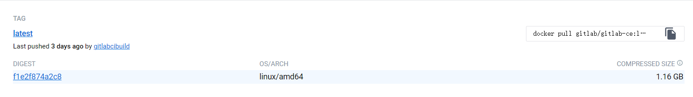
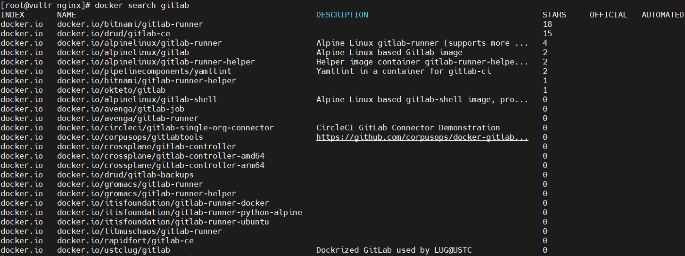
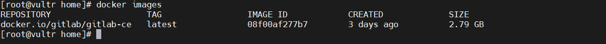
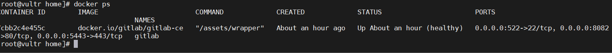
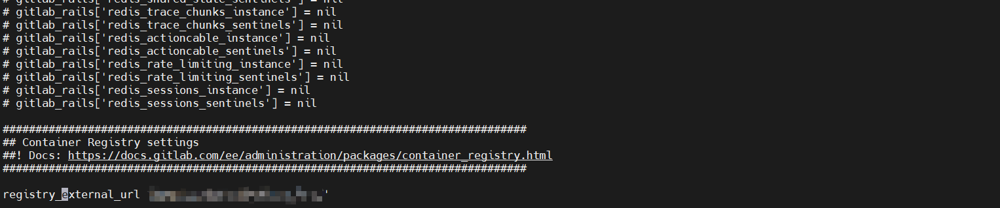
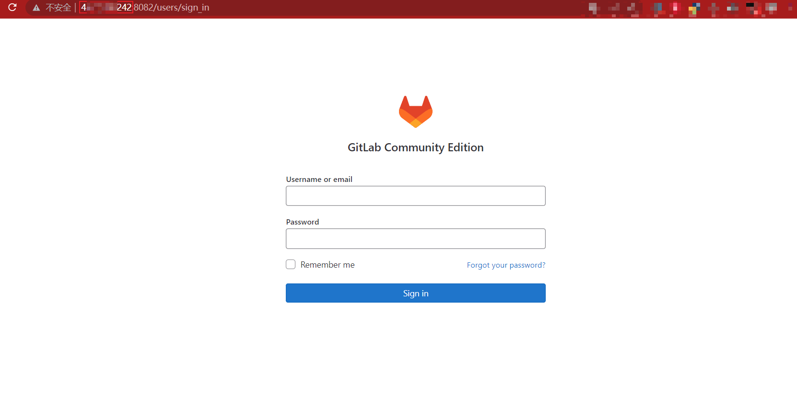
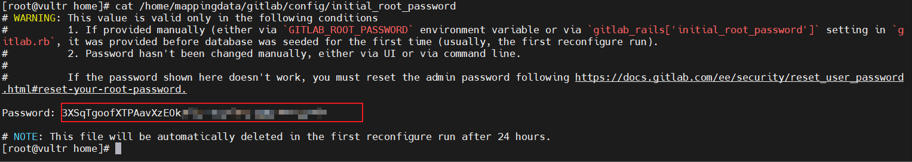
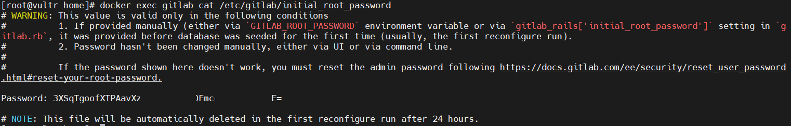
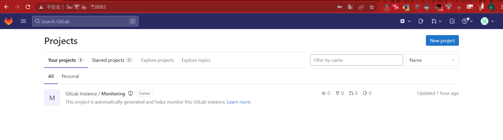

## GitLab-Docker安装说明

### 安装配置
* CentOS：7
* Memory：4G（GitLab官网给出的最小内存就是4G；太小的话会安装失败）
* 安装镜像：gitlab/gitlab-ce:latest（DIGEST:sha256:f1e2f874a2c8e715a2e55f78a74f56ea947c3013df37bf826600c38feba9957f）


### 安装docker（通过yum源安装），如果docker命令已经存在，不需要安装
```shell
yum install docker -y

# 启动docker
systemctl start docker
```

### 拉取docker镜像
```shell
docker pull gitlab/gitlab-ce

# 如果使用其它版本，通过docker search gitlab查询所有的版本进行拉取
docker search gitlab
```


### 查看拉取下来的镜像
```shell
docker images
```


### docker创建容器启动
```shell
docker run -d  -p 5443:443 -p 8082:80 -p 5522:22 --name gitlab --restart always -v /home/mappingdata/gitlab/config:/etc/gitlab -v /home/mappingdata/gitlab/logs:/var/log/gitlab -v /home/mappingdata/gitlab/data:/var/opt/gitlab docker.io/gitlab/gitlab-ce
```
* 注意：-v后面的是本地路径与docker镜像中的路径映射关系；本地路径:容器路径（本地路径可以不存在，docker run会自动创建文件夹）
* -d: 后台启动
* --name=gitlab ：指定容器名称为gitlab
* --restart=always：在容器退出时总是重启容器（--restart选项通常只用于detached后台启动模式的容器）
* -p：端口映射，映射宿主机的54323端口到容器内的443端口

| 宿主机目录位置                  | 容器内目录位置  | 描述                 |
| ------------------------------- | --------------- | -------------------- |
| /home/mappingdata/gitlab/config | /etc/gitlab     | 存储 GitLab 配置文件 |
| /home/mappingdata/gitlab/logs   | /var/log/gitlab | 存储日志             |
| /home/mappingdata/gitlab/data   | /var/opt/gitlab | 存储应用程序数据     |

### 查看容器启动状态
```shell
docker ps 
```


### 配置GitLab服务的访问地址
```shell
vi /home/mappingdata/gitlab/config/gitlab.rb 
# 配置http协议所使用的访问IP地址（修改为自己的ip）
external_url 'http://192.168.1.100' 
```


### 重启gitlab
```shell
docker restart gitlab
```

### 测试访问：http://ip:端口


### 登录
#### 查看密码，默认帐号root（下面都是使用的docker容器的映射文件查看的，也可以进入docker进行查看）
```shell
cat /home/mappingdata/gitlab/config/initial_root_password
```

#### docker命令查看密码两种方法任选其一
```shell
docker exec gitlab cat /etc/gitlab/initial_root_password
# docker exec 容器名 执行的命令
```

#### 进入gitlab



