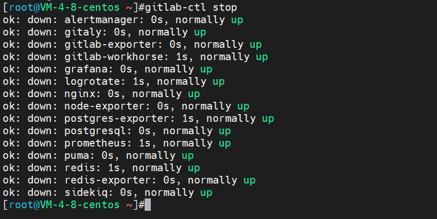
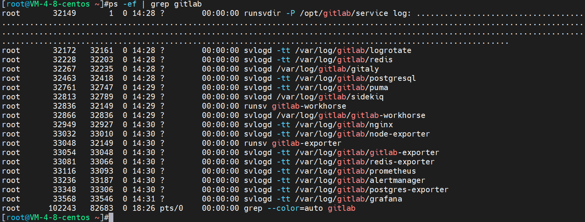
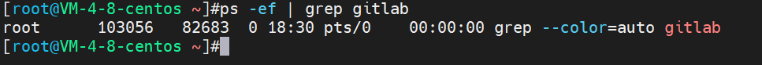

## GitLab卸载说明

### 安装配置
* CentOS：8
* Memory：4G（GitLab官网给出的最小内存就是4G；太小的话会安装失败）
* 安装镜像：gitlab-ce-14.2.4-ce.0.el8.x86_64.rpm

### 卸载
#### 停止GitLab
```shell
gitlab-ctl stop
```


#### 卸载GitLab
```shell
rpm -e gitlab-ce
```


#### 查杀GitLab进程
* 查找
```shell
ps -ef | grep gitlab
```


* 杀掉第一个守护进程：
```shell
kill -9 32149
```


* 再次查看进程都结束了



#### 删除GitLab文件
```shell
find / -name gitlab|xargs rm -rf
```


#### 删除gitlab-ctl uninstall时自动在root下备份的配置文件
> 进入root目录，如果没有gitlab-cleanse...文件夹则不需要操作，有的话通过`rm -rf 文件`对其进行删除


