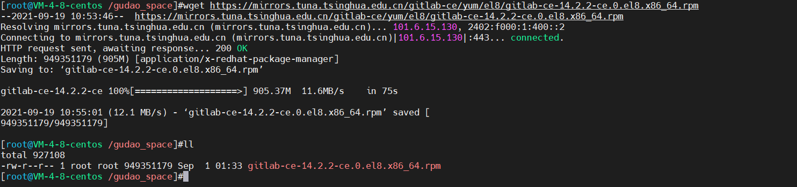

## GitLab安装说明

### 安装配置
* CentOS：8
* Memory：4G（GitLab官网给出的最小内存就是4G；太小的话会安装失败）
* 安装镜像：gitlab-ce-14.2.4-ce.0.el8.x86_64.rpm

### 安装

#### 清华镜像池找到OS对应的GitLab安装版本
[CentOS 8 镜像地址](https://mirrors.tuna.tsinghua.edu.cn/gitlab-ce/yum/el8/)

#### 赋值镜像地址，进行下载
```shell
wget https://mirrors.tuna.tsinghua.edu.cn/gitlab-ce/yum/el8/gitlab-ce-14.2.2-ce.0.el8.x86_64.rpm
```


#### 依赖软件安装
```shell
yum -y install policycoreutils openssh-server openssh-clients postfix
```


#### 设置postfix开机自启，并启动，postfix支持gitlab发信功能
```shell
systemctl enable postfix && systemctl start postfix
```


#### 安装GitLab
```shell
rpm -i gitlab-ce-14.2.2-ce.0.el8.x86_64.rpm
```


#### 修改GitLab配置文件指定服务器ip和自定义端口
```shell
vim /etc/gitlab/gitlab.rb
```
* 修改成如下：
    * IP地址+端口号： external_url 'http://192.168.0.49:8070'
    * 进入修改的方法：按下键盘“i”
  * 退出编辑器的方法：Esc -> 输入wq-> 回车
* 注意：
  * 安装在云服务器上的，记得在策略组或者防火墙中将自己gitlab中url的端口打开
  


#### 重置GitLab
```shell
gitlab-ctl reconfigure
```


#### 重启GitLab
```shell
gitlab-ctl restart
```


#### 如果安装过程中未提供自定义密码，查看系统默认生成的root密码位置
```text
随机生成一个密码并在/etc/gitlab/initial_root_password 使用此密码和用户名root登录
```


#### 如果安装过程中未提供自定义密码，那么直接使用命令行修改root密码
```shell
# 进入production控制窗口
gitlab-rails console -e production

# 找到需要修改的用户（1是root用户）
user = User.where(id: 1).first

# 修改密码
user.password = '用户密码'

user.password_confirmation = '用户密码'

# 保存
user.save
```


#### 访问【我有自己的域名，直接使用域名解析，映射到我的服务器上去了（为了好看我gitlab使用的80端口，所以不需要域名后面加端口号）】


### 安装问题
```text
gitlab启动报warning: warning: logrotate: unable to open supervise/ok: file does not exist

解决：
1、按住CTRL+C强制结束
2、运行：sudo systemctl restart gitlab-runsvdir
3、再次执行：sudo gitlab-ctl reconfigure

打开浏览器，输入前面配置的地址，如果本机可以访问，但其他电脑访问不了

解决：防火墙拦截了端口，可以在防火墙添加端口
/sbin/iptables -I INPUT -p tcp --dport 8010 -j ACCEPT

如果访问的时候报502错误

解决：
chmod -R 755 /var/log/gitlab
```