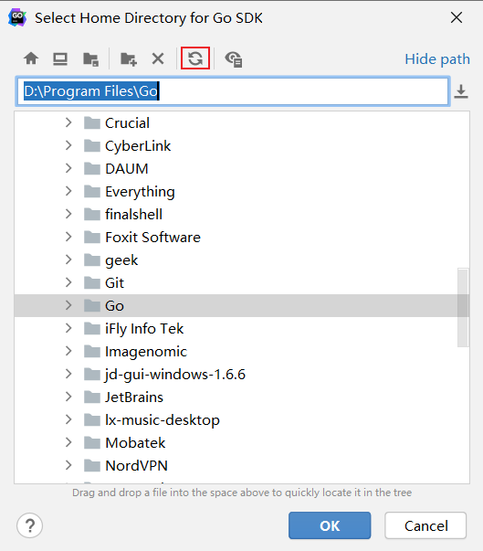

## Go idea 配置GOROOT报：The selected directory is not a valid home for Go Sdk

## 配置
* Go idea版本：2020.2.2
* golang版本：go1.18.5
* 在上述配置条件下，cmd 窗口使用 go version 等命令均可正常使用，系统环境变量配置正确

### 问题信息


### 问题解决
* 找到${GOROOT}/src/runtime/internal/sys/zversion.go文件，追加下面配置（你的版本号）
```shell
 const TheVersion = `go1.17.2`
```
* 打开Go idea后，配置GOROOT，记得需要刷新下目录

