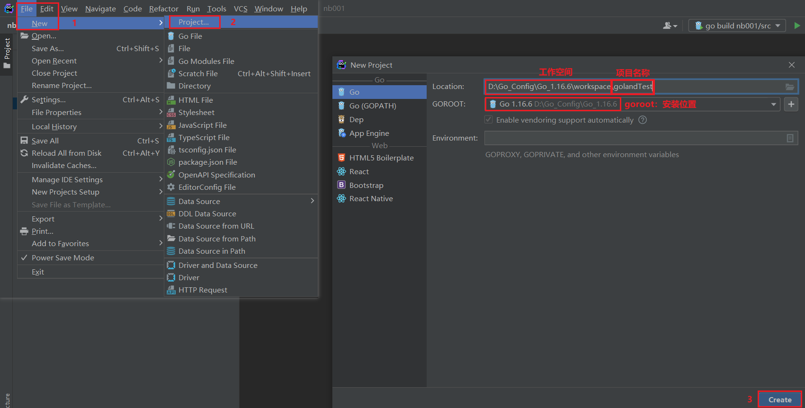
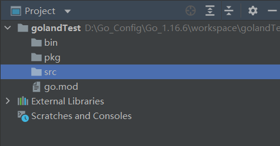
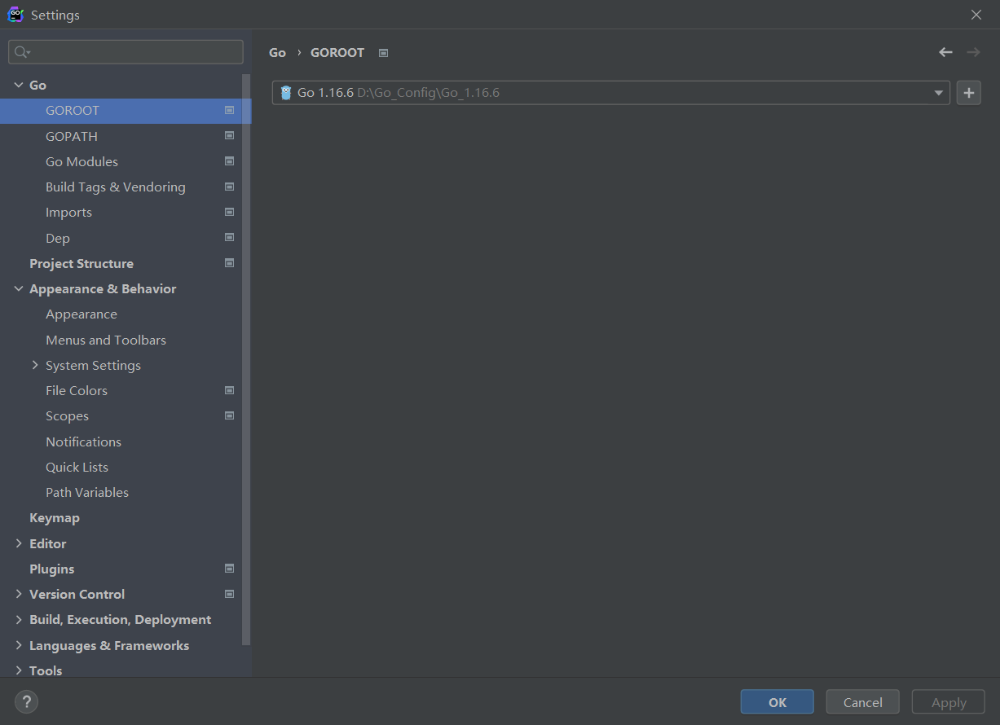
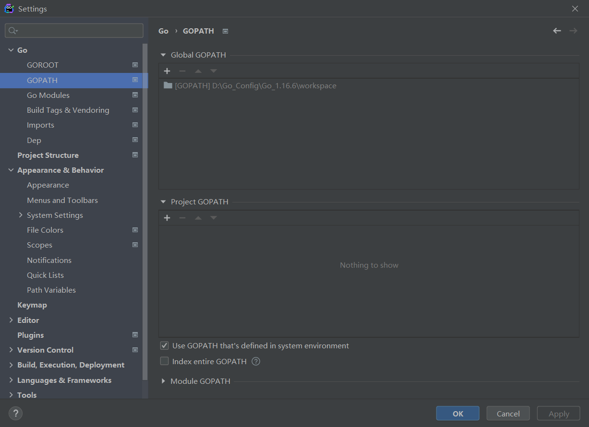
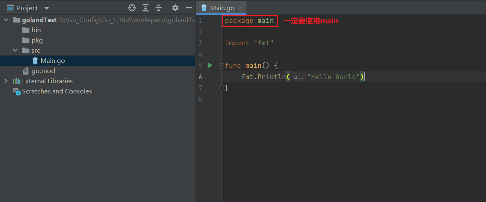
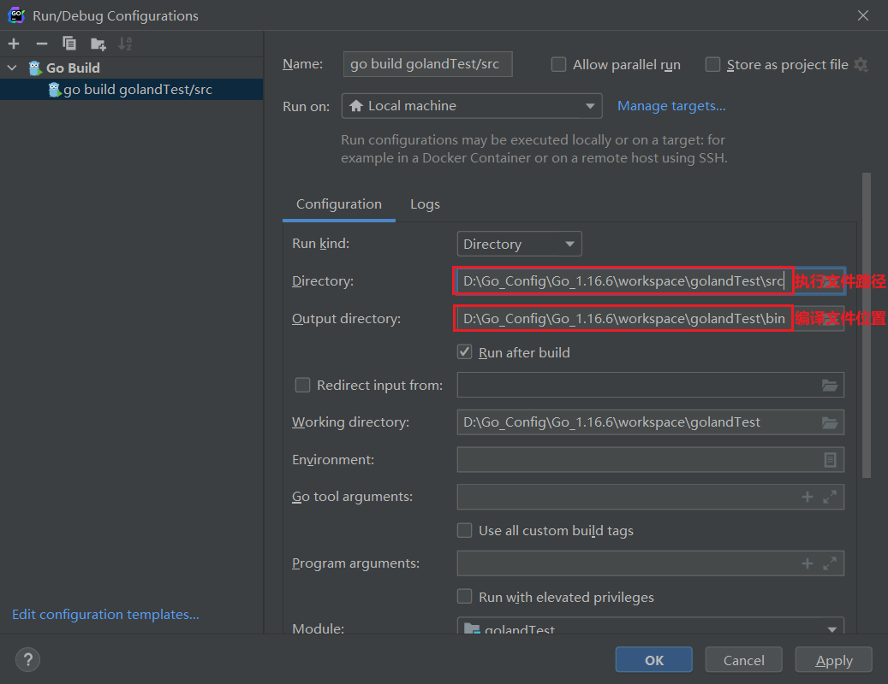
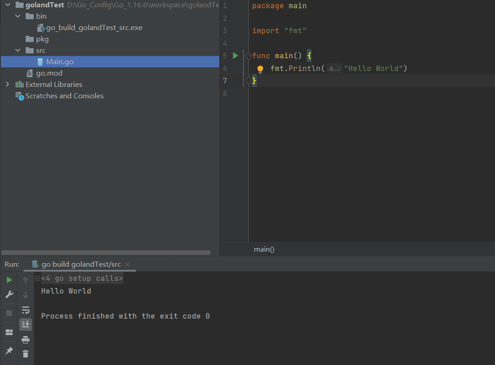

## GoLand启动Go项目

### 新建项目


### 在项目目录下手动创建 bin，pkg，src三个文件夹
* bin 用来存放编译后的 .exe 文件
* pkg 放置自定义包的位置
* src 我们的工程的开发文件存放的点，在 src 中创建项目跟项目文件


### 配置goland的gopath和goroot
* GOROOT


* GOPATH


### src下创建项目
```golang
package main

import "fmt"

func main() {
	fmt.Println("Hello World")
}
```
<br>
注意：
* run 指定的 go 文件的 package 必须是 main 才可以运行，不是有 main 方法就可以的
* 如果出现什么 系统不兼容的错误，多半就是 package 不是为 main 而导致的
  
### 构建代码配置


### 配置完成后执行代码
* 右击 -> Run "xxx"

### 执行结果


