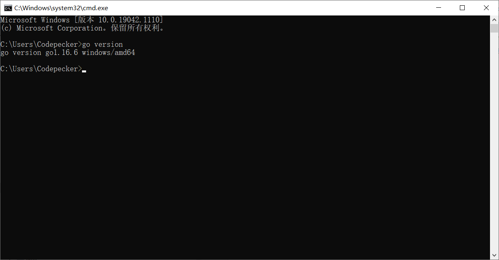
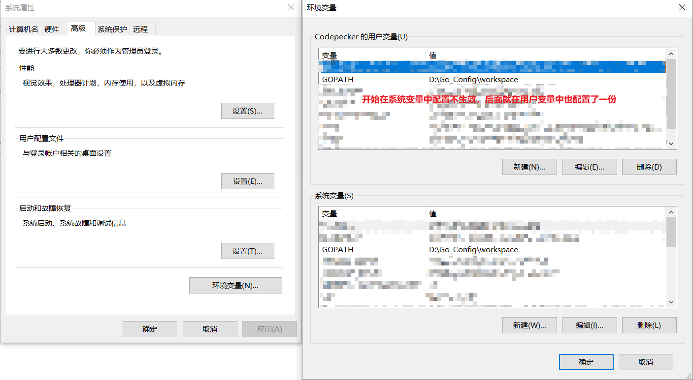

## GO语言Windows安装说明

### 下载GO语言安装包
[官网地址：需出国](https://golang.org/dl/)

### 安装完成后查看安装是否成功
* cmd窗口命令`go version`

### GOPATH工作空间配置
* 个人使用的工作空间位置为D:\Go_Config\Go_1.16.6\workspace【在桌面上右键单击“我的电脑”图标，在弹出的菜单中单击“属性”，然后单击“高级系统设置”；在“系统属性”对话框中单击“环境变量”按钮，然后添加GOPATH变量即可】

* 注意：我的电脑中在系统环境中配置GOPATH不生效，后才在用户变量中又配置了一份；各位可以根据自己的电脑，系统变量不生效了再配置用户变量

### 查看环境信息
* cmd窗口命令`go env [环境名称]`

