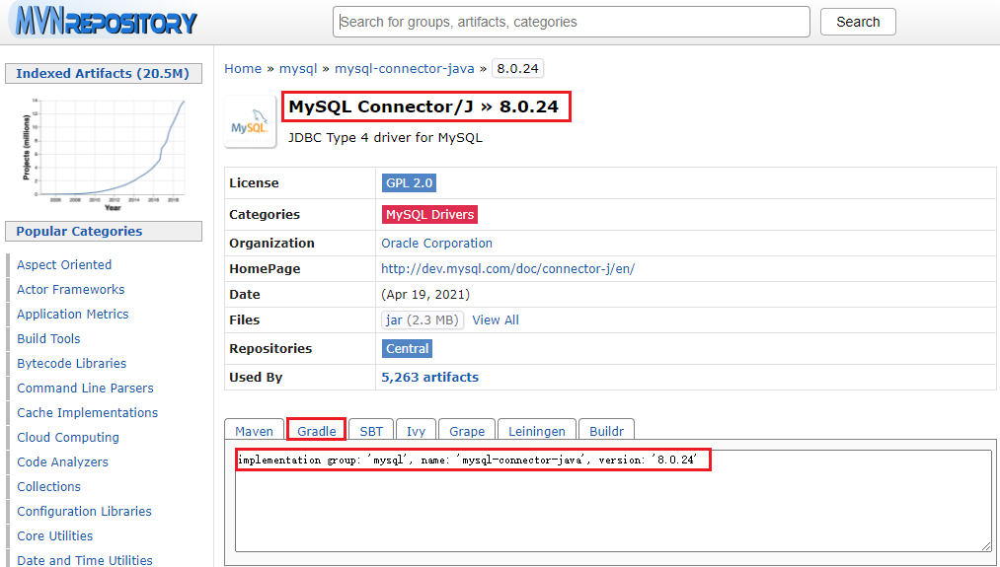

· gradle是什么,能做什么:编程框架,通过编程完成构建( gradle特色)
· gradle使用编程语言构建ANT& MAVEN使用xm构建
· DSL:领域特定语言：html，UML

· gradle优势
灵活性(ant、 maven无法)
粒度上(ant、 maven源代码和构建脚本分开)力度在task
扩展性复用已有的插件
兼容性兼容 ant | maven
gradle4x的版本支持kotlin

gradle组成 
groovy核心语法 build script block 
gradle api

groovy
下载地址:http://groovy-lang.org/download.html
兼具脚本语言与静态语言
JVM虚拟机上
完全兼容java语法

·gooy核心语法
基础语法
所有类型都是对象
字符串
逻辑控制重点: 
    switch, for each
闭包使用
    所有的闭包都有返回值
    函散中超过两个参数以上,并且最后一个参数是闭包,可以把闭包放在
    ```
    project('myproj-common') {Project project -> 
        group 'com.test' 
        version '2.0.0 
        dependencies {
        }
    }
    ```
字符与闭包
列表: list
字典: map
Rang

gradle项目说明
gradle工具下载地址：https://gradle.org/releases/
settings.gradle:配置项目基本信息 
build.gradle:task(任务) 
    project + task组成了gradle基础骨架
gradle基础命令: 
    clean 
    build 
    check   

gradle组成部分
```text
groovy核心语法
build script block
    buildscript{
        依赖配置: gradle自身对外部的依赖
    }
    外部(allprojects{}){
        依赖配置:项目本身对外部库的依赖
    }
gradle api
```

gradle执行过程


学习内容
了解 gradle project配置背后的原理
定制化基于 gradle构建的项目
```
入了解 Project 
什么是 Project 
gradew project

Project核心API讲解 
    AllProjects 
    subProjects 
    parentproect 
    rootproject 
配置project group version 
    allprojects配置
    subproject配置
配置 project属性,ext, apply from this.file(' common.gradle ')
文件属性相关 
    rootdir, bui lddir, projectin 
获取文件内容 
copy 
文件遍历 
依赖管理, buildscript
```


build.gradle是什么,有什么用
构建逻辑, gradle工具通过build.gradle完成构建
settings.gradle是什么,有什么用
标记根项目和子项目
Gradlew是什么,有什么用上
对gradle可执行命令的包装，屏蔽不同版本的兼容性
Gradle生命周期
初始化-》配置-》执行
```
/**
 * 配置阶段开始前的监听
 */
this.beforeEvaluate {
    println('配置开始前')
}

/**
 * 配置阶段开始后的监听
 */
this.afterEvaluate {
    println('配置完成后')
}

/**
 * 执行完成监听
 */
this.gradle.buildFinished {
    println('执行阶段完毕')
}
```


### 依赖管理
* implementation（gradle4.x）
    > 这个指令的特点就是,对于使用了该命令编译的依赖,对该项目有依赖的项目将无法访问到使用该命令编译的依赖中的任何程序,也就是将该依赖隐藏在内部,而不对外部公开。
* api
    > 完全等同于compile指令。
* compile（gradle3.x）
    > 这种是我们最常用的方式,使用该方式依赖的库将会参与编译和打包。
* testCompile
    > testCompile只在单元测试代码的编译以及最终打包测试apk时有效
* debugCompile 
    > debugCompile只在debug模式的编译和最终的debug apk打包时有效。
* releaseCompile 
    > releaseCompile仅仅针对Release模式的编译和最终的Release apk打包。
```
dependencies { 
    compile 'org.springframework.boot: springboot-starter-web' 
    //添加该依赖主要是解析yaml 
    compile 'com.fasterxml.jackson.dataformat:jacksondataformat-yaml:2.9.5.
    //添加该依赖主要解析
    json compile'com.fasterxml.jackson.core:jackson-databind:2.9.51 
    testCompile'org.springframework.boot:sprinq-boot-startertest 
}
```
### 依赖冲突：高版本与低版本的放在一起，高版本中没有低版本中的api
* 解决冲突
    * 查看依赖报告 `gradle dependency`
    * 排查传递性依赖
    ```
    compile('org.xxx:yyy:1.0'){
        exclude group: "org.slf4j", module:"slf4j-api"
        // 是否传递依赖（false为不传递）
        transitive = false.
    ```
    * 强制使用某个版本
    ```
    configurations.all { 
        resolutionstrategy{ 
            // 强制项目中都使用1.7.25的版本
            force 'org.s1f4j:s1f4j-api:1.7.25'
        }
    }
    ```
* 默认冲突策略：默认情况下使用最高版本
```
configurations.all { 
    resolutionstrategy{ 
        failonVersionConflict 
    }
}
```

### build.gradle说明

#### 添加项目依赖
```
// 注意：此处的dependecies不是在buildscript下的
dependencies {
    testImplementation 'org.junit.jupiter:junit-jupiter-api:5.7.0'
    testRuntimeOnly 'org.junit.jupiter:junit-jupiter-engine:5.7.0'
    // 添加项目依赖方式1
    implementation group: 'org.springframework.boot', name: 'spring-boot-starter-data-jpa', version: '2.4.5'
    // 添加项目依赖方式2
    implementation group: 'mysql', name: 'mysql-connector-java', version: '8.0.24'
    // 添加项目依赖方式3
    compile('com.alibaba:druid:1.1.9')
    // 添加项目依赖方式4
    compile 'org.apache.logging.log4j:log4j-spring-cloud-config-client:2.14.1'
}
```
##### gradle坐标查找方式
* 通过[maven仓库查找](https://mvnrepository.com/)


#### 部分属性说明
```text
// 组名
group 'org.gudao'
// 版本名
version '1.0-SNAPSHOT'
// 源码兼容版本（源码的）
sourceCompatibility = 1.8
// 目标版本（class文件的）
targetCompatibility = 1.8
```
#### buildscript:gradle自身依赖的插件如何获取
```
// 在buildscript中的是给gradle自身使用的，没有在buildscript中的是给项目用的
buildscript {
    // 扩展属性
    ext { springBootversion = '2.0.1.RELEASE' } 
        // 仓库配置
        repositories { 
            // maven仓库：按照配置顺序查找
            maven{ url 'http://maven.aliyun.com/nexus/content/groups/public/' } 
            mavencentral() 
        } 
        // 依赖
        dependencies { 
            classpath("org.springframework.boot:spring-boot-gradle-plugin: ${springBootVersion}")
        } 
    }
}
```
#### 插件配置
```
plugins { 
    id 'java' 
} 
apply plugin: 'java'
```
#### jar插件 
```
jar { 
    baseName = 'springboot-application' 
    version = '0.0.1-SNAPSHOT 
}
```
#### 仓库配置（没有配置在buildscript中的属于就是项目的仓库）
```
repositories {
    mavencentral() 
    maven{ 
        url 'http://maven.aliyun.com/nexus/content/groups/public/
    }  
}
```
#### sourceSets
> Java插件引入了一个概念叫做SourceSets,通过修改SourceSets中的属性,可以指定哪些源文件(或文件夹下的源文件)要被编译,哪些源文件要被排除。Gradle就是通过它实现ava项目的布局定义。
```
sourceSets { 
    main { 
        java { 
            srcDir 'src/java' //指定源码目录 
        }
        resources { 
            srcDir 'src/resources' //资源目录 
        } 
    }
}
```
#### 单项目配置
```
project ('springboot-application') {// 项目名称
    dependencies { 
        // 需要添加的配置
        compile project (':springboot-data') 
        compile project (':springboot-web') 
        compile project (':springboot-shiro') 
        compile project (':springboot-base')
    } 
}
```
#### 扩展属性配置 
```
1.ext { springBootVersion = '2.0.1. RELEASE' } 添加属性
2·通过gradle.properties配置
```
#### 子项目的配置
```
subprojects{
...
}
```
#### 所有项目的通用配置
```
allprojects {
    apply plugin: "java"
    version = "1.0"
}
```
#### 发布
> publiclishing定义的闭环是放在buildscript中的

```
apply plugin: 'maven-publish' 
// 定义需要获取的插件信息
publishing { 
    publications { 
        mypublish (MavenPublication) { 
            groupId 'com.gupao.edu.vip.plugin' 
            artifactId 'myplugin' 
            version '1.0.0' 
            from components.java 
        }
    }
}

// 定义获取插件的仓库地址
publishing { 
    repositories { 
        maven { 
            url uri('插件仓库存在的位置')
        }
    }
}
```