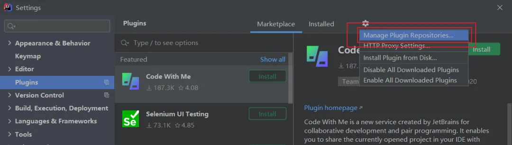
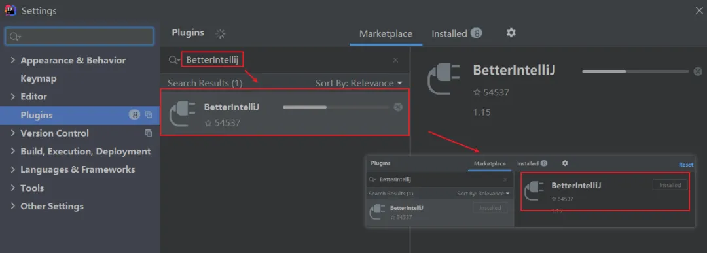
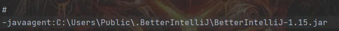

## 激活教程

#### 2020.3的激活码路径如下图


#### 软件下载


#### 试用进入软件

* 如果没有这个提示，可以使用资源包中的工具进行重置
    * 根据你的操作系统选择执行
        
    * 如果你之前是使用的jetbrains-agent-latest或者其他插件进行激活的，需要先移除原有激活的方式；否则可能导致软件无法启动
    
#### 移除原先的激活方式
> 如果你之前是使用的jetbrains-agent-latest或者其他插件进行激活的，需要先移除原有激活的方式；否则可能导致软件无法启动
1. 路径：help > Edit Custom VM Options


2. 删掉（或注释）最下面的一行，其他激活插件相关的jar包路径


#### 激活
1. File -> Settings -> Manage Plugins Reposito【打开软件中心】


2. 设置仓库地址
    ```shell
    https://repo.idechajian.com
    如果有https://plugins.zhile.io的地址，请移除掉...
    ```
    

3. 搜索 关键字“BetterIntellij” 安装并应用


4. 装完之后，会在help > Edit Custom VM Options配置文件中多如下配置；可自行确认是否安装成功。
    ```shell
    -javaagent:C:\Users\Public\.BetterIntelliJ\BetterIntelliJ-1.15.jar
    ```
    
5. 重启软件；重要！重要！重要！
    > 一定要先重启！先重启！先重启！再输入激活码；否则会提示激活码无效；如果开了多个窗口，请全部关闭，关闭单个窗口无效。
    
6. 打开  help --> Register
    > 输入资源包中的激活码，这里的激活码只有一个；全选粘贴就好；路径如下图
    
7. 参数设置


    


