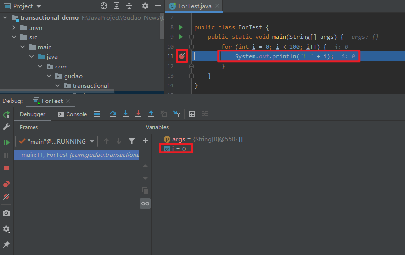
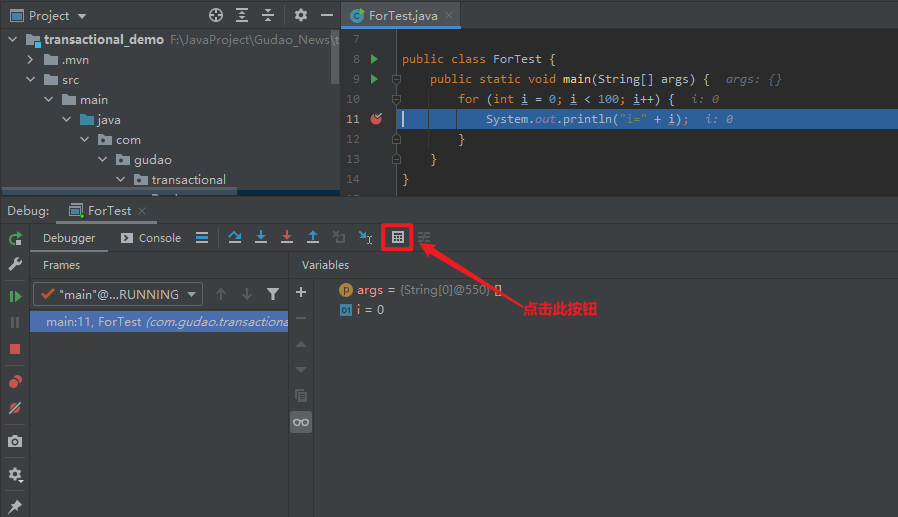
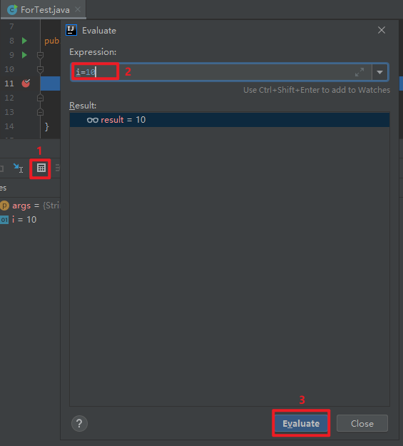

## 执行遍历代码，跳到指定的循环次数

### 方法说明
* 测试代码
    ```java
    public class ForTest {
        public static void main(String[] args) {
            for (int i = 0; i < 100; i++) {
                System.out.println("i=" + i);
            }
        }
    }
    ```
* 挂载断点，debug执行代码<br/>
    
* 点击如下图标，快捷键 `Alt + F8`<br/>
    
* 输入想要执行的 `i` 值<br/>
    <br/>
* 下面就会从指定的 `i` 值继续执行循环了