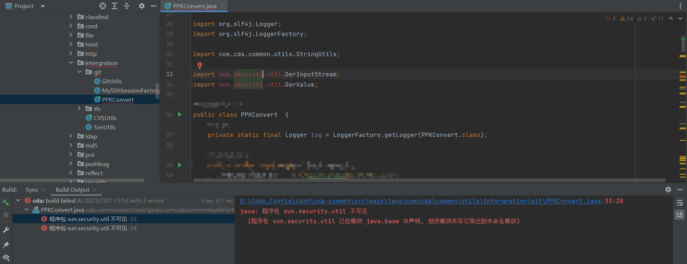
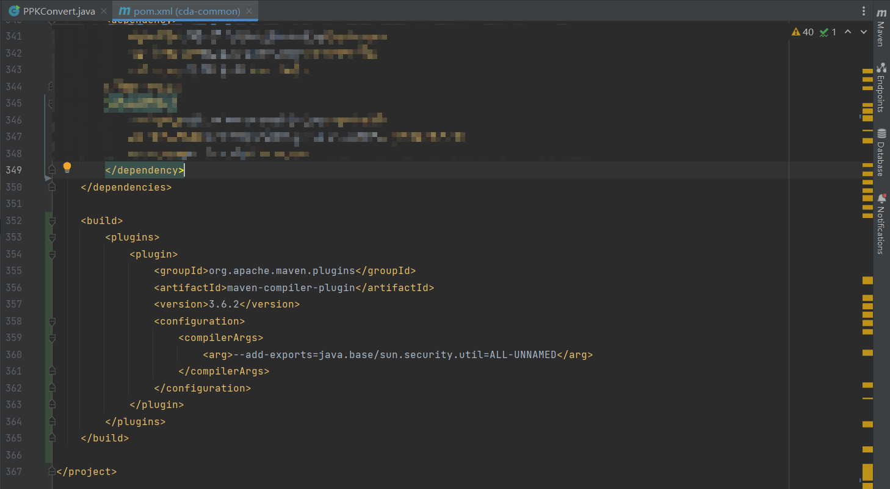

## 项目从JAVA8升级到JAVA17过程中出现的xxx包找不到

### 环境说明
* windows 10
* JDK8 升级 腾讯Kona17.0.7(因为OpenJDK我升级的时候，JDK17的社区版没有跟Oracle正式版同步，所以用了腾讯的，开源社区说是最新的17.0.7)
* [Kona17开源地址](https://github.com/Tencent/TencentKona-17/releases)
* IntelliJ IDEA 2023(具体版本为2023.1.4 (Ultimate Edition))

### 问题截图


### 解决办法
对应模块pom.xml增加maven插件，增加
```xml
<build>
    <plugins>
        <plugin>
            <!-- 此处的版本可以自己指定，我这个只是我们项目中使用的 -->
            <groupId>org.apache.maven.plugins</groupId>
            <artifactId>maven-compiler-plugin</artifactId>
            <version>3.6.2</version>
            <configuration>
                <compilerArgs>
                    <!-- 这个模块就是我上面报错中缺少的 -->
                    <!-- 如果跟我的报错不一样，这个可以根据自己的报错，修改成需要的模块 -->
                    <!-- java.base/sun.security.util就是上面报错中需要的模块 -->
                    <arg>--add-exports=java.base/sun.security.util=ALL-UNNAMED</arg>
                </compilerArgs>
            </configuration>
        </plugin>
    </plugins>
</build>
```
