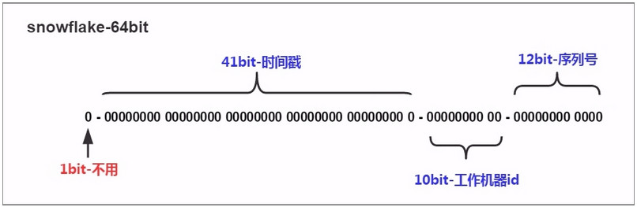

## 分布式ID-Java实现雪花ID

### 说明



### 算法描述

* 最高位是符号位，始终为0，不可用。
    * 二进制中最高位为1的都是负数，但是我们生成的id一般都使用整数，所以这个最高位固定是0
* 41位的时间序列，精确到毫秒级，41位的长度可以使用69年。时间位还有一个很重要的作用是可以根据时间进行排序。
    * 41位可以表示`2^41-1`个数字，
    * 如果只用来表示正整数（计算机中正数包含0），可以表示的数值范围是：`0`至`2^41-1`，减1是因为可表示的数值范围是从0开始算的，而不是1。
    * 也就是说41位可以表示`2^41-1`个毫秒的值，转化成单位年则是`(2^41-1) / (1000 * 60 * 60 * 24 * 365) = 69`年
* 10位的机器标识，10位的长度最多支持部署1024个节点
    * 可以部署在`2^10 = 1024`个节点，包括5位datacenterId和5位workerId
    * 5位（bit）可以表示的最大正整数是`2^5-1 = 31`，即可以用0、1、2、3、....31这32个数字，来表示不同的datecenterId或workerId
* 12位的计数序列号，序列号即一系列的自增id，可以支持同一节点同一毫秒生成多个ID序号，12位的计数序列号支持每个节点每毫秒产生4096个ID序号
    * 12位（bit）可以表示的最大正整数是$2^{12}-1 = 4095$，即可以用0、1、2、3、....4094这4095个数字，来表示同一机器同一时间截（毫秒)内产生的4095个ID序号

> 由于在Java中64bit的整数是long类型，所以在Java中SnowFlake算法生成的id就是long来存储的。

### SnowFlake可以保证：

* 所有生成的id按时间趋势递增
* 整个分布式系统内不会产生重复id（因为有datacenterId和workerId来做区分）

### 代码示例

```java
/**
 * Twitter_Snowflake
 * SnowFlake的结构如下(每部分用-分开):
 * 0 - 0000000000 0000000000 0000000000 0000000000 0 - 00000 - 00000 - 000000000000 
 * 1位标识，由于long基本类型在Java中是带符号的，最高位是符号位，正数是0，负数是1，所以id一般是正数，最高位是0
 * 41位时间截(毫秒级)，注意，41位时间截不是存储当前时间的时间截，而是存储时间截的差值（当前时间截 - 开始时间截)
 * 得到的值），这里的的开始时间截，一般是我们的id生成器开始使用的时间，由我们程序来指定的（如下下面程序IdWorker类的startTime属性）。41位的时间截，可以使用69年，年T = (1L << 41) / (1000L * 60 * 60 * 24 * 365) = 69
 * 10位的数据机器位，可以部署在1024个节点，包括5位datacenterId和5位workerId
 * 12位序列，毫秒内的计数，12位的计数顺序号支持每个节点每毫秒(同一机器，同一时间截)产生4096个ID序号
 * 加起来刚好64位，为一个Long型。
 * SnowFlake的优点是，整体上按照时间自增排序，并且整个分布式系统内不会产生ID碰撞(由数据中心ID和机器ID作区分)，并且效率较高，经测试，SnowFlake每秒能够产生26万ID左右。
 */
public class SnowflakeIdWorker {

    // ==============================Fields===========================================
    /** 开始时间截 (2015-01-01) */
    private final long twepoch = 1420041600000L;

    /**
     * 每一部分占用的位数
     */
    /* 机器id所占的位数 */
    private final long workerIdBits = 5L;
    /* 序列在id中占的位数 */
    private final long sequenceBits = 12L;
    /* 数据标识id所占的位数 */
    private final long datacenterIdBits = 5L;

    /**
     * 每一部分的最大值
     */
    /* 生成序列的掩码，这里为4095 (0b111111111111=0xfff=4095) */
    private final long sequenceMask = -1L ^ (-1L << sequenceBits);
    /* 支持的最大机器id，结果是31 (这个移位算法可以很快的计算出几位二进制数所能表示的最大十进制数) */
    private final long maxWorkerId = -1L ^ (-1L << workerIdBits);
    /* 支持的最大数据标识id，结果是31 */
    private final long maxDatacenterId = -1L ^ (-1L << datacenterIdBits);

    /**
     * 每一部分向左的位移
     */
    /* 机器ID向左移12位 */
    private final long workerIdShift = sequenceBits;
    /* 数据标识id向左移17位(12+5) */
    private final long datacenterIdShift = sequenceBits + workerIdBits;
    /* 时间截向左移22位(5+5+12) */
    private final long timestampLeftShift = sequenceBits + workerIdBits + datacenterIdBits;

    /* 工作机器ID(0~31) */
    private long workerId;

    /* 数据中心ID(0~31) */
    private long datacenterId;

    /* 毫秒内序列(0~4095) */
    private long sequence = 0L;

    /* 上次生成ID的时间截 */
    private long lastTimestamp = -1L;

    //==============================Constructors=====================================

    /**
     * 构造函数
     * @param workerId 工作ID (0~31)
     * @param datacenterId 数据中心ID (0~31)
     */
    // 检查机房id和机器id是否超过31 不能小于0
    public SnowflakeIdWorker(long workerId, long datacenterId) {
        if (workerId > maxWorkerId || workerId < 0) {
            throw new IllegalArgumentException(String.format("worker Id can't be greater than %d or less than 0", maxWorkerId));
        }
        if (datacenterId > maxDatacenterId || datacenterId < 0) {
            throw new IllegalArgumentException(String.format("datacenter Id can't be greater than %d or less than 0", maxDatacenterId));
        }
        this.workerId = workerId;
        this.datacenterId = datacenterId;
    }

    // ==============================Methods==========================================

    /**
     * 获得下一个ID (该方法是线程安全的)
     * @return SnowflakeId
     */
    // 这个是核心方法，通过调用nextId()方法，让当前这台机器上的snowflake算法程序生成一个全局唯一的id
    public synchronized long nextId() {
        long timestamp = timeGen();

        // 如果当前时间小于上一次ID生成的时间戳，说明系统时钟回退过这个时候应当抛出异常[这儿就是获取当前时间戳，单位是毫秒]
        if (timestamp < lastTimestamp) {
            throw new RuntimeException(String.format("Clock moved backwards.  Refusing to generate id for %d milliseconds", lastTimestamp - timestamp));
        }

        // 如果是同一时间生成的，则进行毫秒内序列
        // 下面是说假设在同一个毫秒内，又发送了一个请求生成一个id
        // 这个时候就得把seqence序号给递增1，最多就是4096
        if (lastTimestamp == timestamp) {
            // 这个意思是说一个毫秒内最多只能有4096个数字，无论你传递多少进来，
            // 这个位运算保证始终就是在4096这个范围内，避免你自己传递个sequence超过了4096这个范围
            sequence = (sequence + 1) & sequenceMask;
            // 毫秒内序列溢出
            if (sequence == 0) {
                // 阻塞到下一个毫秒,获得新的时间戳
                timestamp = tilNextMillis(lastTimestamp);
            }
        }
        // 时间戳改变，毫秒内序列重置
        else {
            sequence = 0L;
        }

        // 记录上次生成ID的时间截
        lastTimestamp = timestamp;

        // 移位并通过或运算拼到一起组成64位的ID
        // 先将当前时间戳左移，放到41 bit那儿；将机房id左移放到5 bit那儿；将机器id左移放到5 bit那儿；将序号放最后12 bit
        // 最后拼接起来成一个64 bit的二进制数字，转换成10进制就是个long型
        return ((timestamp - twepoch) << timestampLeftShift) 
                | (datacenterId << datacenterIdShift) 
                | (workerId << workerIdShift)
                | sequence;
    }

    /**
     * 阻塞到下一个毫秒，直到获得新的时间戳
     * 当某一毫秒的时间，产生的id数 超过4095，系统会进入等待，直到下一毫秒，系统继续产生ID
     * @param lastTimestamp 上次生成ID的时间截
     * @return 当前时间戳
     */
    protected long tilNextMillis(long lastTimestamp) {
        long timestamp = timeGen();
        while (timestamp <= lastTimestamp) {
            timestamp = timeGen();
        }
        return timestamp;
    }

    /**
     * 返回以毫秒为单位的当前时间
     * @return 当前时间(毫秒)
     */
    protected long timeGen() {
        return System.currentTimeMillis();
    }

    //==============================Test=============================================

    /** 测试 */
    public static void main(String[] args) {
        // 通过工具类的构造函数确定：工作机器ID，数据中心ID
        SnowflakeIdWorker idWorker = new SnowflakeIdWorker(0, 0);

        for (int i = 0; i < 100; i++) {
            long id = idWorker.nextId();
            System.out.println(Long.toBinaryString(id));
            System.out.println(id);
        }
    }
}
```

### SnowFlake算法的优点
* 高性能高可用：生成时不依赖于数据库，完全在内存中生成
* 容量大：每秒中能生成数百万的自增ID
* ID自增：存入数据库中，索引效率高

### SnowFlake算法的缺点
* 时间回拨问题【依赖与系统时间的一致性】：由于机器的时间是动态的调整的，有可能会出现时间跑到之前几毫秒，如果这个时候获取到了这种时间，则会出现数据重复
* 机器id分配及回收问题：目前机器id需要每台机器不一样，这样的方式分配需要有方案进行处理，同时也要考虑，如果改机器宕机了，对应的workerId分配后的回收问题
* 机器id上限：机器id是固定的bit，那么也就是对应的机器个数是有上限的，在有些业务场景下，需要所有机器共享同一个业务空间，那么10bit表示的1024台机器是不够的