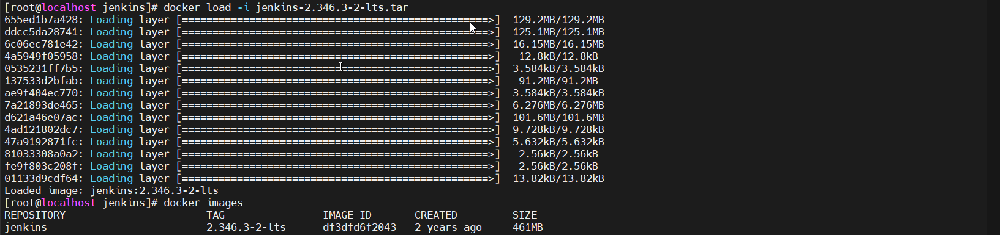

## Jenkins通过Docker部署并配置离线插件

### 环境说明
* 系统：CentOS7.9
* Jenkins版本：2.346.3-2-lts

### 导入镜像
```shell
# 使用已经提供的镜像文件
docker load -i jenkins-2.346.3-2-lts.tar
# 使用docker进行pull镜像
docker pull jenkins/jenkins:2.346.3-2-lts
```


### 创建容器
```shell
# 用户身份运行容器，避免权限问题
# -p 80:8080 前面映射的主机端口使用80，可以自行修改。
docker run -itd -p 80:8080 --name jenkins -u root --privileged=true --env DOCKER_TLS_CERTDIR=/certs jenkins:2.346.3-2-lts

# 模拟局域网无网络情况
docker run -itd -p 80:8080 --name jenkins --dns 0.0.0.0 -u root --privileged=true --env DOCKER_TLS_CERTDIR=/certs jenkins:2.346.3-2-lts
```
* -u root：以 root 用户身份运行容器，避免权限问题（这可以避免一些权限问题；如文件操作、安装插件等）
* --privileged=true：启用特权模式，赋予容器更高的权限
* DOCKER_TLS_CERTDIR: 指定 Docker 客户端和服务器之间的 TLS 证书目录（可以忽略）
* -itd
  * -i: 保持标准输入（stdin）打开
  * -t: 分配一个伪终端（pseudo-TTY）
  * -d: 将容器放入后台运行（detached mode）


### 访问Jenkins

#### 访问地址：
**http://ip:port**

#### 初始密码查看
```shell
# cat /var/jenkins_home/secrets/initialAdminPassword 为容器内查看密码命令
# jenkins修改为上面配置的容器名
docker exec -it jenkins cat /var/jenkins_home/secrets/initialAdminPassword
```

### 安装离线插件
```shell
# plugins.tar 为插件包的路径，根据个人需求修改
# /var/jenkins_home/plugins 为容器内插件包路径（此处压缩包中包含 plugins 目录，故直接解压即可）
docker cp plugins.tar jenkins:/var/jenkins_home
# 进⼊容器
docker exec -it jenkins /bin/bash
# 解压plugins
# /var/jenkins_home/plugins.tar 为压缩包的路径，根据前面 cp 命令修改
tar -xvf /var/jenkins_home/plugins.tar -C /var/jenkins_home/

# 重启Jenkins，jenkins 为docker run配置的容器名称
docker restart jenkins
```
* 配置Jenkins时，插件那⼀步直接点击X跳过即可

### 补充：GitLab中的Token如何生成流水线语法
> 通过Token创建凭证，直接使用用户和密码的方式。用户名称随意填写，将token复制到密码处，即可使用。

#### 在GitLab中，点击头像，找到User Settings -> Edit Profile -> Access Tokens，选择权限，点击Create personal access token，即可看到Token


#### 在Jenkins中，点击Credentials -> System -> Global credentials -> Add Credentials，选择GitLab API Token，即可看到Token


#### 配置流水线语法


