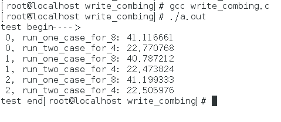

## 现代cpu的合并写技术对程序的影响
对于现代cpu而言，性能瓶颈则是对于内存的访问。cpu的速度往往都比主存的高至少两个数量级。因此cpu都引入了L1_cache与L2_cache,更加高端的cpu还加入了L3_cache.很显然，这个技术引起了下一个问题:

         如果一个cpu在执行的时候需要访问的内存都不在cache中，cpu必须要通过内存总线到主存中取，那么在数据返回到cpu这段时间内（这段时间大致为cpu执行成百上千条指令的时间，至少两个数据量级）干什么呢？ 答案是cpu会继续执行其他的符合条件的指令。比如cpu有一个指令序列 指令1  指令2  指令3 …， 在指令1时需要访问主存，在数据返回前cpu会继续后续的和指令1在逻辑关系上没有依赖的”独立指令”，cpu一般是依赖指令间的内存引用关系来判断的指令间的”独立关系”，具体细节可参见各cpu的文档。这也是导致cpu乱序执行指令的根源之一。

         以上方案是cpu对于读取数据延迟所做的性能补救的办法。对于写数据则会显得更加复杂一点：

         当cpu执行存储指令时，它会首先试图将数据写到离cpu最近的L1_cache, 如果此时cpu出现L1未命中，则会访问下一级缓存。速度上L1_cache基本能和cpu持平，其他的均明显低于cpu，L2_cache的速度大约比cpu慢20-30倍，而且还存在L2_cache不命中的情况，又需要更多的周期去主存读取。其实在L1_cache未命中以后，cpu就会使用一个另外的缓冲区，叫做合并写存储缓冲区。这一技术称为合并写入技术。在请求L2_cache缓存行的所有权尚未完成时，cpu会把待写入的数据写入到合并写存储缓冲区，该缓冲区大小和一个cache line大小，一般都是64字节。这个缓冲区允许cpu在写入或者读取该缓冲区数据的同时继续执行其他指令，这就缓解了cpu写数据时cache miss时的性能影响。

当后续的写操作需要修改相同的缓存行时，这些缓冲区变得非常有趣。在将后续的写操作提交到L2缓存之前，可以进行缓冲区写合并。 这些64字节的缓冲区维护了一个64位的字段，每更新一个字节就会设置对应的位，来表示将缓冲区交换到外部缓存时哪些数据是有效的。当然，如果程序读取已被写入到该缓冲区的某些数据，那么在读取缓存数据之前会先去读取本缓冲区的。

经过上述步骤后，缓冲区的数据还是会在某个延时的时刻更新到外部的缓存（L2_cache）.如果我们能在缓冲区传输到缓存之前将其尽可能填满，这样的效果就会提高各级传输总线的效率，以提高程序性能。

从下面这个具体的例子来看吧：

下面一段测试代码，从代码本身就能看出它的基本逻辑。
```text
#include <unistd.h>
#include <stdio.h>
#include <sys/time.h>
#include <stdlib.h>
#include <limits.h>

static const int iterations = INT_MAX;
static const int items = 1<<24;
static int mask;

static int arrayA[1<<24];
static int arrayB[1<<24];
static int arrayC[1<<24];
static int arrayD[1<<24];
static int arrayE[1<<24];
static int arrayF[1<<24];
static int arrayG[1<<24];
static int arrayH[1<<24];

double run_one_case_for_8()
{
         double start_time;
         double end_time;
         struct timeval start;
         struct timeval end;
 
         int i = iterations;
         gettimeofday(&start, NULL);

         while(--i != 0)
         {
                  int slot = i & mask;
                  int value = i;
                  arrayA[slot] = value;
                  arrayB[slot] = value;
                  arrayC[slot] = value;
                  arrayD[slot] = value;
                  arrayE[slot] = value;
                  arrayF[slot] = value;
                  arrayG[slot] = value;
                  arrayH[slot] = value;
         }

         gettimeofday(&end, NULL);
         start_time = (double)start.tv_sec + (double)start.tv_usec/1000000.0;
         end_time = (double)end.tv_sec + (double)end.tv_usec/1000000.0;
         return end_time - start_time;
}

double run_two_case_for_4()
{
         double start_time;
         double end_time;
         struct timeval start;
         struct timeval end;

         int i = iterations;
         gettimeofday(&start, NULL);

         while(--i != 0)
         {
                  int slot = i & mask;
                  int value = i;
                  arrayA[slot] = value;
                  arrayB[slot] = value;
                  arrayC[slot] = value;
                  arrayD[slot] = value;
         }

         i = iterations;
         
         while(--i != 0)
         {
                  int slot = i & mask;
                  int value = i;
                  arrayG[slot] = value;
                  arrayE[slot] = value;
                  arrayF[slot] = value;
                  arrayH[slot] = value;
         }

         gettimeofday(&end, NULL);
         start_time = (double)start.tv_sec + (double)start.tv_usec/1000000.0;
         end_time = (double)end.tv_sec + (double)end.tv_usec/1000000.0;
         return end_time - start_time;
}


int main()
{
         mask = items -1;
         int i;
         printf("test begin---->\n"); 

         for(i=0;i<3;i++)
         {
                  printf(" %d, run_one_case_for_8: %lf\n", i, run_one_case_for_8());
                  printf(" %d, run_two_case_for_4: %lf\n", i, run_two_case_for_4());
         }

         printf("test end");
         return 0;
}
```
相信很多人会认为run_two_case_for_4 的运行时间肯定要比run_one_case_for_8的长，因为至少前者多了一遍循环的i++操作。但是事实却不是这样：下面是运行的截图：


测试环境: fedora 20 64bits, 4G DDR3内存，CPU:Inter® Core™ i7-3610QM cpu @2.30GHZ.

结果是令人吃惊的，他们的性能差距居然达到了1倍，太神奇了。

原理:上面提到的合并写存入缓冲区离cpu很近，容量为64字节，很小了，估计很贵。数量也是有限的，我这款cpu它的个数为4。个数时依赖cpu模型的，intel的cpu在同一时刻只能拿到4个。

因此，run_one_case_for_8函数中连续写入8个不同位置的内存，那么当4个数据写满了合并写缓冲时，cpu就要等待合并写缓冲区更新到L2cache中，因此cpu就被强制暂停了。然而在run_two_case_for_4函数中是每次写入4个不同位置的内存，可以很好的利用合并写缓冲区，因合并写缓冲区满到引起的cpu暂停的次数会大大减少，当然如果每次写入的内存位置数目小于4，也是一样的。虽然多了一次循环的i++操作（实际上你可能会问，i++也是会写入内存的啊，其实i这个变量保存在了寄存器上）， 但是它们之间的性能差距依然非常大。

从上面的例子可以看出，这些cpu底层特性对程序员并不是透明的。程序的稍微改变会带来显著的性能提升。对于存储密集型的程序，更应当考虑到此到特性。

希望这篇文章能该大家带来一些帮助，也能可做性能优化的同事带来参考。