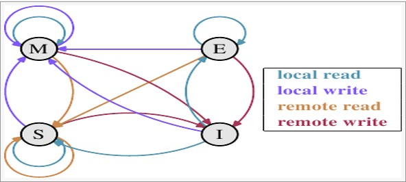
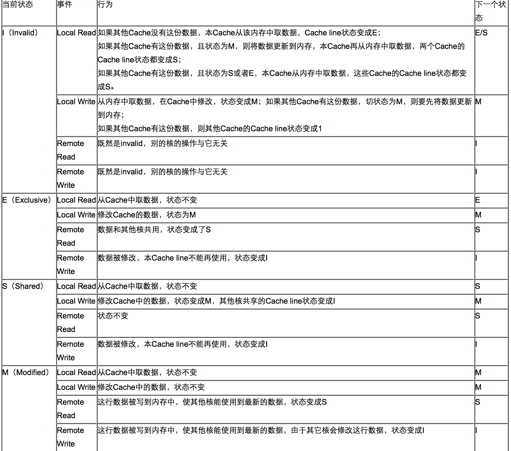

## MESI--CPU缓存一致性协议

### 概念
MESI（Modified Exclusive Shared Or Invalid）(也称为伊利诺斯协议，是因为该协议由伊利诺斯州立大学提出）是一种广泛使用的支持写回策略的缓存一致性协议。

### MESI协议中的状态
* CPU中每个缓存行（caceh line)使用4种状态进行标记（使用额外的两位(bit)表示):

#### M: 被修改（Modified)
* 该缓存行只被缓存在该CPU的缓存中，并且是被修改过的（dirty),即与主存中的数据不一致，该缓存行中的内存需要在未来的某个时间点（允许其它CPU读取请主存中相应内存之前）写回（write back）主存。
* 当被写回主存之后，该缓存行的状态会变成独享（exclusive)状态。

#### E: 独享的（Exclusive)
* 该缓存行只被缓存在该CPU的缓存中，它是未被修改过的（clean)，与主存中数据一致。该状态可以在任何时刻当有其它CPU读取该内存时变成共享状态（shared)。
* 同样地，当CPU修改该缓存行中内容时，该状态可以变成Modified状态。

#### S: 共享的（Shared)
* 该状态意味着该缓存行可能被多个CPU缓存，并且各个缓存中的数据与主存数据一致（clean)，当有一个CPU修改该缓存行中，其它CPU中该缓存行可以被作废（变成无效状态（Invalid））。

#### I: 无效的（Invalid）
* 该缓存是无效的（可能有其它CPU修改了该缓存行）。

### MESI状态转换图

#### 状态之间的相互转换关系也可以使用下表进行表示。
 

### 操作
在一个典型系统中，可能会有几个缓存（在多核系统中，每个核心都会有自己的缓存）共享主存总线，每个相应的CPU会发出读写请求，而缓存的目的是为了减少CPU读写共享主存的次数。

一个缓存除在Invalid状态外都可以满足cpu的读请求，一个Invalid的缓存行必须从主存中读取（变成S或者 E状态）来满足该CPU的读请求。

一个写请求只有在该缓存行是M或者E状态时才能被执行，如果缓存行处于S状态，必须先将其它缓存中该缓存行变成Invalid状态（也既是不允许不同CPU同时修改同一缓存行，即使修改该缓存行中不同位置的数据也不允许）。该操作经常作用广播的方式来完成，例如：RequestFor Ownership (RFO)。

缓存可以随时将一个非M状态的缓存行作废，或者变成Invalid状态，而一个M状态的缓存行必须先被写回主存。

一个处于M状态的缓存行必须时刻监听所有试图读该缓存行相对就主存的操作，这种操作必须在缓存将该缓存行写回主存并将状态变成S状态之前被延迟执行。

一个处于S状态的缓存行也必须监听其它缓存使该缓存行无效或者独享该缓存行的请求，并将该缓存行变成无效（Invalid）。

一个处于E状态的缓存行也必须监听其它缓存读主存中该缓存行的操作，一旦有这种操作，该缓存行需要变成S状态。

对于M和E状态而言总是精确的，他们在和该缓存行的真正状态是一致的。而S状态可能是非一致的，如果一个缓存将处于S状态的缓存行作废了，而另一个缓存实际上可能已经

独享了该缓存行，但是该缓存却不会将该缓存行升迁为E状态，这是因为其它缓存不会广播他们作废掉该缓存行的通知，同样由于缓存并没有保存该缓存行的copy的数量，因此（即使有这种通知）也没有办法确定自己是否已经独享了该缓存行。

从上面的意义看来E状态是一种投机性的优化：如果一个CPU想修改一个处于S状态的缓存行，总线事务需要将所有该缓存行的copy变成Invalid状态，而修改E状态的缓存不需要使用总线事务。