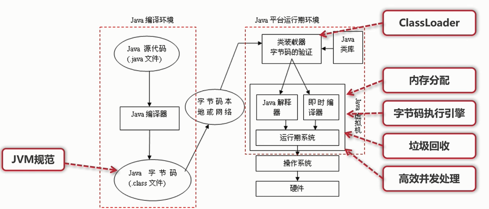
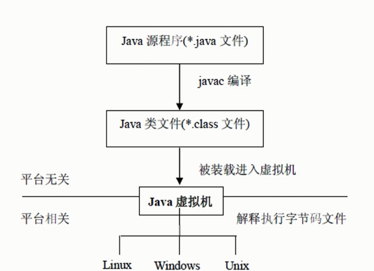

## JVM概述JVM
* Java Virtual Machine ,也就是Java虚拟机
* 所谓虚拟机是指:通过软件模拟的具有完整硬件系统功能的、运行在一个完全隔离环境中的计算机系统
* JVM是通过软件来模拟Java字节码的指令集,是Java程序的运行环境

### java执行流程

### JVM主要功能
* 通过ClassLoader寻找和装载class文件
* 解释字节码成为指令并执行,提供class文件的运行环境
* 进行运行期间的内存分配和垃圾回收
* 提供与硬件交互的平台

### 虚拟机是java平台无关的保障
