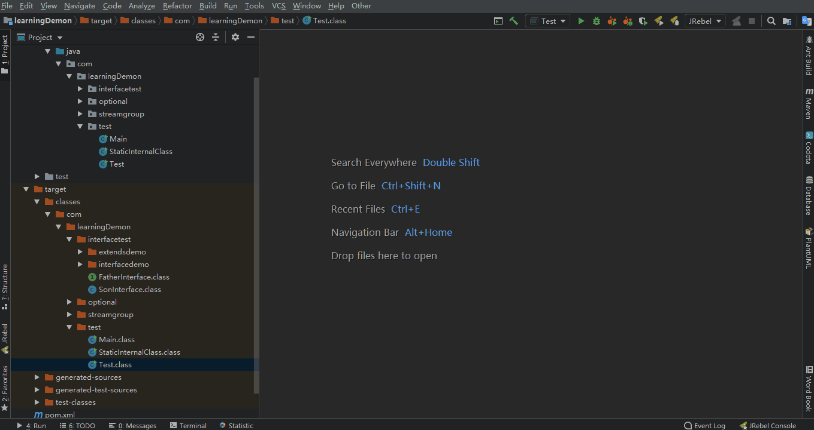
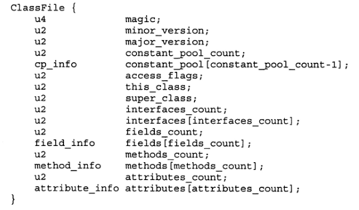

## Class文件

### 字节码文件查看方式 
> idea插件：jclasslib、BinEd-Binary

### Class文件格式
* javap工具生成非正式的"虚拟机汇编语言" ,格式如下:<index> <opcode> [<operand1> [<operand2 > ..[<(comment >]
* <index>是指令操作码在数组中的下标,该数组以字节形式来存储当前方法的Java虚拟机代码;也可以是相对于方法起始处的字节偏移量
* <opcode>是指令的助记码、<operand>是操作数、<comment>是行尾的注释

### Class_File结构

> 详情请看jvm-class文件解析.xmind

### Class文件说明
constant pool_count:是从1开始
不同的常量类型,用tag来区分的,它后面对应的info结构是不一样的
L表示对象,[表示数组、V表示void
了解预定义attribute的含义
stack:方法执行时,操作栈的深度
Locals:局部变量所需的存储空间,单位是slot
slot是虚拟机为局部变量分配内存所使用的最小单位
args-size:参数个数,为1的话,因实例方法默认会传入thislocals也会预留一个slot来存放
