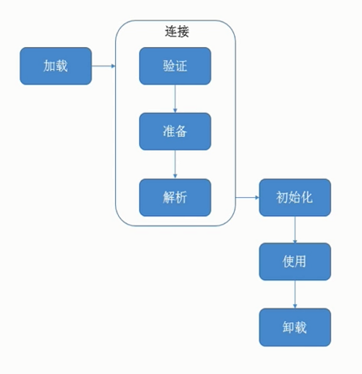
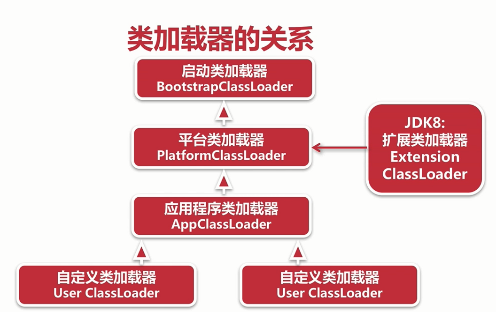

## 类加载

#### 简易流程


#### 说明
* 加载:查找并加载类文件的二进制数据
* 连接:就是将已经读入内存的类的二进制数据合并到VM运行时环境中去,包含如下几个步骤:
    * 验证:确保被加载类的正确性
    * 准备:为类的静态变量分配内存,并初始化它们【当前步骤还没有给其赋值】
    * 解析:把常量池中的符号引用转换成直接引用
    * 初始化:为类的静态变量赋初始值
    
#### 类加载要完成的功能
* 通过类的全限定名来获取该类的二进制字节流
* 把二进制字节流转化为方法区的运行时数据结构
* 在堆上创建一个java.lang.Class对象,用来封装类在方法区内的数据结构,并向外提供了访问方法区内数据结构的接口

#### 加载类的方式
* 最常见的方式:本地文件系统中加载、从jar等归档文件中加载
* 动态的方式:将java源文件动态编译成class【ASM】
* 其它方式:网络下载、从专有数据库中加载等等

## 类加载器

#### Java虚拟机自带的加载器包括如下几种:

* 启动类加载器( BootstrapClassLoader )
* 平台类加载器( PlatformClassLoader ) -> java8并没有此版本；JDK8:扩展类加载器( Extension ClassLoader )
* 应用程序类加载器( AppClassLoader )
* 用户自定义的加载器,是java.lang.ClassLoader的子类用户可以定制类的加载方式;只不过自定义类加载器其加载的顺序是在所有系统类加载器的最后

#### 加载器说明
* 启动类加载器:用于加载启动的基础模块类,比如:java.base, java.management, java.xml等等
* 平台类加载器:用于加载一些平台相关的模块,比如:java.scripting、java.compiler*、 java.corba*等等
* 应用程序类加载器:用于加载应用级别的模块,比如:jdk.compiler、 jdk.jartool, jdkjshell等等;还加载classpath路径中的所有类库

#### JDK8中类加载器说明
* JDK8 :启动类加载器:负责将<JAVA_HOME>/lib，或者Xbootclasspath参数指定的路径中的,且是虚拟机识别的类库加载到内存中(按照名字识别，比如rt.jar，对于不能识别的文件不予装载)
* JDK8 :扩展类加载器:负责加载<JREHOME>/lib/ext，或者java.ext.dirs系统变量所指定路径中的所有类库
* JDK8 :应用程序类加载器:负责加载classpath路径中的所有类库 
```java
class Test {

    public static void main(String[] args) throws ClassNotFoundException {
        String gudao = "test";
        // 启动类加载器
        System.out.println(gudao.getClass().getClassLoader());

        Class driver = Class.forName("sun.net.spi.nameservice.dns.DNSNameService");
        // 扩展类加载器
        System.out.println(driver.getClassLoader());

        Gudao gudaoClass = new Gudao();
        System.out.println(gudaoClass.getClass().getClassLoader());
    }

    static class Gudao{
        private String name;
    }
}
```

#### 加载器注意点
* Java程序不能直接引用启动类加载器,直接设置classLoader为null,默认就使用启动类加载器
* 类加载器并不需要等到某个类"首次主动使用"的时候才加载它,Jvm规范允许类加载器在预料到某个类将要被使用的时候就预先加载它
* 如果在加载的时候.class文件缺失,会在该类首次主动使用时报告LinkageError错误,如果一直没有被使用,就不会报错