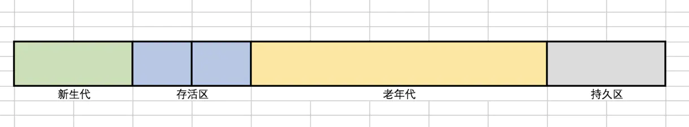

# GC和GC Tuning

### GC的基础知识
#### 什么是垃圾
> 没有任何引用指向的一个对象或者多个对象（循环引用）
* 没有引用的指向

* 多个对象（循环引用）

##### C语言
申请内存：malloc 
释放内存：free

##### C++
申请内存：new 
释放内存：delete

##### Java
申请内存：new 
释放内存：？【自动内存回收，编程上简单，系统不容易出错

##### 手动释放内存，容易出两种类型的问题
> 1. 忘记回收
> 2. 多次回收

#### 如何定位垃圾
1. 引用计数【不能解决循环引用，会出现内存泄漏】
    > 对象中添加一个引用计数器，如果引用计数器为0则表示没有其它地方在引用它。如果有一个地方引用就+1，引用失效时就-1。看似搞笑且简单的一个算法，实际上在大部分Java虚拟机中并没有采用这种算法，因为它会带来一个致命的问题——对象循环引用。对象A指向B，对象B反过来指向A，此时它们的引用计数器都不为0，但它们俩实际上已经没有意义因为没有任何地方指向它们。

2. 根可达算法【根搜索】
    > 这种算法可以有效地避免对象循环引用的情况，整个对象实例以一个树呈现，根节点是一个称为“GC Roots”的对象，从这个对象开始向下搜索并作标记，遍历完这棵树过后，未被标记的对象就会判断“已死”，即为可被回收的对象。

#### 常见的垃圾回收算法
1. 标记清除 
    > 等待被回收对象的“标记”过程在上文已经提到过，如果在被标记后直接对对象进行清除，会带来另一个新的问题——内存碎片化。如果下次有比较大的对象实例需要在堆上分配较大的内存空间时，可能会出现无法找到足够的连续内存而不得不再次触发垃圾回收。

    
    * 问题：位置不连续 产生碎片
2. 拷贝算法【Java堆中新生代的垃圾回收算法】
    > 复制算法把内存分为两部分，两部分大小相同，每次只使用其中一个。一块内存用完后，把活着的对象复制到另一块内存，当前内存块全部回收。这个算法不会产生内存碎片，但是可用内存明显变少。

    
    * 问题没有碎片，浪费空间
3. 标记压缩【或称为标记-整理算法，Java堆中老年代的垃圾回收算法】
    > 标记-整理算法与标记-清除算法类似，不同的是，不会直接对垃圾对象进行回收，而是把所有存活的对象都移动到一端，然后清理掉其他部分。
    * 问题：没有碎片，效率偏低
    
#### JVM内存分代模型（用于分代垃圾回收算法）
1. 部分垃圾回收器使用的模型
2. 新生代 + 老年代 + 永久代（1.7）/ 元数据区(1.8) Metaspace
   * 永久代 元数据 都是存放 Class
   * 区别：永久代必须指定大小限制 ，元数据可以设置，也可以不设置，无上限（受限于物理内存）
   * 区别：字符串常量 1.7 - 永久代，1.8 - 堆
   * MethodArea逻辑概念 - 对应 1.7的永久代/1.8的元数据
   
3. 新生代 = Eden + 2个suvivor区 
    > 在Java堆中被分为了新生代和老年代，这样的划分是方便GC。Java堆中的新生代就使用了GC复制算法。在新生代中又分为了三个区域：Eden 空间、To Survivor空间、From Survivor空间。
    

    新的对象实例被创建的时候通常在Eden空间，发生在Eden空间上的GC称为Minor GC，当在新生代发生一次GC后，会将Eden和其中一个Survivor空间的内存复制到另外一个Survivor中，如果反复几次有对象一直存活，此时内存对象将会被移至老年代。可以看到新生代中Eden占了大部分，而两个Survivor实际上占了很小一部分。这是因为大部分的对象被创建过后很快就会被GC（这里也许运用了是二八原则）
    
   1. YGC回收之后，大多数的对象会被回收，活着的进入s0
   2. 再次YGC，活着的对象eden + s0 -> s1
   3. 再次YGC，eden + s1 -> s0
   4. 年龄足够 -> 老年代 （有些老的回收器：15岁 使用CMS回收器： 6岁）
   5. s区装不下 -> 装不下的部分进入老年代
   
4. 老年代
   1. 顽固分子
   2. 老年代满了FGC Full GC
   
5. GC Tuning (Generation)【分代GC调优】
   1. 尽量减少FGC【服务器内存越大，回收效率越慢，会产生STW停顿现象】
   2. MinorGC = YGC
   3. MajorGC = FGC

#### 常见的垃圾回收器

1. Serial 年轻代 串行回收
2. PS 年轻代 并行回收
3. ParNew 年轻代 配合CMS的并行回收
4. SerialOld 
5. ParallelOld
6. ConcurrentMarkSweep 老年代 并发的， 垃圾回收和应用程序同时运行，降低STW的时间(200ms)
7. G1(10ms)
8. ZGC (1ms) PK C++
9. Shenandoah
10. Eplison

##### 现在主要调优的就是1，2，4，5【2，5常用】
1.8默认的垃圾回收：PS + ParallelOld

##### 需要掌握的回收器比较

| 收集器                | 串行、并行or并发 | 新生代/老年代 | 算法               | 目标         | 适用场景                                  |
| --------------------- | ---------------- | ------------- | ------------------ | ------------ | ----------------------------------------- |
| **Serial**            | 串行             | 新生代        | 复制算法           | 响应速度优先 | 单CPU环境下的Client模式                   |
| **Serial Old**        | 串行             | 老年代        | 标记-整理          | 响应速度优先 | 单CPU环境下的Client模式、CMS的后备预案    |
| **ParNew**            | 并行             | 新生代        | 复制算法           | 响应速度优先 | 多CPU环境时在Server模式下与CMS配合        |
| **Parallel Scavenge** | 并行             | 新生代        | 复制算法           | 吞吐量优先   | 在后台运算而不需要太多交互的任务          |
| **Parallel Old**      | 并行             | 老年代        | 标记-整理          | 吞吐量优先   | 在后台运算而不需要太多交互的任务          |
| **CMS**               | 并发             | 老年代        | 标记-清除          | 响应速度优先 | 集中在互联网站或B/S系统服务端上的Java应用 |
| **G1**                | 并发             | both          | 标记-整理+复制算法 | 响应速度优先 | 面向服务端应用，将来替换CMS               |

###### Serial收集器
> Serial，是单线程执行垃圾回收的。当需要执行垃圾回收时，程序会暂停一切手上的工作，然后单线程执行垃圾回收。
* 因为新生代的特点是对象存活率低，所以收集算法用的是复制算法，把新生代存活对象复制到老年代，复制的内容不多，性能较好。

> 单线程地好处就是减少上下文切换，减少系统资源的开销。但这种方式的缺点也很明显，在GC的过程中，会暂停程序的执行。若GC不是频繁发生，这或许是一个不错的选择，否则将会影响程序的执行性能。 对于新生代来说，区域比较小，停顿时间短，所以比较实用。

###### ParNew收集器
> ParNew同样用于新生代，是Serial的多线程版本，并且在参数、算法（同样是复制算法）上也完全和Serial相同。
* Par是Parallel的缩写，但它的并行仅仅指的是收集多线程并行，并不是收集和原程序可以并行进行。ParNew也是需要暂停程序一切的工作，然后多线程执行垃圾回收。

> 因为是多线程执行，所以在多CPU下，ParNew效果通常会比Serial好。但如果是单CPU则会因为线程的切换，性能反而更差。

###### Parallel Scavenge收集器
> 新生代的收集器，同样用的是复制算法，也是并行多线程收集。与ParNew最大的不同，它关注的是垃圾回收的吞吐量。
* 这里的吞吐量指的是 总时间与垃圾回收时间的比例。这个比例越高，证明垃圾回收占整个程序运行的比例越小。
* Parallel Scavenge收集器提供两个参数控制垃圾回收的执行：
    1. -XX:MaxGCPauseMillis，最大垃圾回收停顿时间。这个参数的原理是空间换时间，收集器会控制新生代的区域大小，从而尽可能保证回收少于这个最大停顿时间。简单的说就是回收的区域越小，那么耗费的时间也越小。所以这个参数并不是设置得越小越好。设太小的话，新生代空间会太小，从而更频繁的触发GC。
    2. -XX:GCTimeRatio，垃圾回收时间与总时间占比。这个是吞吐量的倒数，原理和MaxGCPauseMillis相同。
> 因为Parallel Scavenge收集器关注的是吞吐量，所以当设置好以上参数的时候，同时不想设置各个区域大小（新生代，老年代等）。可以开启**-XX:UseAdaptiveSizePolicy**参数，让JVM监控收集的性能，动态调整这些区域大小参数。

###### Serial Old收集器
> 老年代的收集器，与Serial一样是单线程，不同的是算法用的是标记-整理（Mark-Compact）。

> 因为老年代里面对象的存活率高，如果依旧是用复制算法，需要复制的内容较多，性能较差。并且在极端情况下，当存活为100%时，没有办法用复制算法。所以需要用Mark-Compact，以有效地避免这些问题。

###### Parallel Old收集器
> 老年代的收集器，是Parallel Scavenge老年代的版本。其中的算法替换成Mark-Compact。

###### CMS收集器
> CMS，Concurrent Mark Sweep，同样是老年代的收集器。它关注的是垃圾回收最短的停顿时间（低停顿），在老年代并不频繁GC的场景下，是比较适用的。
* 命名中用的是concurrent，而不是parallel，说明这个收集器是有与工作执行并发的能力的。MS则说明算法用的是Mark Sweep算法。
* CMS整个过程比之前的收集器要复杂，整个过程分为四步：
    * 初始标记（initial mark），单线程执行，需要“Stop The World”，但仅仅把GC Roots的直接关联可达的对象给标记一下，由于直接关联对象比较小，所以这里的速度非常快。
    * 并发标记（concurrent mark），对于初始标记过程所标记的初始标记对象，进行并发追踪标记，此时其他线程仍可以继续工作。此处时间较长，但不停顿。
    * 重新标记（remark），在并发标记的过程中，由于可能还会产生新的垃圾，所以此时需要重新标记新产生的垃圾。此处执行并行标记，与用户线程不并发，所以依然是“Stop The World”，时间比初始时间要长一点。
    * 并发清除（concurrent sweep），并发清除之前所标记的垃圾。其他用户线程仍可以工作，不需要停顿。

> 由于最耗费时间的并发标记与并发清除阶段都不需要暂停工作，所以整体的回收是低停顿的
* 缺点
    * Mark Sweep算法会导致内存碎片比较多
    * CMS的并发能力依赖于CPU资源，所以在CPU数少和CPU资源紧张的情况下，性能较差
    * 并发清除阶段，用户线程依然在运行，所以依然会产生新的垃圾，此阶段的垃圾并不会再本次GC中回收，而放到下次。所以GC不能等待内存耗尽的时候才进行GC，这样的话会导致并发清除的时候，用户线程可以了利用的空间不足。所以这里会浪费一些内存空间给用户线程预留。
###### 有人会觉得既然Mark Sweep会造成内存碎片，那么为什么不把算法换成Mark Compact呢？
> 答案其实很简答，因为当并发清除的时候，用Compact整理内存的话，原来的用户线程使用的内存还怎么用呢？要保证用户线程能继续执行，前提的它运行的资源不受影响嘛。Mark Compact更适合“Stop the World”这种场景下使用

###### G1收集器
> G1，Garbage First，在JDK 1.7版本正式启用，是当时最前沿的垃圾收集器。G1可以说是CMS的终极改进版，解决了CMS内存碎片、更多的内存空间登问题。虽然流程与CMS比较相似，但底层的原理已是完全不同。
* 高效益优先。G1会预测垃圾回收的停顿时间，原理是计算老年代对象的效益率，优先回收最大效益的对象。
* 堆内存结构的不同。以前的收集器分代是划分新生代、老年代、持久代等。

* G1则是把内存分为多个大小相同的区域Region，每个Region拥有各自的分代属性，但这些分代不需要连续。

这样的分区可以有效避免内存碎片化问题。但是这样同样会引申一个新的问题，就是分代的内存不连续，导致在GC搜索垃圾对象的时候需要全盘扫描找出引用内存所在。为了解决这个问题，G1对于每个Region都维护一个Remembered Set，用于记录对象引用的情况。当GC发生的时候根据Remembered Set的引用情况去搜索。
    * 两种GC模式：
        * Young GC，关注于所有年轻代的Region，通过控制收集年轻代的Region个数，从而控制GC的回收时间。
        * Mixed GC，关注于所有年轻代的Region，并且加上通过预测计算最大收益的若干个老年代Region。
    * 整体的执行流程：
        * 初始标记（initial mark），标记了从GC Root开始直接关联可达的对象。STW（Stop the World）执行。
        * 并发标记（concurrent marking），并发标记初始标记的对象，此时用户线程依然可以执行。
        * 最终标记（Remark），STW，标记再并发标记过程中产生的垃圾。
        * 筛选回收（Live Data Counting And Evacuation），评估标记垃圾，根据GC模式回收垃圾。STW执行。

在Region层面上，整体的算法偏向于Mark-Compact。因为是Compact，会影响用户线程执行，所以回收阶段需要STW执行。

###### ZGC
> 在JDK 11当中，加入了实验性质的ZGC。它的回收耗时平均不到2毫秒。它是一款低停顿高并发的收集器。
* ZGC几乎在所有地方并发执行的，除了初始标记的是STW的。所以停顿时间几乎就耗费在初始标记上，这部分的实际是非常少的。那么其他阶段是怎么做到可以并发执行的呢？
* ZGC主要新增了两项技术
    > 一个是着色指针Colored Pointer，另一个是读屏障Load Barrier。
    * 着色指针Colored Pointer
        > ZGC利用指针的64位中的几位表示Finalizable、Remapped、Marked1、Marked0（ZGC仅支持64位平台），以标记该指向内存的存储状态。相当于在对象的指针上标注了对象的信息。注意，这里的指针相当于Java术语当中的引用。在这个被指向的内存发生变化的时候（内存在Compact被移动时），颜色就会发生变化。在G1的时候就说到过，Compact阶段是需要STW，否则会影响用户线程执行。那么怎么解决这个问题呢？
    * 读屏障Load Barrier
        > 由于着色指针的存在，在程序运行时访问对象的时候，可以轻易知道对象在内存的存储状态（通过指针访问对象），若请求读的内存在被着色了。那么则会触发读屏障。读屏障会更新指针再返回结果，此过程有一定的耗费，从而达到与用户线程并发的效果。
* 把这两项技术联合下理解，引用R大（RednaxelaFX）的话
> 与标记对象的传统算法相比，ZGC在指针上做标记，在访问指针时加入Load Barrier（读屏障），比如当对象正被GC移动，指针上的颜色就会不对，这个屏障就会先把指针更新为有效地址再返回，也就是，永远只有单个对象读取时有概率被减速，而不存在为了保持应用与GC一致而粗暴整体的Stop The World。

ZGC虽然目前还在JDK 11还在实验阶段，但由于算法与思想是一个非常大的提升，相信在未来不久会成为主流的GC收集器使用。

#### JVM调优第一步，了解生产环境下的垃圾回收器组合

* JVM的命令行参数参考：https://docs.oracle.com/javase/8/docs/technotes/tools/unix/java.html

* JVM参数分类

  > 标准： - 开头，所有的HotSpot都支持
  >
  > 非标准：-X 开头，特定版本HotSpot支持特定命令
  >
  > 不稳定：-XX 开头，下个版本可能取消

  -XX:+PrintCommandLineFlags 命令行参数【可以查看生产环境中的javaGC的配置】

  -XX:+PrintFlagsFinal 最终参数值

  -XX:+PrintFlagsInitial 默认参数值

### 参考资料

1. [https://blogs.oracle.com/](https://blogs.oracle.com/jonthecollector/our-collectors)[jonthecollector](https://blogs.oracle.com/jonthecollector/our-collectors)[/our-collectors](https://blogs.oracle.com/jonthecollector/our-collectors)
2. https://docs.oracle.com/javase/8/docs/technotes/tools/unix/java.html
3. http://java.sun.com/javase/technologies/hotspot/vmoptions.jsp