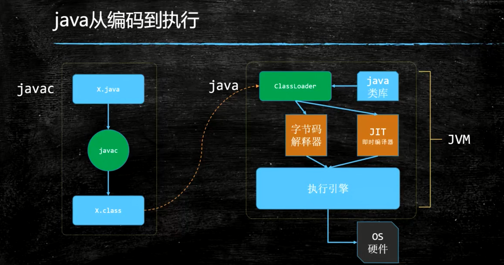
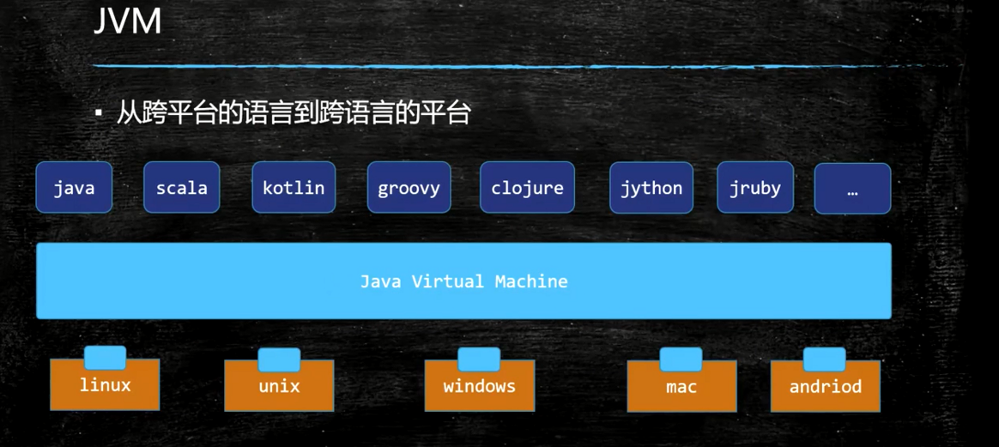
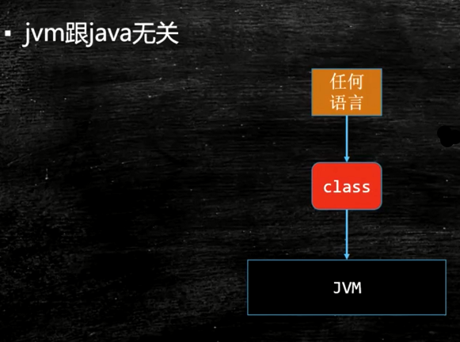
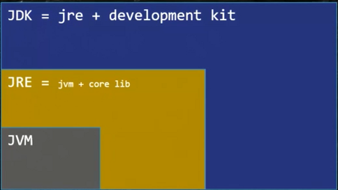

## JVM入门

#### Java从编码到执行

#### Java是解释执行的还是编译执行的？
> 其实java是解释和编译可以混合执行的【解释通过字节码解释器，编译通过jit即时执行器{代码用到的特别多就会通过JIT即时执行}】

#### JVM支持的语言【大概有100多种】

#### 注意
JVM与class文件有关、与java无关，只要class文件满足了JVM的规范，就能在JVM中执行

jvm是一种规范
> java virtual machine specifications 
<https://docs.oracle.com/en/java/javase/13/> 
<https://docs.oracle.com/iavase/specs/index.html> 

#### JVM是虚构出来的一台计算机 
字节码指令集(汇编语言) 
内存管理:栈堆方法区等

#### 常见的JVM实现
* Hotspot 
    * oracle官方,我们做实验用的 VM 
    * java-version 
* TaobaoVM 
    * hotspot深度定制版 
* LiquidVM 
    * 直接针对硬件 
* Jrockit 
    * BEA,曾经号称世界上最快的 JVM，被Oracle收购,合并于hotspot 
* J9
    * IBM 
* azul zing 
    * 最新垃圾回收的业界标杆 www.azul.com 
* Microsoft VM

#### JVM JRE JDK区别
