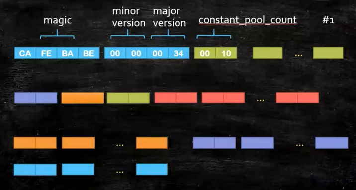

## ClassFileFormat
* 二进制字节流
* 数据类型: u1 u2 u4 u8和_info (表类型)
    * _info的来源是hotspot源码中的写法
* 查看16进制格式的ClassFile
    * sublime / notepad 
    * IDEA插件-BinEd
* 有很多可以观察ByteCode的方法:
    * javap
    * JBE-可以直接修改
    * JClassLib-IDEA插件
    
* classFile构成
```shell
ClassFile { 
    u4 magic; 
    u2 minor_version; 
    u2 major_version; 
    u2 constant_pool_count; 
    cp_info constant_pool [constant_pool_count-1]; 
    u2 
}
```
#### 初步组成阅读

#### 命令行直接查看class文件详情
`javap -v class文件绝对路径`

