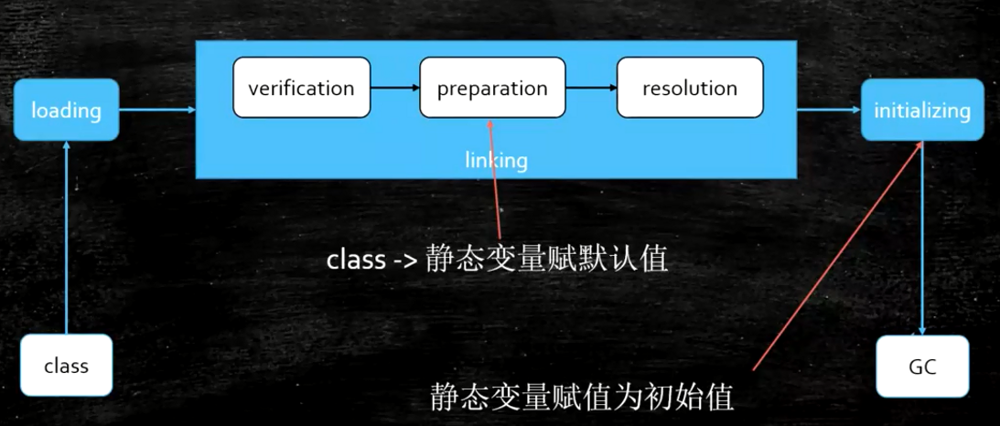
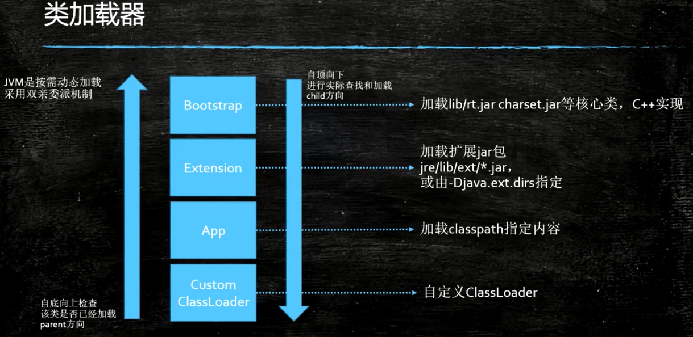

## 类加载&初始化

#### 加载过程

1. Loading
    > 加载到内存      
2. Linking  
    1. Verification
        > 验证文件是否符合JVM规定
    2. Preparation
        > 静态成员变量赋默认值
    3. Resolution
        > 将类、方法、属性等符号引用解析为直接引用，常量池中的各种符号引用解析为指针、偏移量等内存地址的直接引用   
3. Initializing
    > 调用类初始化代码 <clinit>，给静态成员变量赋初始值
    
#### 内加载器
