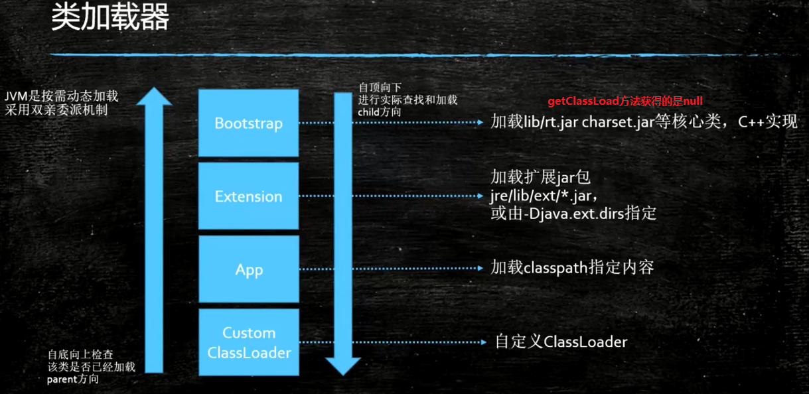

## 类加载&初始化

### 加载过程

1. Loading
    > 加载到内存      
2. Linking  
    1. Verification：校验
        > 验证文件是否符合JVM规定
    2. Preparation 
        > 静态成员变量赋默认值
    3. Resolution：解析（protected Class<?> loadClass(String name, boolean resolve)中的resolve为true就对其进行解析，反之不解析）
        > 将类、方法、属性等符号引用解析为直接引用，常量池中的各种符号引用解析为指针、偏移量等内存地址的直接引用   
3. Initializing
    > 调用类初始化代码 < >，给静态成员变量赋初始值
    
### 内加载器

* 注意：
    * 因为Bootstrap类加载器是使用C语言实现的，所有在java中找不到，就会返回nul
    * 加载器之间不是继承关系
    
### 关于类加载过程的面试题目：preparation阶段（静态变量赋默认值），initalizing（静态变量赋初始值）
```java
public class ClassLoadingProcedure {
    public static void main(String[] args) {
        System.out.println(T.count);
    }
}

class T {
    public static T t = new T(); // null
    public static int count = 2; //0

    //private int m = 8;

    private T() {
        count ++;
        //System.out.println("--" + count);
    }
}
```
#### 结果说明
* `public static T t = new T()`在上面，结果为2
  * 先初始化；实例化T，调用无参T()，count变为1，然而通过`public static int count = 2`count二次被赋值，结果为2
* `public static int count = 2`在上面，结果为3
  * 初始化；通过`public static int count = 2`count被赋值为2，实例化T，调用无参构造，count进行++，变为3
    
#### 总结
* load（加载class）：赋默认值 -> 赋初始值
* new Object（创建对象）：申请内存空间 -> 赋默认值 -> 赋初始值