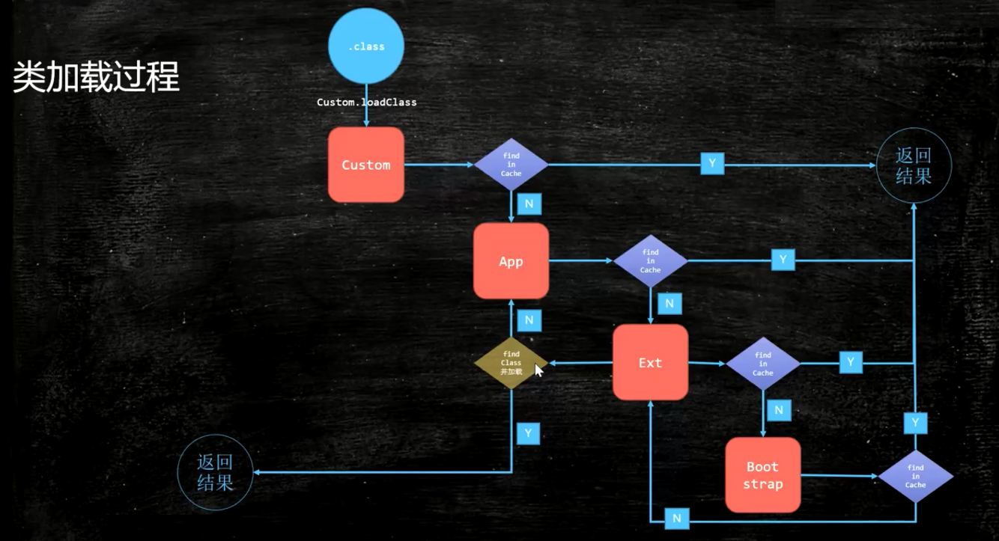

## 双亲委派机制

### 双亲委派机制说明
> 先从子到父，再由父到子的过程 


* 某个特定的类加载器在接到加载类的请求时，首先将加载任务委托给父类加载（让父类加载器去内存中去查找需要加载的类，如果在内存中找到了需要加载的类，那就成功返回；如果在内存中没有找到，当前类加载器会将加载任务委托给它的父类），依次递归。最后找到顶级加载器Bootstrap时，还是没有在内存中找到的话，Bootstrap加载器会委托它下一级加载器（Ext）去找到这个class文件，进行加载；如果Ext不能加载的话，Ext加载器也会委托它的下级加载器去找class文件加载，依次递归
    * 注意：加载器先回找它的父加载器去**内存**中查找，直到Bootstrap加载器也没子在内存中找到；此时会向下委托，去找class文件加载，返回；如果最后还是没有找到。就会抛出一个ClassNotFoundException异常。


### 使用双亲委派机制可以解决的问题
* 安全问题（主要问题）
> 通过双亲委派机制将JDK中的主要类加载到内存中去了，防止了用户写同样的类（做手脚：木马、替换JDK中自带的String类，通过自己写的String类中的方法在用户登陆时候，将账号密码的String字符串信息发送到自己手机上）来替换到JDK中的类文件，但使用双亲委派机制之后了，会看看内存中有没有加载过，加载过直接将内存中的那类返回

* 资源消耗（次要问题）
> 当资源已经加载过一次后，通过双亲委派机制直接去内存中去找，避免了资源重新加载的问题

### 双亲委派机制如何打破
> 双亲委派机制逻辑顺序在ClassLoader类中的loadClass()方法中被写死的
* 打破双亲委派机制，也就只能重写ClassLoader中的loadClass方法

### 需要打破双亲委派机制的情况
1. JDK1.2之前，自定义的ClassLoader都必须重写loadClass方法（当时的JDK还没有模板方法（findClass）来实现双亲委派机制）
2. ThreadContextClassLoader可以实现基础类调用实现类代码，通过`thread.setContextClassLoader`指定
3. 热启动，热部署
  * osgi tomcat都有自己的模块指定classlasder（可以加载统一类库的不同版本）

### 简单实现热加载
> Hello类在【MSB007】classloader源码.md中查看如何实现
```java
public class ClassLoaderTest {
    private static class MyLoader extends ClassLoader {
        @Override
        public Class<?> loadClass(String name) throws ClassNotFoundException {

            File f = new File("C:/work/ijprojects/JVM/out/production/JVM/" + name.replace(".", "/").concat(".class"));

            if(!f.exists()) return super.loadClass(name);

            try {

                InputStream is = new FileInputStream(f);

                byte[] b = new byte[is.available()];
                is.read(b);
                return defineClass(name, b, 0, b.length);
            } catch (IOException e) {
                e.printStackTrace();
            }

            return super.loadClass(name);
        }
    }

    public static void main(String[] args) throws Exception {
        MyLoader m = new MyLoader();
        Class clazz = m.loadClass("com.gudao.jvm.Hello");

        m = new MyLoader();
        Class clazzNew = m.loadClass("com.gudao.jvm.Hello");

        System.out.println(clazz == clazzNew);// false
    }
}
```