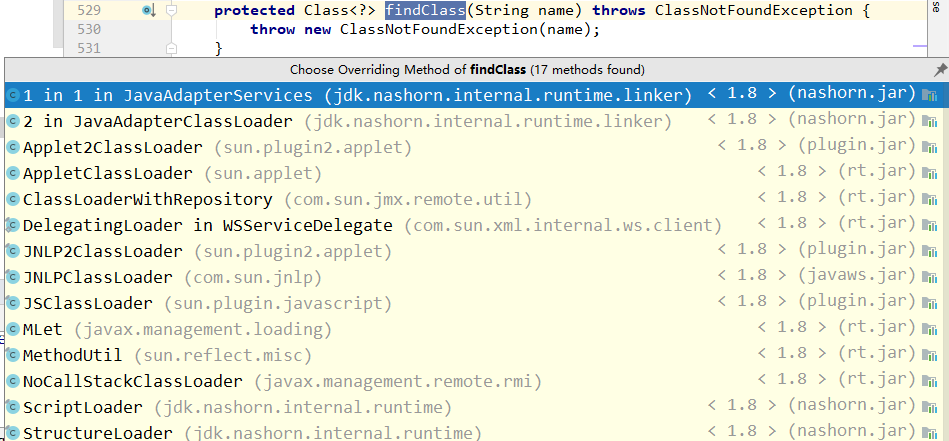

## ClassLoader源码解析

### 类加载器原理说明
> 类加载器之间寻找到需要的类，是通过加载器之间的双亲委派机制来实现的：双亲委派机制请看【MSB005】双亲委派机制.md

### 源码说明

#### 创建一个需要加载的实体类，实体类位置：com.gudao.jvm.Hello
```java
public class Hello {
    public void method() {
        System.out.println("Hello JVM!");
    }
}
```

#### 自定义一个类加载器，来加载自己写的实体
* 自定义的类加载器只要继承ClassLoader，并且重写findClass方法（（该方法使用了模版模式））即可
```java
public class MyClassLoader extends ClassLoader {

    @Override
    protected Class<?> findClass(String name) throws ClassNotFoundException {
        File f = new File("c:/test/", name.replace(".", "/").concat(".class"));
        try {
            FileInputStream fis = new FileInputStream(f);
            ByteArrayOutputStream baos = new ByteArrayOutputStream();
            int b = 0;

            while ((b=fis.read()) !=0) {
                baos.write(b);
            }

            byte[] bytes = baos.toByteArray();
            baos.close();
            fis.close();//可以写的更加严谨

            return defineClass(name, bytes, 0, bytes.length);
        } catch (Exception e) {
            e.printStackTrace();
        }
        return super.findClass(name); //throws ClassNotFoundException
    }
}
```

#### 通过main函数实现类的加载并阅读源码
```java
public static void main(String[] args) throws Exception {
    // 创建classLoader对象
    MyClassLoader myClassLoader = new MyClassLoader();
    // 让ClassLoader通过路径加载Hello.class
    Class clazz = myClassLoader.loadClass("com.gudao.jvm.Hello");
}
```

#### ClassLoader中的loadClass方法
```java
public Class<?> loadClass(String name) throws ClassNotFoundException {
    return loadClass(name, false);
}
```
#### 调用自己类中受保护的localClass方法
```java
protected Class<?> loadClass(String name, boolean resolve) throws ClassNotFoundException{
    // 首先，实现加锁操作
    synchronized (getClassLoadingLock(name)) {
        // 向内存中查看，这个class有没有已经被加载到内存中
        Class<?> c = findLoadedClass(name);
        // 在内存中没有找到
        if (c == null) {
            long t0 = System.nanoTime();
            try {
                // 判断当前加载器是不是顶级类加载器
                if (parent != null) {
                    // 不是的话，直接调用父类加载器的loadClass方法（此处就相当于一个递归操作，但跟递归又有些不同）
                    // 注意：parent函数是使用final来修饰的，所以这个双亲委派机制的顺序已经被写死了
                    c = parent.loadClass(name, false);
                } else {
                    // null一般就代表Bootstrap加载器，如果是顶级类加载器的话，因为Bootstrap是通过C语言实现的，所以会通过findBootstrapClassOrNull -> findBootstrapClass -> private native Class<?> findBootstrapClass(String name); 来调用C语言代码
                    c = findBootstrapClassOrNull(name);
                }
            } catch (ClassNotFoundException e) {
                // ClassNotFoundException thrown if class not found
                // from the non-null parent class loader
            }
            
            if (c == null) {
                // If still not found, then invoke findClass in order
                // to find the class.
                long t1 = System.nanoTime();
                // 到自己对应的加载class中寻找，有没有改类，有就加载返回，没有返回null，再看子加载器中有没有
                c = findClass(name);

                // this is the defining class loader; record the stats
                sun.misc.PerfCounter.getParentDelegationTime().addTime(t1 - t0);
                sun.misc.PerfCounter.getFindClassTime().addElapsedTimeFrom(t1);
                sun.misc.PerfCounter.getFindClasses().increment();
            }
        }
        if (resolve) {
            resolveClass(c);
        }
        // 内存中找到直接返回
        return c;
    }
}
```

#### findClass方法说明（模板方法，每个类加载器都会实现一个自己的findClass方法）

##### AppClassLoad
```java
protected Class findClass(String var1) throws ClassNotFoundException {
    int var2 = var1.indexOf(";");
    String var3 = "";
    if (var2 != -1) {
        var3 = var1.substring(var2, var1.length());
        var1 = var1.substring(0, var2);
    }

    try {
        return super.findClass(var1);
    } catch (ClassNotFoundException var8) {
        if (!this.codebaseLookup) {
            throw new ClassNotFoundException(var1);
        } else {
            String var4 = ParseUtil.encodePath(var1.replace('.', '/'), false);
            final String var5 = var4 + ".class" + var3;

            try {
                byte[] var6 = (byte[])((byte[])AccessController.doPrivileged(new PrivilegedExceptionAction() {
                    public Object run() throws IOException {
                        try {
                            URL var1 = new URL(AppletClassLoader.this.base, var5);
                            return AppletClassLoader.this.base.getProtocol().equals(var1.getProtocol()) && AppletClassLoader.this.base.getHost().equals(var1.getHost()) && AppletClassLoader.this.base.getPort() == var1.getPort() ? AppletClassLoader.getBytes(var1) : null;
                        } catch (Exception var2) {
                            return null;
                        }
                    }
                }, this.acc));
                if (var6 != null) {
                    return this.defineClass(var1, var6, 0, var6.length, this.codesource);
                } else {
                    throw new ClassNotFoundException(var1);
                }
            } catch (PrivilegedActionException var7) {
                throw new ClassNotFoundException(var1, var7.getException());
            }
        }
    }
}
```

#### 到此处的逻辑梳理
1. 如果子类委派父类去内存中查询需要加载的类：每当执行到c = parent.loadClass(name, false);的时候，就会调用父加载器的同样的方法，如果父加载器还不是顶级加载器，还会继续调用父加载器的父加载器，形成递归
2. 此时，所有的加载器都没有在自己指定的内存中查询到需要加载的类，那么每个加载器都会执行findClass方法，最顶级的加载器指派下一层加载器去指定路口下查找class文件加载（此时已经不是在内存中寻找了）
3. 如果找到就返回，最后到最小的（自定义加载器）还没有找到，就会返回ClassNotFoundException异常了


### ClassLoader中的parent（父类加载器）的指派
#### 在`MyClassLoader myClassLoader = new MyClassLoader();`中调用了MyClassLoader的构造函数
```java

```