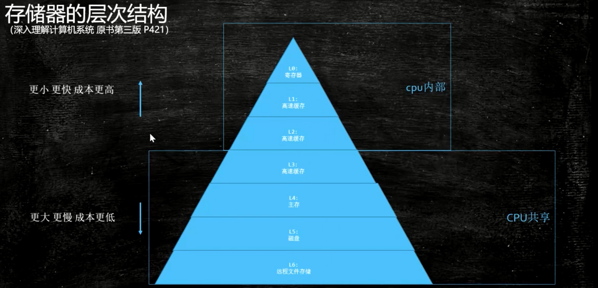
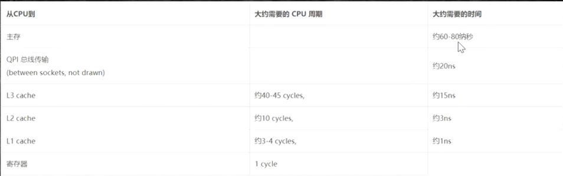
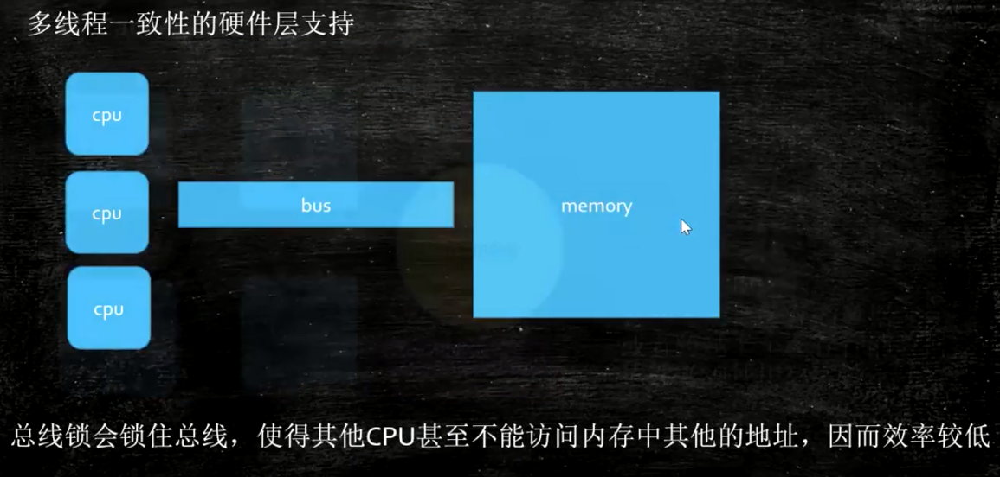
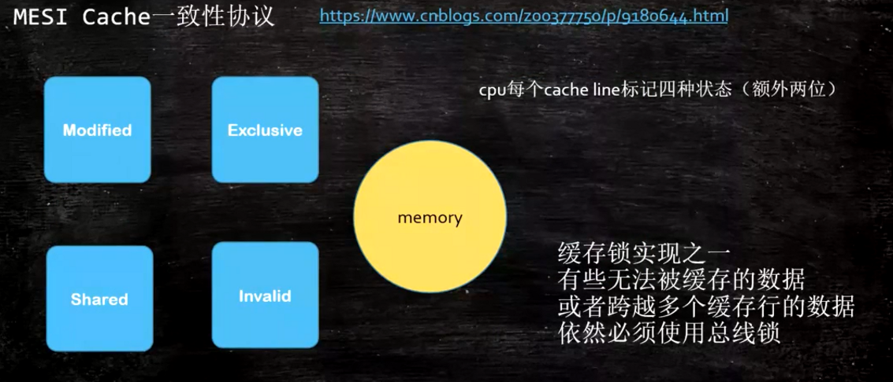

## JMM 内存模型说明

### 存储器的层次结构


#### 各层级间效率对比


### cache line的概念，缓存行对齐，伪共享（下图主要说明数据不一致问题）


#### 数据不一致解决方案
* 添加总线锁（在cpu去访问L3 Cache时，对总线进行加锁，让其它cpu不能访问）<br>
  
    * 降低效率
    
* MESI Cache一致性协议（硬件层一致性协议，有很多，英特尔的使用的是MESI）<br>
  > 通过协议来控制各个CPU中的缓存保持一致性
  [MESI](https://www.cnblogs.com/z00377750/p/9180644.html)
  
    * 数据更改过，标记为Modified
    * 数据被独享，标记为Exclusive
    * 数据为共享，标记为Shared
    * 如果当前CPU读的数据被其它CPU修改过，当前CPU就会标记为Invalid（修改数据的那个CPU会标记为Modified）

* 现代CPU一致性协议还是通过缓存锁（MESI等一致性协议）+总线锁来实现的，总线锁的问题还是没有被彻底解决

#### 缓存行，伪共享问题
> 缓存行：读取缓存以cache line为基本单位,目前64bytes
* 伪共享问题：位于同一缓存行的两个不同数据,被两个不同CPU锁定,产生互相影响的伪共享问题

##### 代码案例
```java
// 数组中的两个对象位于同一行缓存行（执行效率较低）
public class CacheLinePaddingOneLine {
    private static class T {
        public volatile long x = 0L;
    }

    public static T[] arr = new T[2];

    static {
        arr[0] = new T();
        arr[1] = new T();
    }

    public static void main(String[] args) throws Exception {
        Thread t1 = new Thread(()->{
            for (long i = 0; i < 1000_0000L; i++) {
                arr[0].x = i;
            }
        });

        Thread t2 = new Thread(()->{
            for (long i = 0; i < 1000_0000L; i++) {
                arr[1].x = i;
            }
        });

        final long start = System.nanoTime();
        t1.start();
        t2.start();
        t1.join();
        t2.join();
        System.out.println((System.nanoTime() - start)/100_0000);
    }
}
```
```java
// 数组中的两个对象不位于同一行缓存行
public class CacheLinePaddingWithOutOneLine {
    private static class Padding {
        // 此时的Padding长度就是 7 * 8 byte，加一个long类型的x值就会独占一行缓存行，提升效率
        public volatile long p1, p2, p3, p4, p5, p6, p7;
    }

    private static class T extends Padding {
        public volatile long x = 0L;
    }

    public static T[] arr = new T[2];

    static {
        arr[0] = new T();
        arr[1] = new T();
    }

    public static void main(String[] args) throws Exception {
        Thread t1 = new Thread(()->{
            for (long i = 0; i < 1000_0000L; i++) {
                arr[0].x = i;
            }
        });

        Thread t2 = new Thread(()->{
            for (long i = 0; i < 1000_0000L; i++) {
                arr[1].x = i;
            }
        });

        final long start = System.nanoTime();
        t1.start();
        t2.start();
        t1.join();
        t2.join();
        System.out.println((System.nanoTime() - start)/100_0000);
    }
}
```
* 总结：使用缓存行对齐就能够提高效率
