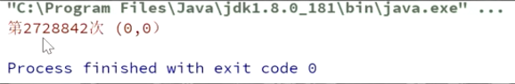
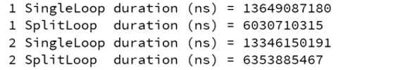

## CPU的读等待同时指令执行
### CPU乱序执行的根源
[CPU乱序的根源](https://www.cnblogs.com/liushaodong/p/4777308.html)<br>
* CPU为了提高执行效率，会在读指令的同时可以执行不影响的其他指令（比如去内存中读取数据【去内存读数据比CPU执行慢100倍】），前提是两条指令没有依赖关系； 

```java
public class T04_Disorder {
    private static int x = 0, y = 0;
    private static int a = 0, b =0;

    public static void main(String[] args) throws InterruptedException {
        int i = 0;
        for(;;) {
            i++;
            x = 0; y = 0;
            a = 0; b = 0;
            Thread one = new Thread(new Runnable() {
                public void run() {
                    //由于线程one先启动，下面这句话让它等一等线程two. 读着可根据自己电脑的实际性能适当调整等待时间.
                    //shortWait(100000);
                    a = 1;
                    x = b;
                }
            });

            Thread other = new Thread(new Runnable() {
                public void run() {
                    b = 1;
                    y = a;
                }
            });

          /**
           * 如此情况下，CPU没有为提高效率而进行指令重拍的话，x，y的结果只能为0 1，1 0， 1 1 不会出现 0 0 的情况，出现了说明指令重排了
           * 不管哪个线程先被执行，要么a先被赋值为1，要么b被赋值为1，所以不指令重排的话就不会出现0 0 的情况
           */
        
          one.start();other.start();
            one.join();other.join();
            String result = "第" + i + "次 (" + x + "," + y + "）";
            if(x == 0 && y == 0) {
                System.err.println(result);
                break;
            } else {
                //System.out.println(result);
            }
        }
    }
    
    public static void shortWait(long interval){
        long start = System.nanoTime();
        long end;
        do{
            end = System.nanoTime();
        }while(start + interval >= end);
    }
}
```


* 而写的同时可以同时进行写合并，这样就是CPU执行乱序[CPU乱序的根源中有说明]
    * WCBuffer（4个位置byte）
```java
public final class WriteCombining {

    private static final int ITERATIONS = Integer.MAX_VALUE;
    private static final int ITEMS = 1 << 24;
    private static final int MASK = ITEMS - 1;

    private static final byte[] arrayA = new byte[ITEMS];
    private static final byte[] arrayB = new byte[ITEMS];
    private static final byte[] arrayC = new byte[ITEMS];
    private static final byte[] arrayD = new byte[ITEMS];
    private static final byte[] arrayE = new byte[ITEMS];
    private static final byte[] arrayF = new byte[ITEMS];

    public static void main(final String[] args) {

        for (int i = 1; i <= 3; i++) {
            System.out.println(i + " SingleLoop duration (ns) = " + runCaseOne());
            System.out.println(i + " SplitLoop  duration (ns) = " + runCaseTwo());
        }
    }

    public static long runCaseOne() {
        long start = System.nanoTime();
        int i = ITERATIONS;

        while (--i != 0) {
            int slot = i & MASK;
            byte b = (byte) i;
            arrayA[slot] = b;
            arrayB[slot] = b;
            arrayC[slot] = b;
            arrayD[slot] = b;
            arrayE[slot] = b;
            arrayF[slot] = b;
        }
        return System.nanoTime() - start;
    }

    public static long runCaseTwo() {
        long start = System.nanoTime();
        int i = ITERATIONS;
        while (--i != 0) {
            int slot = i & MASK;
            // b 会占用WCBuffer中的一个byte，此时刚好四位，通过合并写的化不用其它处理逻辑，执行会变快
            byte b = (byte) i;
            arrayA[slot] = b;
            arrayB[slot] = b;
            arrayC[slot] = b;
        }
        i = ITERATIONS;
        while (--i != 0) {
            int slot = i & MASK;
            byte b = (byte) i;
            arrayD[slot] = b;
            arrayE[slot] = b;
            arrayF[slot] = b;
        }
        return System.nanoTime() - start;
    }
}
```
#### 两次执行效率对比


### 必须使用Memory Barrier来做好指令重排序
* volatile的底层就是这么实现的（windows是lock指令）

### 如何保证特定情况下不乱序
#### CPU内存屏障（下面的是英特尔的，不同的CPU内存屏障也不一样）
* sfence：在sfence指令前的写操作当必须在sfence指令后的写操作前完成
* lfenec：在lfence指令前的读操作当必须在lfence指令后的读操作前完成
* mfence：在mfence指令前的读写操作当必须在mfence指令后的读写操作前完成

#### lock汇编指令（英特尔）
原子指令,如x86上的" lock "指令是一个Full Barrier，执行时会锁住内存子系统来确保执行顺序，甚至跨多个CPU。 Software Locks通常使用了内存屏障或原子指令来实现变量可见性和保持程序顺序

