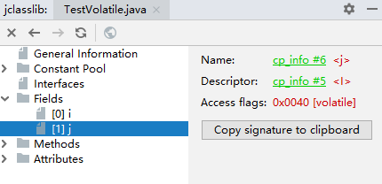
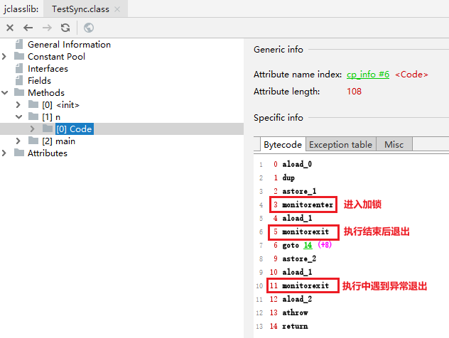

## Volatile&Synchronized实现细节

### Volatile
```
public class TestVolatile {
    int i;
    volatile int j;
}
```

#### 字节码层面
ACC_VOLATILE
#### JVM层面
* volatile内存区的读写都加屏障
* 写操作
```text
StoreStoreBarrier
volatile写操作
StoreLoadBarrier
```
* 读操作
```text
LoadLoadBarrier
volatile写操作
LoadStoreBarrier
```
#### OS和硬件层面
* 使用hsdis HotSpot Dis Assembler《hotspot凡汇编，jvm的反汇编》
[硬件测试](https://blog.csdn.net/qq_26222859/article/details/52235930)
* windows中就是用lock实现的

### Synchronized
```java
public class TestSync {
    void n() {
        synchronized (this) {

        }
    }
}
```

#### 字节码层面
* ACCESS_SYNCHRONIZED       
* monitorenter
* monitorexit
#### JVM层面
* C C++调用了操作系统提供的同步机制
#### OS和硬件程序
* x86中 lock cmpxchg xxxxx 
  * cmpchg：将区域锁定，只能让自己修改
[lock cmpxchg实现](https://blog.csdn.net/21aspnet/article/details/88571740)

