# kubeadm部署单Master节点kubernetes集群 1.21                                     

# 一、kubernetes 1.21发布

## 1.1 介绍

2021年04月，Kubernetes 1.21正式与大家见面，这是我们 2021 年的第一个版本！这个版本包含 51 个增强功能：13 个增强功能升级为稳定版，16 个增强功能升级为 beta 版，20 个增强功能进入 alpha 版，还有 2 个功能已经弃用。

## 1.2 主要变化

- CronJobs 毕业到稳定！

自 Kubernetes 1.8 以来，CronJobs一直是一个测试版功能！在 1.21 中，我们终于看到这个广泛使用的 API 毕业到稳定。

CronJobs 用于执行定期计划的操作，如备份、报告生成等。每个任务都应该被配置为无限期地重复出现（例如：一天/一周/一个月）；你可以在该间隔内定义作业应该启动的时间点。

- 不可变的 Secrets 和 ConfigMaps

Immutable Secrets和ConfigMaps为这些资源类型添加了一个新字段，如果设置了该字段，将拒绝对这些对象的更改。默认情况下，Secrets 和 ConfigMaps 是可变的，这对能够使用更改的 pod 是有益的。如果将错误的配置推送给使用它们的 pod，可变的 Secrets 和 ConfigMaps 也会导致问题。

通过将 Secrets 和 ConfigMaps 标记为不可变的，可以确保应用程序配置不会改变。如果你希望进行更改，则需要创建一个新的、唯一命名的 Secret 或 ConfigMap，并部署一个新的 pod 来消耗该资源。不可变资源也有伸缩性优势，因为控制器不需要轮询 API 服务器来观察变化。

这个特性在 Kubernetes 1.21 中已经毕业到稳定。

- IPv4/IPv6 双栈支持

IP 地址是一种可消耗的资源，集群操作人员和管理员需要确保它不会耗尽。特别是，公共 IPv4 地址现在非常稀少。双栈支持使原生 IPv6 路由到 pod 和服务，同时仍然允许你的集群在需要的地方使用 IPv4。双堆栈集群网络还改善了工作负载的可能伸缩限制。

Kubernetes 的双栈支持意味着 pod、服务和节点可以获得 IPv4 地址和 IPv6 地址。在 Kubernetes 1.21 中，双栈网络已经从 alpha 升级到 beta，并且已经默认启用了。

- 优雅的节点关闭

在这个版本中，优雅的节点关闭也升级到测试版（现在将提供给更大的用户群）！这是一个非常有益的特性，它允许 kubelet 知道节点关闭，并优雅地终止调度到该节点的 pod。

目前，当节点关闭时，pod 不会遵循预期的终止生命周期，也不会正常关闭。这可能会在许多不同的工作负载下带来问题。接下来，kubelet 将能够通过 systemd 检测到即将发生的系统关闭，然后通知正在运行的 pod，以便它们能够尽可能优雅地终止。

- PersistentVolume 健康监测器

持久卷（Persistent Volumes，PV）通常用于应用程序中获取本地的、基于文件的存储。它们可以以许多不同的方式使用，并帮助用户迁移应用程序，而不需要重新编写存储后端。

Kubernetes 1.21 有一个新的 alpha 特性，允许对 PV 进行监视，以了解卷的运行状况，并在卷变得不健康时相应地进行标记。工作负载将能够对运行状况状态作出反应，以保护数据不被从不健康的卷上写入或读取。

- 减少 Kubernetes 的构建维护

以前，Kubernetes 维护了多个构建系统。这常常成为新贡献者和当前贡献者的摩擦和复杂性的来源。

在上一个发布周期中，为了简化构建过程和标准化原生的 Golang 构建工具，我们投入了大量的工作。这应该赋予更广泛的社区维护能力，并降低新贡献者进入的门槛。


## 1.3 重大变化

- 弃用 PodSecurityPolicy

在 Kubernetes 1.21 中，PodSecurityPolicy 已被弃用。与 Kubernetes 所有已弃用的特性一样，PodSecurityPolicy 将在更多版本中继续可用并提供完整的功能。先前处于测试阶段的 PodSecurityPolicy 计划在 Kubernetes 1.25 中删除。

接下来是什么？我们正在开发一种新的内置机制来帮助限制 Pod 权限，暂定名为“PSP 替换策略”。我们的计划是让这个新机制覆盖关键的 PodSecurityPolicy 用例，并极大地改善使用体验和可维护性。

- 弃用 TopologyKeys

服务字段 topologyKeys 现在已弃用；所有使用该字段的组件特性以前都是 alpha 特性，现在也已弃用。我们用一种实现感知拓扑路由的方法替换了 topologyKeys，这种方法称为感知拓扑提示。支持拓扑的提示是 Kubernetes 1.21 中的一个 alpha 特性。你可以在拓扑感知提示中阅读关于替换特性的更多细节；相关的KEP解释了我们替换的背景。


# 二、kubernetes 1.21.0 部署工具介绍

## What is Kubeadm ?

`Kubeadm is a tool built to provide best-practice "fast paths" for creating Kubernetes clusters. It performs the actions necessary to get a minimum viable, secure cluster up and running in a user friendly way. Kubeadm's scope is limited to the local node filesystem and the Kubernetes API, and it is intended to be a composable building block of higher level tools.`

Kubeadm是为创建Kubernetes集群提供最佳实践并能够“快速路径”构建kubernetes集群的工具。它能够帮助我们执行必要的操作，以获得最小可行的、安全的集群，并以用户友好的方式运行。


## Common Kubeadm cmdlets

1. **kubeadm init** to bootstrap the initial Kubernetes control-plane node. `初始化`
2. **kubeadm join** to bootstrap a Kubernetes worker node or an additional control plane node, and join it to the cluster. `添加工作节点到kubernetes集群`
3. **kubeadm upgrade** to upgrade a Kubernetes cluster to a newer version. ` 更新kubernetes版本`
4. **kubeadm reset** to revert any changes made to this host by kubeadm init or kubeadm join. ` 重置kubernetes集群`


# 三、kubernetes 1.21.0 部署环境准备

## 3.1 主机操作系统说明

| 序号 | 操作系统及版本 | 备注 |
| :--: | :------------: | :--: |
|  1   |   CentOS7u9    |      |


## 3.2 主机硬件配置说明

| 需求 | CPU  | 内存 | 硬盘  | 角色         | 主机名   |
| ---- | ---- | ---- | ----- | ------------ | -------- |
| 值   | 4C   | 8G   | 100GB | master       | master01 |
| 值   | 4C   | 8G   | 100GB | worker(node) | worker01 |
| 值   | 4C   | 8G   | 100GB | worker(node) | worker02 |


## 3.3 主机配置

### 3.3.1 主机名配置

由于本次使用3台主机完成kubernetes集群部署，其中1台为master节点,名称为master01;其中2台为worker节点，名称分别为：worker01及worker02

```shell
# master节点,名称为master1
hostnamectl set-hostname master01
```

```shell
# worker1节点,名称为worker1
hostnamectl set-hostname worker01
```

```shell
# worker2节点,名称为worker2
hostnamectl set-hostname worker02
```


### 3.3.2 主机IP地址配置

```shell
# master节点IP地址为：192.168.0.184/24
vim /etc/sysconfig/network-scripts/ifcfg-ens33

TYPE="Ethernet"
PROXY_METHOD="none"
BROWSER_ONLY="no"
BOOTPROTO="none"
DEFROUTE="yes"
IPV4_FAILURE_FATAL="no"
IPV6INIT="yes"
IPV6_AUTOCONF="yes"
IPV6_DEFROUTE="yes"
IPV6_FAILURE_FATAL="no"
IPV6_ADDR_GEN_MODE="stable-privacy"
NAME="ens192"
DEVICE="ens192"
ONBOOT="yes"
IPADDR="192.168.0.184"
PREFIX="24"
GATEWAY="192.168.0.254"
DNS1="119.29.29.29"
```


```shell
# worker1节点IP地址为：192.168.0.185/24
vim /etc/sysconfig/network-scripts/ifcfg-ens33

TYPE="Ethernet"
PROXY_METHOD="none"
BROWSER_ONLY="no"
BOOTPROTO="none"
DEFROUTE="yes"
IPV4_FAILURE_FATAL="no"
IPV6INIT="yes"
IPV6_AUTOCONF="yes"
IPV6_DEFROUTE="yes"
IPV6_FAILURE_FATAL="no"
IPV6_ADDR_GEN_MODE="stable-privacy"
NAME="ens192"
DEVICE="ens192"
ONBOOT="yes"
IPADDR="192.168.0.185"
PREFIX="24"
GATEWAY="192.168.0.254"
DNS1="119.29.29.29"
```


```shell
# worker2节点IP地址为：192.168.0.187/24
vim /etc/sysconfig/network-scripts/ifcfg-ens33

TYPE="Ethernet"
PROXY_METHOD="none"
BROWSER_ONLY="no"
BOOTPROTO="none"
DEFROUTE="yes"
IPV4_FAILURE_FATAL="no"
IPV6INIT="yes"
IPV6_AUTOCONF="yes"
IPV6_DEFROUTE="yes"
IPV6_FAILURE_FATAL="no"
IPV6_ADDR_GEN_MODE="stable-privacy"
NAME="ens192"
DEVICE="ens192"
ONBOOT="yes"
IPADDR="192.168.0.187"
PREFIX="24"
GATEWAY="192.168.0.254"
DNS1="119.29.29.29"

```


### 3.3.3 主机名与IP地址解析

> 所有集群主机均需要进行配置。

```shell
# 修改host文件；不用重启，保存就生效
vi /etc/hosts
# 添加域名解析
192.168.0.184 master01
192.168.0.185 worker01
192.168.0.187 worker02
# ping worker01这种情况是能ping通的（前提：主机之间必须保证通信正常）

cat /etc/hosts
# 返回信息
127.0.0.1   localhost localhost.localdomain localhost4 localhost4.localdomain4
::1         localhost localhost.localdomain localhost6 localhost6.localdomain6
192.168.0.184 master01
192.168.0.185 worker01
192.168.0.187 worker02
```


### 3.3.4 防火墙配置

> 所有主机均需要操作。

```shell
# 关闭现有防火墙firewalld
systemctl disable firewalld
systemctl stop firewalld
# 查看防火墙状态
firewall-cmd --state
# 返回信息
not running
```


### 3.3.5 SELINUX配置

> 所有主机均需要操作。修改SELinux配置需要重启操作系统。

```shell
sed -ri 's/SELINUX=enforcing/SELINUX=disabled/' /etc/selinux/config
```


### 3.3.6 时间同步配置

>所有主机均需要操作。最小化安装系统需要安装ntpdate软件。

```shell
# 安装ntp工具
yum install ntpdate -y

# 添加下面定时任务
crontab -e
# 添加内容
0 */1 * * * /usr/sbin/ntpdate time1.aliyun.com

# crontab -l
0 */1 * * * /usr/sbin/ntpdate time1.aliyun.com
```


### 3.3.7 升级操作系统内核

> 所有主机均需要操作。

```shell
# 导入elrepo gpg key
rpm --import https://www.elrepo.org/RPM-GPG-KEY-elrepo.org
```

```shell
# 安装elrepo YUM源仓库
yum -y install https://www.elrepo.org/elrepo-release-7.0-4.el7.elrepo.noarch.rpm
```

```shell
# 安装kernel-ml版本，ml为长期稳定版本，lt为长期维护版本
yum --enablerepo="elrepo-kernel" -y install kernel-ml.x86_64
```

```shell
# 设置grub2默认引导为0
grub2-set-default 0
```

```shell
# 重新生成grub2引导文件
grub2-mkconfig -o /boot/grub2/grub.cfg
```

```shell
# 更新后，需要重启，使用升级的内核生效。
reboot
```

```shell
#  重启后，需要验证内核是否为更新对应的版本
uname -r
```


### 3.3.8 配置内核转发及网桥过滤

>所有主机均需要操作。

```shell
# 添加网桥过滤及内核转发配置文件
vi /etc/sysctl.d/k8s.conf
# 添加内容
net.bridge.bridge-nf-call-ip6tables = 1
net.bridge.bridge-nf-call-iptables = 1
net.ipv4.ip_forward = 1
vm.swappiness = 0
```

```shell
# 加载br_netfilter模块
modprobe br_netfilter
```

```shell
# 查看是否加载
lsmod | grep br_netfilter
# 返回信息
br_netfilter           22256  0
bridge                151336  1 br_netfilter
```

```shell
加载网桥过滤及内核转发配置文件
# sysctl -p /etc/sysctl.d/k8s.conf
net.bridge.bridge-nf-call-ip6tables = 1
net.bridge.bridge-nf-call-iptables = 1
net.ipv4.ip_forward = 1
vm.swappiness = 0
```


### 3.3.9 安装ipset及ipvsadm

> 所有主机均需要操作。主要用于实现service转发。

```shell
# 安装ipset及ipvsadm
yum -y install ipset ipvsadm
```

```shell
# 配置ipvsadm模块加载方式
# 添加需要加载的模块
cat > /etc/sysconfig/modules/ipvs.modules <<EOF
#!/bin/bash
modprobe -- ip_vs
modprobe -- ip_vs_rr
modprobe -- ip_vs_wrr
modprobe -- ip_vs_sh
modprobe -- nf_conntrack
EOF
```


```shell
# 授权、运行、检查是否加载
chmod 755 /etc/sysconfig/modules/ipvs.modules && bash /etc/sysconfig/modules/ipvs.modules && lsmod | grep -e ip_vs -e nf_conntrack
```


### 3.3.10 关闭SWAP分区

> 修改完成后需要重启操作系统，如不重启，可临时关闭，命令为swapoff -a

```shell
# 永远关闭swap分区，需要重启操作系统
vi /etc/fstab

# 如下面例子在行首添加#

......

# /dev/mapper/centos-swap swap                    swap    defaults        0 0

```


## 3.4 Docker准备

> 所有集群主机均需操作。

### 3.4.1 获取YUM源

> 使用阿里云开源软件镜像站。

```shell
# 下载docker的yum源
yum install wget
wget https://mirrors.aliyun.com/docker-ce/linux/centos/docker-ce.repo -O /etc/yum.repos.d/docker-ce.repo
```

### 3.4.2 查看可安装版本（可不做）

```shell
# yum list docker-ce.x86_64 --showduplicates | sort -r
```

### 3.4.3 安装指定版本并设置启动及开机自启动

```shell
# yum -y install --setopt=obsoletes=0 docker-ce-20.10.9-3.el7
```

#### 报错

通过阿里镜像安装报错

```shell
docker-ce-rootless-extras-24.0 FAILED                                          =========================        ] 595 kB/s |  90 MB  00:00:30 ETA
https://mirrors.aliyun.com/docker-ce/linux/centos/7/x86_64/stable/Packages/docker-ce-rootless-extras-24.0.6-1.el7.x86_64.rpm: [Errno -1] Package does not match intended download. Suggestion: run yum --enablerepo=docker-ce-stable clean metadata
Trying other mirror.

# 解决
yum --enablerepo=docker-ce-stable clean metadata
yum clean all
yum -y install --setopt=obsoletes=0 docker-ce-20.10.9-3.el7
```

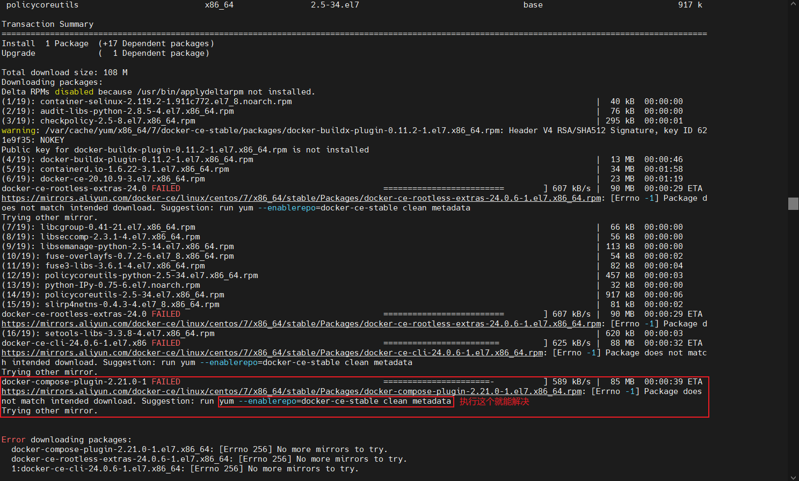

#### 还解决不了就使用官方镜像
> 过程中还报上面的错，就执行一个图片中的提示语句，就能正常执行
```shell
# 删除原本镜像
rm -rf /etc/yum.repos.d/docker-ce.repo
sudo yum remove docker-ce docker-ce-cli containerd.io
sudo yum install -y yum-utils
# 下载官方镜像
sudo yum-config-manager --add-repo https://download.docker.com/linux/centos/docker-ce.repo

yum clean all
yum -y install --setopt=obsoletes=0 docker-ce-20.10.9-3.el7
```

```
# 设置开机自启，并运行docker
systemctl enable docker ; systemctl start docker
```

### 3.4.4 修改cgroup方式

> 因为 Kubernetes 使用该驱动进行资源管理。如果 Docker 的 `cgroupdriver` 不是 `systemd`，在部署 Kubernetes 集群的时候可能会碰到问题。所以，为了确保 Kubernetes 可以正确工作，通常需将 Docker 的 `cgroupdriver` 设置为 `systemd`

```shell
# 在/etc/docker/daemon.json添加如下内容
vi /etc/docker/daemon.json
{
        "exec-opts": ["native.cgroupdriver=systemd"]
}
```

### 3.4.5 重启docker

```shell
systemctl restart docker
```


# 四、kubernetes 1.21.0  集群部署

## 4.1 集群软件及版本说明

|          | kubeadm                | kubelet                                       | kubectl                |
| -------- | ---------------------- | --------------------------------------------- | ---------------------- |
| 版本     | 1.21.0                 | 1.21.0                                        | 1.21.0                 |
| 安装位置 | 集群所有主机           | 集群所有主机                                  | 集群所有主机           |
| 作用     | 初始化集群、管理集群等 | 用于接收api-server指令，对pod生命周期进行管理 | 集群应用命令行管理工具 |


## 4.2 kubernetes YUM源准备

### 4.2.1 谷歌YUM源

```shell
[kubernetes]
name=Kubernetes
baseurl=https://packages.cloud.google.com/yum/repos/kubernetes-el7-x86_64
enabled=1
gpgcheck=1
repo_gpgcheck=1
gpgkey=https://packages.cloud.google.com/yum/doc/yum-key.gpg
        https://packages.cloud.google.com/yum/doc/rpm-package-key.gpg
```

### 4.2.2 阿里云YUM源

```shell
[kubernetes]
name=Kubernetes
baseurl=https://mirrors.aliyun.com/kubernetes/yum/repos/kubernetes-el7-x86_64/
enabled=1
gpgcheck=1
repo_gpgcheck=1
gpgkey=https://mirrors.aliyun.com/kubernetes/yum/doc/yum-key.gpg https://mirrors.aliyun.com/kubernetes/yum/doc/rpm-package-key.gpg
```

### 4.2.3 选择一个镜像源，添加到`/etc/yum.repos.d/`下面

```shell
vi /etc/yum.repos.d/k8s.repo

# 添加源，这边选的是aliyun，也可以用google的
[kubernetes]
name=Kubernetes
baseurl=https://mirrors.aliyun.com/kubernetes/yum/repos/kubernetes-el7-x86_64/
enabled=1
gpgcheck=1
repo_gpgcheck=1
gpgkey=https://mirrors.aliyun.com/kubernetes/yum/doc/yum-key.gpg https://mirrors.aliyun.com/kubernetes/yum/doc/rpm-package-key.gpg
```


## 4.3 集群软件安装

```shell
# 查看指定版本（可以不做）
yum list kubeadm.x86_64 --showduplicates | sort -r
```

```shell
# 安装指定版本
yum -y install --setopt=obsoletes=0 kubeadm-1.21.0-0  kubelet-1.21.0-0 kubectl-1.21.0-0
```


## 4.4 配置kubelet

>为了实现docker使用的cgroupdriver与kubelet使用的cgroup的一致性，建议修改如下文件内容。

```shell
# vi /etc/sysconfig/kubelet
KUBELET_EXTRA_ARGS="--cgroup-driver=systemd"
```

```shell
# 设置kubelet为开机自启动即可，由于没有生成配置文件，集群初始化后自动启动
systemctl enable kubelet
```


## 4.5 集群镜像准备

> 可使用VPN实现下载；这个在数据包里面已经下载好了，直接使用`docker load -i xxx.tar.gz`

```shell
# kubeadm config images list --kubernetes-version=v1.21.0
k8s.gcr.io/kube-apiserver:v1.21.0
k8s.gcr.io/kube-controller-manager:v1.21.0
k8s.gcr.io/kube-scheduler:v1.21.0
k8s.gcr.io/kube-proxy:v1.21.0
k8s.gcr.io/pause:3.4.1
k8s.gcr.io/etcd:3.4.13-0
k8s.gcr.io/coredns/coredns:v1.8.0
```


```shell
# cat image_download.sh
#!/bin/bash
images_list='
k8s.gcr.io/kube-apiserver:v1.21.0
k8s.gcr.io/kube-controller-manager:v1.21.0
k8s.gcr.io/kube-scheduler:v1.21.0
k8s.gcr.io/kube-proxy:v1.21.0
k8s.gcr.io/pause:3.4.1
k8s.gcr.io/etcd:3.4.13-0
k8s.gcr.io/coredns/coredns:v1.8.0'

for i in $images_list
do
        docker pull $i
done

docker save -o k8s-1-21-0.tar $images_list
```


## 4.6 集群初始化

#### 下面的操作需要在master上面进行

```shell
# --apiserver-advertise-address为master节点的ip
# --pod-network-cidr为k8s集群pod的虚拟ip
[root@master01 ~]# kubeadm init --kubernetes-version=v1.21.0 --pod-network-cidr=10.244.0.0/16 --apiserver-advertise-address=192.168.0.184
```

```shell
# 输出内容，一定保留，便于后继操作使用。
[init] Using Kubernetes version: v1.21.0
[preflight] Running pre-flight checks
[preflight] Pulling images required for setting up a Kubernetes cluster
[preflight] This might take a minute or two, depending on the speed of your internet connection
[preflight] You can also perform this action in beforehand using 'kubeadm config images pull'
[certs] Using certificateDir folder "/etc/kubernetes/pki"
[certs] Generating "ca" certificate and key
[certs] Generating "apiserver" certificate and key
[certs] apiserver serving cert is signed for DNS names [kubernetes kubernetes.default kubernetes.default.svc kubernetes.default.svc.cluster.local master01] and IPs [10.96.0.1 192.168.0.184]
[certs] Generating "apiserver-kubelet-client" certificate and key
[certs] Generating "front-proxy-ca" certificate and key
[certs] Generating "front-proxy-client" certificate and key
[certs] Generating "etcd/ca" certificate and key
[certs] Generating "etcd/server" certificate and key
[certs] etcd/server serving cert is signed for DNS names [localhost master01] and IPs [192.168.0.184 127.0.0.1 ::1]
[certs] Generating "etcd/peer" certificate and key
[certs] etcd/peer serving cert is signed for DNS names [localhost master01] and IPs [192.168.0.184 127.0.0.1 ::1]
[certs] Generating "etcd/healthcheck-client" certificate and key
[certs] Generating "apiserver-etcd-client" certificate and key
[certs] Generating "sa" key and public key
[kubeconfig] Using kubeconfig folder "/etc/kubernetes"
[kubeconfig] Writing "admin.conf" kubeconfig file
[kubeconfig] Writing "kubelet.conf" kubeconfig file
[kubeconfig] Writing "controller-manager.conf" kubeconfig file
[kubeconfig] Writing "scheduler.conf" kubeconfig file
[kubelet-start] Writing kubelet environment file with flags to file "/var/lib/kubelet/kubeadm-flags.env"
[kubelet-start] Writing kubelet configuration to file "/var/lib/kubelet/config.yaml"
[kubelet-start] Starting the kubelet
[control-plane] Using manifest folder "/etc/kubernetes/manifests"
[control-plane] Creating static Pod manifest for "kube-apiserver"
[control-plane] Creating static Pod manifest for "kube-controller-manager"
[control-plane] Creating static Pod manifest for "kube-scheduler"
[etcd] Creating static Pod manifest for local etcd in "/etc/kubernetes/manifests"
[wait-control-plane] Waiting for the kubelet to boot up the control plane as static Pods from directory "/etc/kubernetes/manifests". This can take up to 4m0s
[kubelet-check] Initial timeout of 40s passed.
[apiclient] All control plane components are healthy after 65.503030 seconds
[upload-config] Storing the configuration used in ConfigMap "kubeadm-config" in the "kube-system" Namespace
[kubelet] Creating a ConfigMap "kubelet-config-1.21" in namespace kube-system with the configuration for the kubelets in the cluster
[upload-certs] Skipping phase. Please see --upload-certs
[mark-control-plane] Marking the node master01 as control-plane by adding the labels: [node-role.kubernetes.io/master(deprecated) node-role.kubernetes.io/control-plane node.kubernetes.io/exclude-from-external-load-balancers]

[mark-control-plane] Marking the node master01 as control-plane by adding the taints [node-role.kubernetes.io/master:NoSchedule]
[bootstrap-token] Using token: 4v2ffu.b7hjl23wbb9wwuoh
[bootstrap-token] Configuring bootstrap tokens, cluster-info ConfigMap, RBAC Roles
[bootstrap-token] configured RBAC rules to allow Node Bootstrap tokens to get nodes
[bootstrap-token] configured RBAC rules to allow Node Bootstrap tokens to post CSRs in order for nodes to get long term certificate credentials
[bootstrap-token] configured RBAC rules to allow the csrapprover controller automatically approve CSRs from a Node Bootstrap Token
[bootstrap-token] configured RBAC rules to allow certificate rotation for all node client certificates in the cluster
[bootstrap-token] Creating the "cluster-info" ConfigMap in the "kube-public" namespace
[kubelet-finalize] Updating "/etc/kubernetes/kubelet.conf" to point to a rotatable kubelet client certificate and key
[addons] Applied essential addon: CoreDNS
[addons] Applied essential addon: kube-proxy

Your Kubernetes control-plane has initialized successfully!

To start using your cluster, you need to run the following as a regular user:

  mkdir -p $HOME/.kube
  sudo cp -i /etc/kubernetes/admin.conf $HOME/.kube/config
  sudo chown $(id -u):$(id -g) $HOME/.kube/config

Alternatively, if you are the root user, you can run:

  export KUBECONFIG=/etc/kubernetes/admin.conf

You should now deploy a pod network to the cluster.
Run "kubectl apply -f [podnetwork].yaml" with one of the options listed at:
  https://kubernetes.io/docs/concepts/cluster-administration/addons/

Then you can join any number of worker nodes by running the following on each as root:

kubeadm join 192.168.0.184:6443 --token 4v2ffu.b7hjl23wbb9wwuoh \
        --discovery-token-ca-cert-hash sha256:9fb66862f13a67c9572d459376aa75204abad4b47d055b198cde6fb2a616978a
```


## 4.7 集群应用客户端管理集群文件准备

```shell
[root@master1 ~]# mkdir -p $HOME/.kube
[root@master1 ~]# cp -i /etc/kubernetes/admin.conf $HOME/.kube/config
[root@master1 ~]# chown $(id -u):$(id -g) $HOME/.kube/config
[root@master1 ~]# ls /root/.kube/
config
```

```shell
export KUBECONFIG=/etc/kubernetes/admin.conf
```


## 4.8 集群网络准备(Calico 3.21.6)

> 使用calico部署集群网络
>
> 安装参考网址：https://projectcalico.docs.tigera.io/about/about-calico

### 4.8.1 calico安装

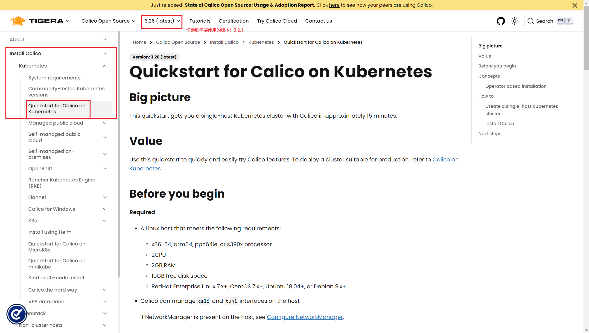


### 切换到3.21的版本使用

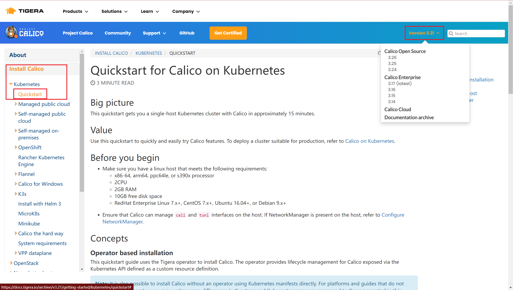

```shell
# 下载operator资源清单文件
kubectl create -f https://docs.projectcalico.org/archive/v3.21/manifests/tigera-operator.yaml
# 定错可使用下面命令删除
kubectl delete -f 资源清单文件或者资源清单地址（https://docs.projectcalico.org/archive/v3.21/manifests/tigera-operator.yaml）

# 通过创建必要的自定义资源来安装 Calico
mkdir calicodir
cd calicodir
wget https://docs.projectcalico.org/archive/v3.21/manifests/custom-resources.yaml --no-check-certificate

# 修改文件中的网段和k8s指定的一致
cidr: 10.244.0.0/16

# 应用资源清单文件
kubectl apply -f custom-resources.yaml
```

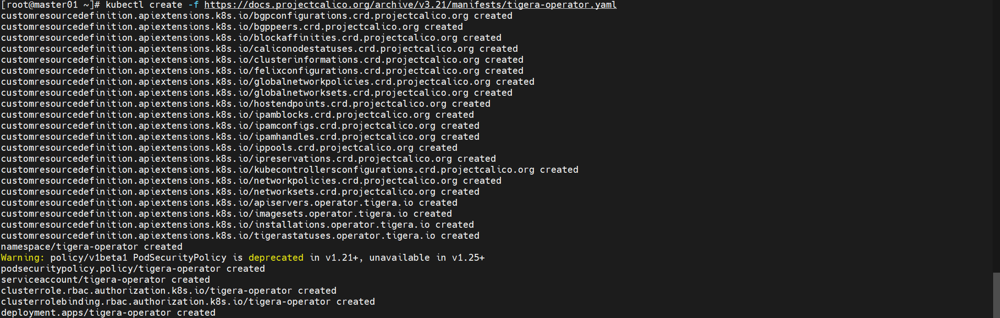

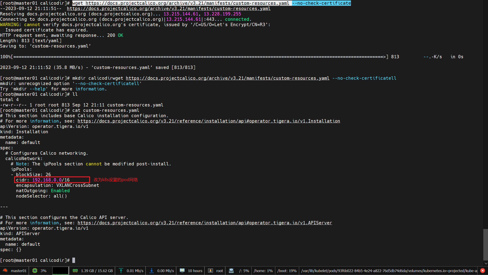

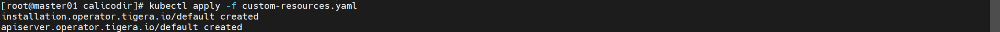

```shell
# 监视calico-sysem命名空间中pod运行情况，需要等到所有的都runing
watch kubectl get pods -n calico-system
```

>Wait until each pod has the `STATUS` of `Running`.

```shell
# 删除 master 上的 taint，不然有的pod启动不了
kubectl taint nodes --all node-role.kubernetes.io/master-

# node-role.kubernetes.io/master：这是一个常见的污点，被赋予控制节点(也称 Master节点)。这个标识的目的是防止应用程序的Pod调度到Master节点上，因为Master节点上运行着很多Kubernetes内部组件，很多情况下我们不希望应用程序的Pod运行在这类节点上，以防止应用程序的Pod干扰Kubernetes内部组件的运行
```

```shell
# 已经全部运行
kubectl get pods -n calico-system

# 返回信息
NAME                                      READY   STATUS    RESTARTS   AGE
calico-kube-controllers-666bb9949-dzp68   1/1     Running   0          11m
calico-node-jhcf4                         1/1     Running   4          11m
calico-typha-68b96d8d9c-7qfq7             1/1     Running   2          11m
```

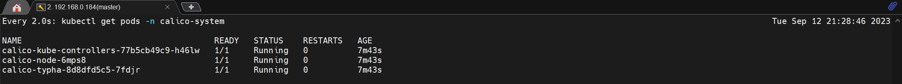

### 4.8.2 calico客户端安装

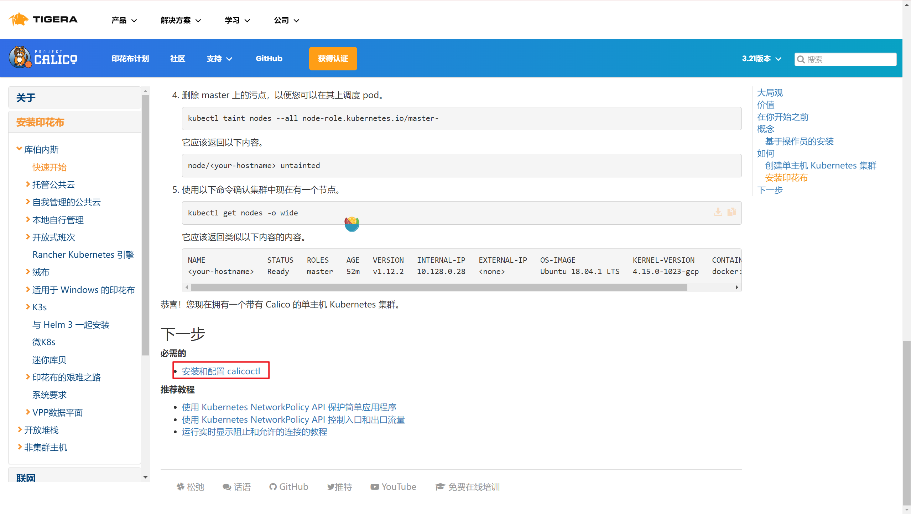

```shell
# 下载二进制文件
curl -L https://github.com/projectcalico/calicoctl/releases/download/v3.21.6/calicoctl-linux-amd64 -o calicoctl

chmod +x calicoctl

# 安装calicoctl
mv calicoctl /usr/bin/

# 查看版本
calicoctl version

Client Version:    v3.21.6
Git commit:        94154c96e
Cluster Version:   v3.21.6
Cluster Type:      typha,kdd,k8s,operator,bgp,kubeadm
```

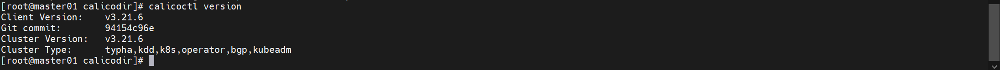

```shell
# 通过~/.kube/config连接kubernetes集群，查看已运行节点
DATASTORE_TYPE=kubernetes KUBECONFIG=~/.kube/config calicoctl get nodes

# 显示信息
NAME
master01
```

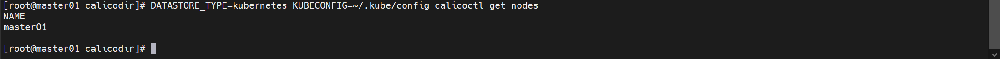


## 4.9 集群工作节点添加

> 因容器镜像下载较慢，可能会导致报错，主要错误为没有准备好cni（集群网络插件），如有网络，请耐心等待即可。

### 4.9.1 worker服务器向master添加节点

> 这两句执行语句都是在master节点创建完成后，日志中提供的；需要根据日志信息自定义修改

```shell
[root@worker01 ]# kubeadm join 192.168.0.184:6443 --token 4v2ffu.b7hjl23wbb9wwuoh \
        --discovery-token-ca-cert-hash sha256:9fb66862f13a67c9572d459376aa75204abad4b47d055b198cde6fb2a616978a
```

```shell
[root@worker02 ~]# kubeadm join 192.168.0.184:6443 --token 4v2ffu.b7hjl23wbb9wwuoh \
        --discovery-token-ca-cert-hash sha256:9fb66862f13a67c9572d459376aa75204abad4b47d055b198cde6fb2a616978a
```

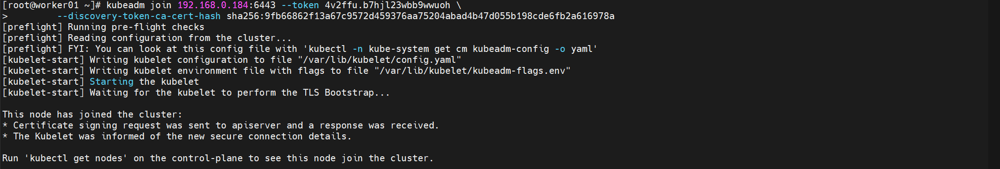

```shell
# 在master节点上操作，查看网络节点是否添加
DATASTORE_TYPE=kubernetes KUBECONFIG=~/.kube/config calicoctl get nodes

# 返回信息
NAME
master01
worker01
worker02
```

## 4.10 验证集群可用性

```shell
# 查看所有的节点
[root@master01 ~]# kubectl get nodes
NAME       STATUS     ROLES                  AGE   VERSION
master01   Ready      control-plane,master   66m   v1.21.0
worker01   NotReady   <none>                 69s   v1.21.0
worker02   NotReady   <none>                 7s    v1.21.0
```

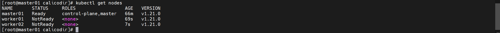

```shell
# 查看集群健康情况,理想状态
[root@master01 ~]# kubectl get cs
NAME                 STATUS    MESSAGE             ERROR
controller-manager   Healthy   ok
scheduler            Healthy   ok
etcd-0               Healthy   {"health":"true"}
```

```shell
# 真实情况，因为端口没有开启，需要开启端口才能解决；如何解决，自己百度
kubectl get cs

# 返回信息
Warning: v1 ComponentStatus is deprecated in v1.19+
NAME                 STATUS      MESSAGE                                                                                       ERROR
controller-manager   Unhealthy   Get "http://127.0.0.1:10252/healthz": dial tcp 127.0.0.1:10252: connect: connection refused
scheduler            Unhealthy   Get "http://127.0.0.1:10251/healthz": dial tcp 127.0.0.1:10251: connect: connection refused
etcd-0               Healthy     {"health":"true"}
```

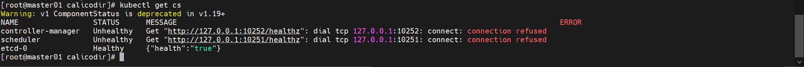

```shell
# 查看kubernetes集群pod运行情况（kubernete基础服务pod运行状态）
[root@master01 ~]# kubectl get pods -n kube-system

# 返回信息
NAME                               READY   STATUS    RESTARTS   AGE
coredns-558bd4d5db-fsmz4           1/1     Running   0          70m
coredns-558bd4d5db-nhsfr           1/1     Running   0          70m
etcd-master01                      1/1     Running   0          70m
kube-apiserver-master01            1/1     Running   0          70m
kube-controller-manager-master01   1/1     Running   0          70m
kube-proxy-9gkmp                   1/1     Running   0          70m
kube-proxy-fhztv                   1/1     Running   0          5m25s
kube-proxy-fqvg5                   1/1     Running   0          4m24s
kube-scheduler-master01            1/1     Running   0          70m
```

```shell
# 再次查看calico-system命名空间中pod运行情况。（calico网络工具的pod运行状态）
[root@master01 ~]# kubectl get pods -n calico-system

# 返回信息
NAME                                      READY   STATUS    RESTARTS   AGE
calico-kube-controllers-666bb9949-dzp68   1/1     Running   3          70m
calico-node-jhcf4                         1/1     Running   15         70m
calico-node-jxq9p                         1/1     Running   0          30m
calico-node-kf78q                         1/1     Running   0          30m
calico-typha-68b96d8d9c-7qfq7             1/1     Running   13         70m
calico-typha-68b96d8d9c-wz2zj             1/1     Running   0          20m
```

 #### 最终worker节点加入成功

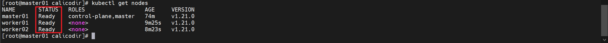

#### 测试k8s的pod是否能联网

```shell
# 安装DNS工具
sudo yum install bind-utils

# 测试pod网络
dig -t  a www.baidu.com @10.96.10
```

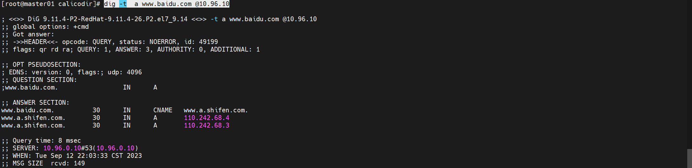


## 4.11 可视化界面安装	

### 4.11.1 安装 Kubernetes 仪表板 `v2.7.0`

> 目前在2.7的版本上测试可用，2.6的版本修改配置文件，因为证书问题，还是不能访问htts的请求

 ```shell
# 安装可视化界面pod
kubectl apply -f https://raw.githubusercontent.com/kubernetes/dashboard/v2.7.0/aio/deploy/recommended.yaml
# 执行信息
namespace/kubernetes-dashboard created
serviceaccount/kubernetes-dashboard created
service/kubernetes-dashboard created
secret/kubernetes-dashboard-certs created
secret/kubernetes-dashboard-csrf created
secret/kubernetes-dashboard-key-holder created
configmap/kubernetes-dashboard-settings created
role.rbac.authorization.k8s.io/kubernetes-dashboard created
clusterrole.rbac.authorization.k8s.io/kubernetes-dashboard created
rolebinding.rbac.authorization.k8s.io/kubernetes-dashboard created
clusterrolebinding.rbac.authorization.k8s.io/kubernetes-dashboard created
deployment.apps/kubernetes-dashboard created
service/dashboard-metrics-scraper created
deployment.apps/dashboard-metrics-scraper created

# 查看Pod是否已启动，需要等待两个都启动后，再进行下面操作
kubectl get pod -n kubernetes-dashboard
# 执行信息
NAME                                         READY   STATUS    RESTARTS   AGE
dashboard-metrics-scraper-7c857855d9-tjgzg   1/1     Running   0          4m26s
kubernetes-dashboard-658b66597c-v4xsj        1/1     Running   0          4m26s

# 详细信息显示：会展出pod的ip等信息
kubectl get pods -n kubernetes-dashboard -o wide
 ```


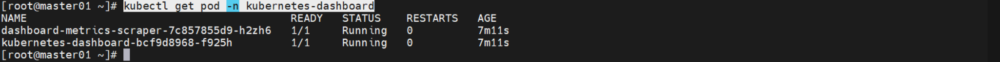

#### 查看pod服务器信息

```shell
kubectl -n kubernetes-dashboard get service kubernetes-dashboard

# 返回信息
NAME                   TYPE        CLUSTER-IP       EXTERNAL-IP   PORT(S)   AGE
kubernetes-dashboard   ClusterIP   10.109.187.228   <none>        443/TCP   12h
```

### 4.11.2 代理启动，不能远程访问（此方法只能本地访问）

```shell
kubectl proxy
#返回信息
Starting to serve on 127.0.0.1:8001

# 关闭，找到进程id，然后kill
ps aux | grep "kubectl proxy"
# 杀死进程
kill -9 <PID_NUMBER>
```

### 4.11.2 通过修改配置文件，使其能远程登录

```shell
# 修改配置文件
kubectl -n kubernetes-dashboard edit service kubernetes-dashboard

# 将 type: ClusterIP 修改成 type: NodePort
# 结果如下图
```

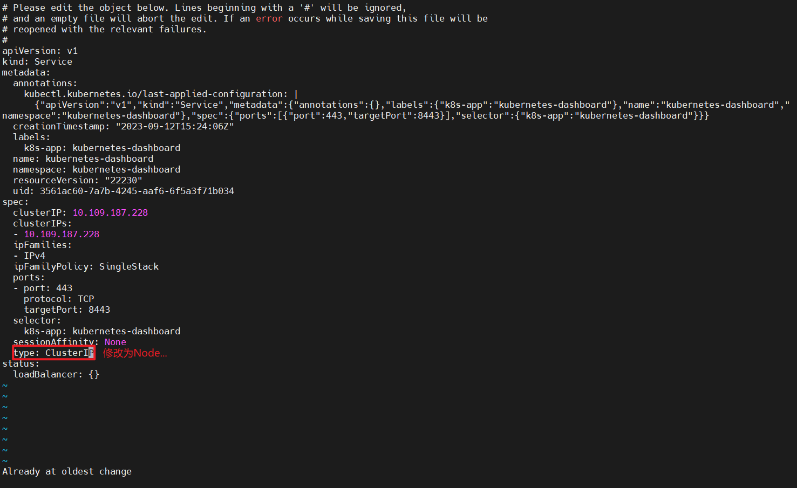

```shell
# 再次查看 kubernetes-dashboard 服务，此时会新开启一个端口
kubectl -n kubernetes-dashboard get service kubernetes-dashboard
# 返回信息
NAME                   TYPE       CLUSTER-IP      EXTERNAL-IP   PORT(S)         AGE
kubernetes-dashboard   NodePort   10.100.142.15   <none>        443:32697/TCP   6m21s

# 访问地址
访问地址为 https://masterIP:32277
```

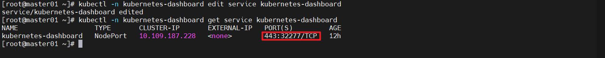

### 4.11.3 创建用户

```shell
# 创建一个名为"dashboard-adminuser"的ServiceAccount
cat <<EOF | kubectl apply -f -
apiVersion: v1
kind: ServiceAccount
metadata:
  name: dashboard-adminuser
  namespace: kubernetes-dashboard
EOF

# 给"dashboard-adminuser"的ServiceAccount绑定"cluster-admin"的角色
cat <<EOF | kubectl apply -f -
apiVersion: rbac.authorization.k8s.io/v1
kind: ClusterRoleBinding
metadata:
  name: dashboard-adminuser
roleRef:
  apiGroup: rbac.authorization.k8s.io
  kind: ClusterRole
  name: cluster-admin
subjects:
- kind: ServiceAccount
  name: dashboard-adminuser
  namespace: kubernetes-dashboard
EOF

# 获取"dashboard-adminuser"的ServiceAccount的Token
kubectl -n kubernetes-dashboard describe secret $(kubectl -n kubernetes-dashboard get secret | grep dashboard-adminuser | awk '{print $1}')
# 返回信息
Name:         dashboard-adminuser-token-swf7r
Namespace:    kubernetes-dashboard
Labels:       <none>
Annotations:  kubernetes.io/service-account.name: dashboard-adminuser
              kubernetes.io/service-account.uid: e449dab1-67c2-48ff-a236-6ec89df31e47

Type:  kubernetes.io/service-account-token

Data
====
ca.crt:     1066 bytes
namespace:  20 bytes
token:      eyJhbGciOiJSUzI1NiIsImtpZCI6Ikg3dGk5U0h5eFJYQlhjb0hfYlNPd29Sb0dza2JGOVc5SVlrbG4yR0VLMWsifQ.eyJpc3MiOiJrdWJlcm5ldGVzL3NlcnZpY2VhY2NvdW50Iiwia3ViZXJuZXRlcy5pby9zZXJ2aWNlYWNjb3VudC9uYW1lc3BhY2UiOiJrdWJlcm5ldGVzLWRhc2hib2FyZCIsImt1YmVybmV0ZXMuaW8vc2VydmljZWFjY291bnQvc2VjcmV0Lm5hbWUiOiJkYXNoYm9hcmQtYWRtaW51c2VyLXRva2VuLXN3ZjdyIiwia3ViZXJuZXRlcy5pby9zZXJ2aWNlYWNjb3VudC9zZXJ2aWNlLWFjY291bnQubmFtZSI6ImRhc2hib2FyZC1hZG1pbnVzZXIiLCJrdWJlcm5ldGVzLmlvL3NlcnZpY2VhY2NvdW50L3NlcnZpY2UtYWNjb3VudC51aWQiOiJlNDQ5ZGFiMS02N2MyLTQ4ZmYtYTIzNi02ZWM4OWRmMzFlNDciLCJzdWIiOiJzeXN0ZW06c2VydmljZWFjY291bnQ6a3ViZXJuZXRlcy1kYXNoYm9hcmQ6ZGFzaGJvYXJkLWFkbWludXNlciJ9.kSHkvT6Ldd4E1zhSkB_aIFam_kWusMoRXPy5kAvTobKHTzXs10XjM3wQAys565RgpXP8rE6E08zsDTQ9p1m7O5D2Fndi3lDnRf3RL71ocoA6L2dvJL_pN02DRHbyKSDwIhRk4fCCmHqYCHvOaIrtYzsQ552w39spefL5acU6sikOJLT-F0zN-ptKJYg1QBYrXU5FziSEdalu5D763aiJ88e_X_ZvdWe62ounRbCqC-G5frY0n3ixXxZP9PG6AUtBw8IpOnbQwoTivqjU23w7e1jp-W2xVjOjEQxR2WPkNjkK3Z4F8lCaNTKJhHv5On5Q1LoJ9mkHgokr5KhHeqdV3g
```

### 4.11.4 访问

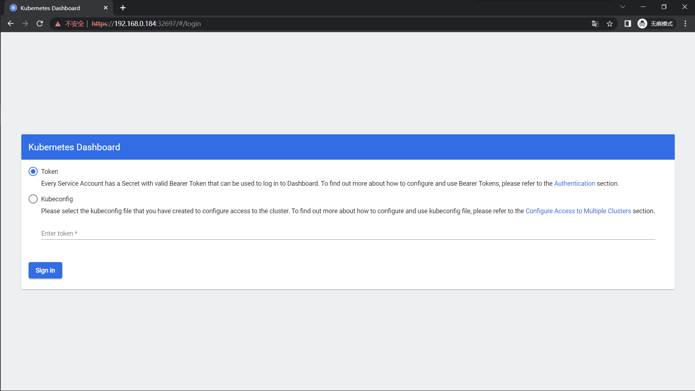

* 输入上面创建的用户后获取的TOKEN值

#### 最终界面

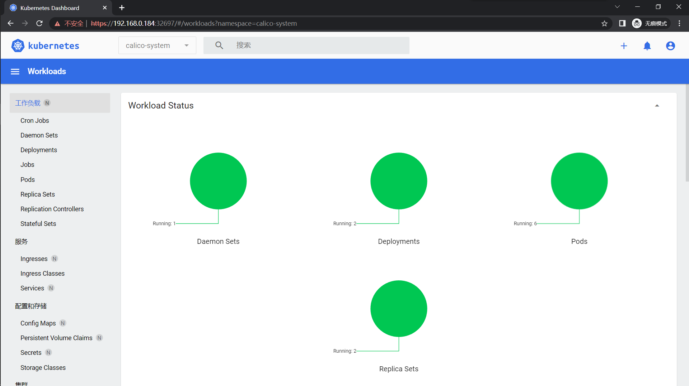

### 4.11.5 删除dashboard

#### 删除用户与角色

> 因为上面创建用户是使用cat命令执行，删除比较麻烦；此处使用的是将cat后面的命令放到文件，通过`kubectl delete -f 文件`

```shell
vi serviceAccount.yaml
# 添加内容
apiVersion: v1
kind: ServiceAccount
metadata:
  name: dashboard-adminuser
  namespace: kubernetes-dashboard
  
vi cluster.yaml
# 添加内容
apiVersion: rbac.authorization.k8s.io/v1
kind: ClusterRoleBinding
metadata:
  name: dashboard-adminuser
roleRef:
  apiGroup: rbac.authorization.k8s.io
  kind: ClusterRole
  name: cluster-admin 
subjects:
- kind: ServiceAccount
  name: dashboard-adminuser
  namespace: kubernetes-dashboard
  
# 删除
kubectl delete -f cluster.yaml
kubectl delete -f serviceAccount.yaml
```

#### 删除dashboard

```shell
kubectl delete -f https://raw.githubusercontent.com/kubernetes/dashboard/v2.7.0/aio/deploy/recommended.yaml
```

