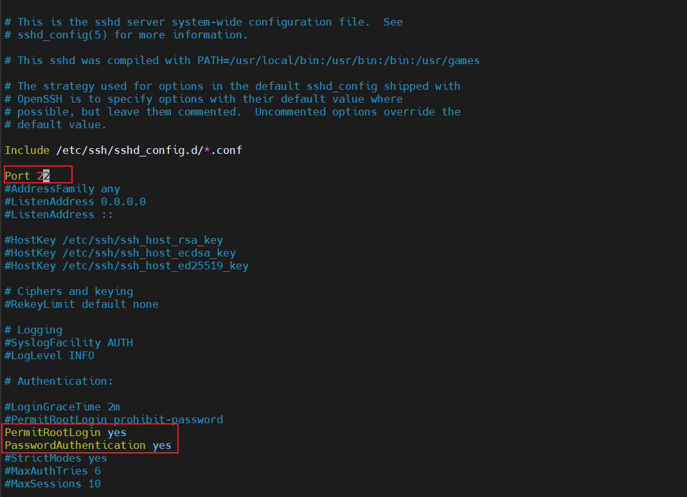
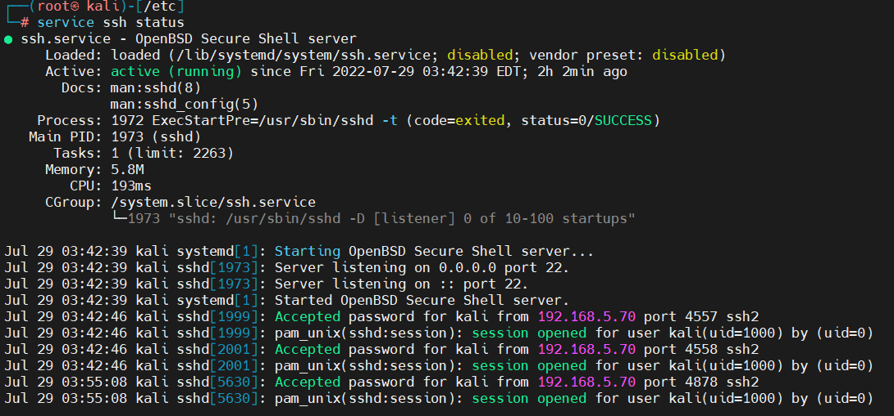

## Kali-Debain在Vmware中开启ssh

### 修改sshd_config配置文件
```shell
vim /etc/ssh/sshd_config

# 将port端口打开
Port 22

# 添加或修改以下两行
PermitRootLogin yes
PasswordAuthentication yes
```


### 重启ssh
```shell
/etc/init.d/ssh start
或者
service ssh start
```

### 查看ssh状态
```shell
service ssh status
```


### 可以设置开机自动启动
```shell
update-rc.d ssh enable
```
