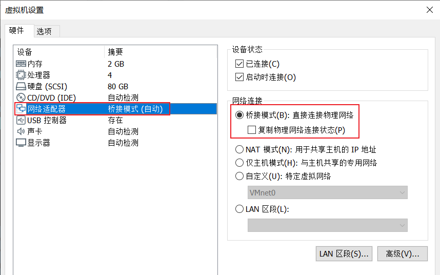
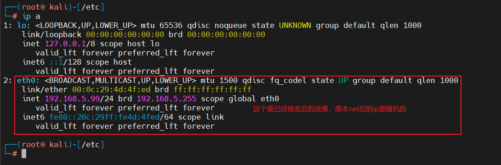
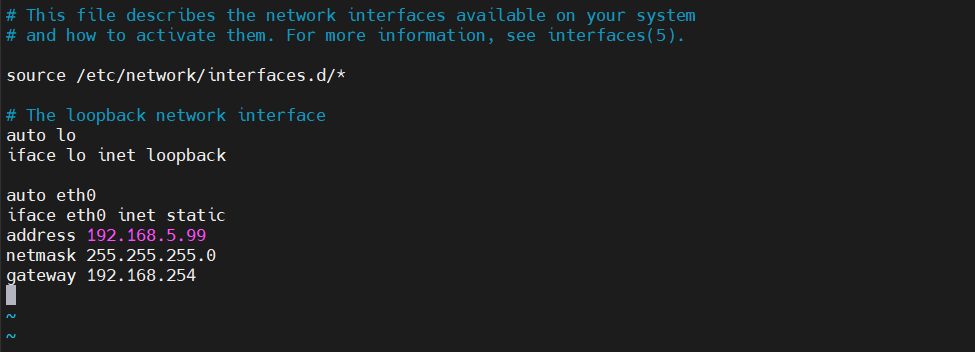
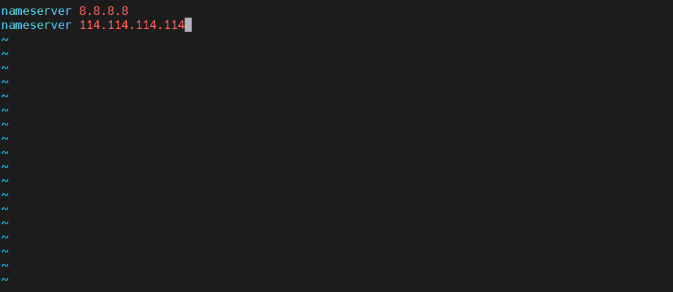
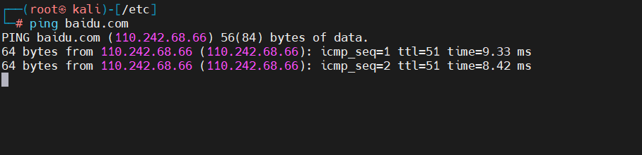

## Kali-Debain在Vmware中配置静态ip

### 通过Vmware设置kali虚拟机的网络模式为**桥接模式**


### 进入虚拟机，使用root用户执行下面操作

#### 获取root权限
```shell
sudo -i
# 输入密码
```

#### 查看自己虚拟机当前的网络信息，找到自己需要修改的网卡
```shell
ip a
```


#### 打开网卡配置文件
```shell
vim /etc/network/interfaces

# 编辑一下内容
auto eth0
iface eth0 inet static
address 192.168.1.63
netmask 255.255.255.0
gateway 192.168.1.1

# eth0需要修改的网卡名称
# iface eth0 inet static将网卡状态设置为静态
# address静态ip地址
# netmask子网掩码
# gateway网关
```


#### 添加dns
```shell
vim /etc/resolv.conf

# 编辑信息
nameserver 8.8.8.8
nameserver 114.114.114.114

# 8.8.8.8为GOOGLE公司DNS地址是全球通用的，而114.114.114.114是全国通用DNS地址
```


#### 重启网卡即可，重启不会报错，即可配置完成，不配置dns是ping不通域名的
```shell
service networking restart
```

#### 重启完成后ping下百度即可
```shell
ping baidu.com
```

