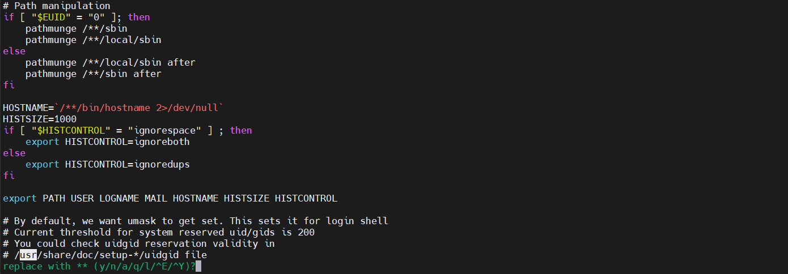

## Vim命令说明

### vi和vim都适用下面命令

#### 行号设置
```shell
# 显示行号
:set nu
# 不显示行号
:set nonu
```

#### 语法高亮
```shell

```

:syntax on|off 启用/关闭语法高亮
:set hls|nohls 开启/关闭查询结果高亮显示
:set ai 　　　　　启用自动缩进
:set autoindent 启用自动缩进
:set noai 关闭自动缩进
:set tabstop=4 表示把tab键的宽度设为4个空格

显示忽略或区分字符大小写
:set ignorecase
:set ic

:set noic

查找到的文本高亮显示或取消
:set hlsearch
:set nohlsearch

#### vim替换
> `:%s/x/xx/g`中的后的g表示global，其他的标记（flags）包括：
* p（print），是要求打印所做的改动；
* g（global），将所有出现的字符都替换成给定字符
* c（confirm），是要求在做出改动以前先询问；
* i（ignorecase），是不区分大小写
* 我们可以组合使用标记，比如以下命令，将会显示将要做改动的文本并要求确认
  * :1,$ s/usr/**/gc
  * replace with Teacher (y/n/a/q/l/^E/^Y)?


```shell
# 替换整篇文档的字符串
:%s/源字符串/替换的字符串/g（如果不加g（global），则只替换每行第一个找到的字符串）
# 例子
:%s/a/00/g

# 指定只在第5至第15行间进行替换
:开始行数,结束行数s/源字符串/替换的字符串/g
# 例子
:5,15s/00/--/g

# 只在当前行至文件结尾间进行替换
:.,$s/源字符串/替换的字符串/g
# 例子
:.,$s/--/##/g

# 只在光标所在行后续9行内进行替换（包含光标所在行）
:.,.+行数s/源字符串/替换的字符串/g
# 例子
:.,.+8s/##/**/g

# 将特定字符做为替换范围
:/开始字符/,/结束字符/s/源字符串/替换的字符串/g
# 例子
:/#/,/;/s/**/00/g

## 多项替换，多个字符一起替换
:%s/字符a\|字符b/替换的字符串/g
# 例子
:%s/Kang\|Kodos/replace/gc

## 全词匹配替换（在搜索sig时，也将匹配sig, signature, signing等多个单词。如果希望精确替换某个单词，可以使用“\<”来匹配单词的开头，并用“\>”来匹配单词的结尾）
:%s/\<源字符串\>/替换的字符串/g
# 例子
:%s/\<term\>/replace/gc
```
