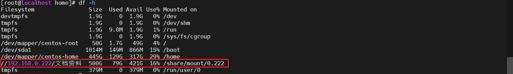

## CentOs挂载Windows共享文件夹

### 环境说明
* CentOS版本：CentOS Linux release 7.6.1810 (Core)
* Windows版本：Windows 10

### 安装 CIFS 工具
```shell
yum install cifs-utils
```

### 创建挂载点
```shell
mkdir -p /share/mount/0.222
```

### 挂载 Windows 共享文件夹
> 使用 mount 命令将 Windows 共享文件夹挂载到刚才创建的目录。
```shell
# mount -t cifs //共享文件电脑ip/共享文件夹路径 服务器挂载路径 -o username=共享电脑用户名,password=共享电脑用户密码,nobrl,iocharset=utf8,uid=0,gid=0
mount -t cifs //192.168.0.222/文档资料 /share/mount/0.222 -o username=admin,password=123456,nobrl,iocharset=utf8,uid=0,gid=0
```
#### 注意
* mount -t cifs
  * mount 是挂载文件系统的命令
  * -t cifs 表示文件系统类型是 CIFS 
* //192.168.0.222/文档资料：这是远程共享目录的路径
  * 192.168.10.22 是远程服务器的 IP 地址
  * /sqlite 是共享目录的名称
* /share/mount/0.222
  * 这是CentOS本地目录，远程共享会挂载到这个目录。 
* -o username=sqliteuser,password=123456,nobrl,iocharset=utf8,uid=0,gid=0: 这是挂载时的选项参数 
  * username=admin: 远程共享的用户名
  * password=123456: 对应用户名的密码 
  * nobrl: 禁用字节范围锁（Byte-Range Locking），在某些情况下可以避免文件锁冲突
  * iocharset=utf8: 设置字符编码为 UTF-8，确保文件名和内容可以正确显示
  * uid=0: 设置挂载后的文件拥有者的用户 ID 为 0（通常是 root 用户）
  * gid=0: 设置挂载后的文件所属的组 ID 为 0（通常是 root 组）

### 如果共享文件夹支持匿名访问，可以省略 username 和 password
```shell
mount -t cifs //192.168.0.222/文档资料 /share/mount/0.222 -o guest
```

### 自动挂载（可选）
> 在系统启动时自动挂载 Windows 共享文件夹，可以将挂载信息写入 /etc/fstab 文件
```shell
vi /etc/fstab

# 添加以下行
## 格式：<远程共享目录> <本地挂载目录> <文件系统类型> <挂载选项> <挂载优先级> <挂载点检查间隔>
//192.168.0.222/文档资料 /share/mount/0.222 cifs defaults,username=admin,password=123456,nobrl,iocharset=utf8,uid=0,gid=0 0 0
```

### 验证挂载所有在 /etc/fstab 中配置的文件系统
```shell
mount -a
```

### 查看挂载情况
```shell
df -h
```


### 取消挂载
```shell
umount /share/mount/0.222
```