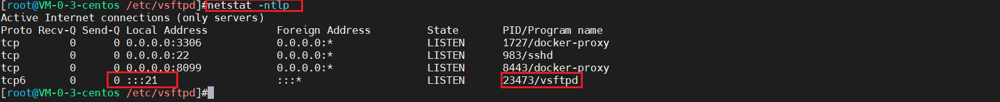

## FTP服务搭建

### 安装环境
* CentOS 7 (CentOS Linux release 7.5.1804 (Core) : cat  /etc/redhat-release命令查看) + 腾讯云
* vsftpd 3.0.2
* 全程关闭防火墙

### 检查是否安装vsftpd
> 显示出`vsftpd-3.0.2-29.el7_9.x86_64`表示服务器中存在；如果想重新下载，先进行卸载
```shell
rpm -qa | grep vsftpd
```


### vsftpd卸载
```shell
# 检查服务器中安装的vsftpd信息
rpm -qa | grep vsftpd
# 停止服务器
systemctl stop vsftpd
# 使用rpm命令进行清除
rpm -e vsftpd-3.0.2-29.el7_9.x86_64（rpm -qa | grep vsftpd查找出的信息）

# 再次执行，如果有绑定的文件信息出来，直接rm -rf 手动删除
rpm -e vsftpd-3.0.2-29.el7_9.x86_64
# 显示
Warning: /etc/vsftpd/user_list saved as /etc/vsftpd/user_list.rpmsave
# 直接删除vsftpd
rm -rf vsftpd
```

### 安装vsftpd
```shell
yum -y install vsftpd
```


### 修改配置文件
```shell
# 进入vsftpd配置文件路径
cd /etc/vsftpd
# 修改vsftpd配置
vi vsftpd.conf
```
#### 配置文件信息说明
```shell
# 是否允许匿名，默认no  【需要配置】
anonymous_enable=NO

# 这个设定值必须要为YES 时，在/etc/passwd内的账号才能以实体用户的方式登入我们的vsftpd主机  【需要配置】
local_enable=YES

# 具有写权限  【需要配置】
write_enable=YES

# 本地用户创建文件或目录的掩码  【需要配置】
local_umask=022

# 当dirmessage_enable=YES时，可以设定这个项目来让vsftpd寻找该档案来显示讯息！您也可以设定其它档名！  【需要配置】
dirmessage_enable=YES

# 当设定为YES时，使用者上传与下载日志都会被纪录起来。记录日志与下一个xferlog_file设定选项有关  【需要配置】
xferlog_enable=YES
xferlog_std_format=YES
# 上传与下载日志存放路径  【需要配置】
xferlog_file=/var/log/xferlog 

# 开启20端口  【需要配置】
connect_from_port_20=YES

# 关于系统安全的设定值： 【**==不配置==**】
#ascii_download_enable=YES(NO)
# 如果设定为YES ，那么 client 就可以使用 ASCII 格式下载档案。
# 一般来说，由于启动了这个设定项目可能会导致DoS 的攻击，因此预设是NO。
#ascii_upload_enable=YES(NO)
# 与上一个设定类似的，只是这个设定针对上传而言！预设是NO。
ascii_upload_enable=NO
ascii_download_enable=NO

# 通过搭配能实现以下几种效果： 
#①当chroot_list_enable=YES，chroot_local_user=YES时，在/etc/vsftpd.chroot_list文件中列出的用户，可以切换到其他目录；未在文件中列出的用户，不能切换到其他目录。 
#②当chroot_list_enable=YES，chroot_local_user=NO时，在/etc/vsftpd.chroot_list文件中列出的用户，不能切换到其他目录；未在文件中列出的用户，可以切换到其他目录。 
#③当chroot_list_enable=NO，chroot_local_user=YES时，所有的用户均不能切换到其他目录。 
#④当chroot_list_enable=NO，chroot_local_user=NO时，所有的用户均可以切换到其他目录。

# 【需要配置】
chroot_local_user=YES
chroot_list_enable=YES
# 这个文件目录需要创建（可以自定义），详情在下一步
chroot_list_file=/etc/vsftpd/chroot_list

# 这个是pam模块的名称，我们放置在/etc/pam.d/vsftpd  【需要配置】
pam_service_name=vsftpd

# 当然我们都习惯支持TCP Wrappers的啦！  【需要配置】
tcp_wrappers=YES

# 不添加下面这个会报错：500 OOPS: vsftpd: refusing to run with writable root inside chroot()   【需要配置（添加）】
allow_writeable_chroot=YES

# ftp的端口号  【**==不配置，默认21==**】
listen_port=60021

# 启动被动式联机(passivemode)  【需要配置（添加），不配置会出现425问题，下面有问题与解决详情】
pasv_enable=YES
#上面两个是与passive mode 使用的 port number 有关，如果您想要使用65400到65410 这 11 个 port 来进行被动式资料的连接，可以这样设定  【需要配置（添加），看自己心情，想开多大范围就开多大范围，最下面配置的是6001=7000】
pasv_min_port=65400
pasv_max_port=65410

# FTP访问目录  【**==不配置==**】
local_root=/data/ftp/
```

### 创建配置文件中chroot_list_file中配置的chroot_list文件
```shell
touch /etc/vsftpd/chroot_list
```


### 赋权
```shell
chmod 755 chroot_list
```


### 重启vsftpd
```shell
# 重启vsftpd
systemctl restart vsftpd
# 查看vsftpd运行状态
systemctl status vsftpd

# 补充：关闭vsftpd
systemctl stop vsftpd
```


#### 再次验证是否启动成功：通过netstat -ntlp 查看端口，如果有21号端口占用
```shell
netstat -ntlp
```


### 创建ftp账号（useradd命令参数不明白请看【【YC-COMMAND】useradd命令说明.md】）
```shell
# 命令
useradd -d /home/gudaospace -g ftp -s /sbin/nologin gudao
# 说明
useradd -d 赋权用户文件地址 -g 组名 -s 设置不能通过SSH登录，只能使用FTP 新建用户名
```
### 为创建的账号绑定密码
```shell
# 命令
passwd gudao
# 说明
passwd 需要绑定密码的账号
```


### 查看FTP用户是否设置不能通过SSH登录，只能使用FTP
```shell
vim /etc/passwd
```


### 问题
#### 530 Login incorrect 的错误
```shell
# 问题
连接一直报错530

# 解决
# 修改一下pam.d下的vsftpd配置，把auth required pam_shells.so 改为 auth required pam_nologin.so
vim /etc/pam.d/vsftpd

# 重启vsftpd
systemctl restart vsftpd
```


#### 500 OOPS: cannot change directory:/home/xxx 
```shell
# 问题
连接报错500

# 解决
修改ftp_home_dir状态，有的版本是tftp_home_dir（修改时候注意）

# 查看ftp配置开关，找到对应的~_home_dir，进行修改
getsebool -a | grep ftp

# 开启tftp_home_dir
setsebool -P tftp_home_dir 1
```


#### 500 OOPS: chroot on vsftpd login
```
setsebool -P ftpd_full_access on
```

#### 设置setsebool -P tftp_home_dir 1时候，报错：getsebool: SELinux is disabled
```shell
# 问题
setsebool -P tftp_home_dir 1报错getsebool: SELinux is disabled

# 解决
# 修改/etc/selinux/config配置文件
vi /etc/selinux/config
# 设置SELINUX为permissive
#默认是disabled,需要更改为permissive
#强制模式SELINUX=enforcing：表示所有违反安全策略的行为都将被禁止。
#宽容模式SELINUX=permissive：表示所有违反安全策略的行为不被禁止，但是会在日志中作记录
SELINUX=permissive
```

###### 如果修改了执行命令，还是显示getsebool: SELinux is disabled（本人没有遇到）
* 修改config文件后，需要重启实例，但直接重启实例将会出现系统无法启动的错误。因此在重启之前需要在根目录下新建autorelabel文件
* 创建文件命令`touch /.autorelabel`
* 重启`reboot`

#### 425 Failed to establish connection. Error EElFTPSError: Invalid server reply
```shell
# 问题
#先到CMD或者linux终端用命令行模式ftp命令测试一下，
#如果能登录，不能使用ls或者dir命令。
#那就说明，主要问题在端口被防火墙控住。

# 提示语句：
200 PORT command successful. Consider using PASV.
425 Failed to establish connection.

# 解决
# 修改配置文件
vi /etc/vsftp.conf
# 添加配置
pasv_enable=YES
pasv_min_port=6000
pasv_max_port=7000
# 如果云服务器，需要开下安全组/防火墙的6000-7000端口
```
##### 启用pasv

##### 腾讯云放开6001-7000端口

##### 连接

