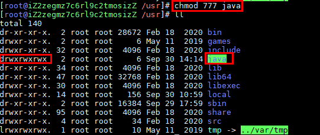

## Linux中的JDK环境搭建详情【CentOS 8】

### 卸载系统自带的OpenJDK以及相关的java文件【可以忽略此操作】：
- 查看系统中是否有java环境：`java -version`<br>
<br>

- 检测jdk的安装包，（注意：rpm命令符没有时记得下载一个输入：apt-get install +命令名称）：`rpm -qa | grep java `<br>
<br>

    **以上文件中，下面这几个可以删除**<br>
    ```shell
    java-1.7.0-openjdk-1.7.0.111-2.6.7.8.el7.x86_64
    java-1.8.0-openjdk-1.8.0.102-4.b14.el7.x86_64
    java-1.8.0-openjdk-headless-1.8.0.102-4.b14.el7.x86_64
    java-1.7.0-openjdk-headless-1.7.0.111-2.6.7.8.el7.x86_64
    ```
    **noarch文件可以不用删除**<br>
    ```shell
    python-javapackages-3.4.1-11.el7.noarch
    tzdata-java-2016g-2.el7.noarch
    javapackages-tools-3.4.1-11.el7.noarch
    ```

    **在命令窗口键入：**
    `rpm -e --nodeps java-1.7.0-openjdk-1.7.0.111-2.6.7.8.el7.x86_64`<br>
    但是会出错，因为在普通用户sxd用户下，并没有操作这几个文件的权限。

    **解决：**<br>
　　      在命令窗口键入：`su root` 进入root用户，可以有权限操作这几个文件。

- 进行包删除：`rpm -e --nodeps +包名`
    ```shell
    完整的删除文件的命令，在命令窗口键入：
    rpm -e --nodeps java-1.7.0-openjdk-1.7.0.111-2.6.7.8.el7.x86_64
    rpm -e --nodeps java-1.8.0-openjdk-1.8.0.102-4.b14.el7.x86_64
    rpm -e --nodeps java-1.8.0-openjdk-headless-1.8.0.102-4.b14.el7.x86_64
    rpm -e --nodeps java-1.7.0-openjdk-headless-1.7.0.111-2.6.7.8.el7.x86_64
    
    命令介绍：
    rpm 　　　　  管理套件  
    -e　　　　　  删除指定的套件
    --nodeps　　 不验证套件档的相互关联性
    ```

- 再次检测jdk的安装包，检查是否删除完即可：`java -version`
<br>

### ORACLE官网下载需要的JDK环境包：
**下载地址：**
```shell 
https://www.oracle.com/java/technologies/javase/javase-jdk8-downloads.html
```
<br>

### 终端进入解压：
- 进入/usr路径下创建java文件【用于存储JDK包】：`mkdir java`
<br>

- 将创建的java文件赋权777：`chmod 777 java`
<br>

- 将下载的`jdk-8u261-linux-x64.tar.gz`文件传到服务器中：
    <br>
    **命令**
    ```shell
    #安装命令插件
    yum -y install lrzsz
    #按下回车键，选择自己windows中要上传的文件
    rz
    ```

- 将JDK解压到指定文件夹：`tar -zxvf jdk-8u261-linux-x64.tar.gz -C /usr/java`
    <br>
    ```shell
    命令介绍：
    tar　　　　　　备份文件
    -zxvf　　　　　
    -z　　　　　　 　　　　　　　　    通过gzip指令处理备份文件
    -x　　　　　　　　　　　　　　     从备份文件中还原文件
    -v　　　　　　　　　　　　　　     显示指令执行过程
    -f　　　　　　 　　　　　　　　    指定备份文件
    jdk-8u144-linux-x64.tar.gz　　  文件名
    ```

- 删除解压包：`rm -f jdk-8u144-linux-x64.tar.gz`
    ```shell
    命令解释：
    rm　　　　删除文件或目录
    -f　　　　强制删除文件或目录
    ```

### 配置环境：
- 修改全局变量：`vim /etc/profile`
<br>

- 在文本的最后一行粘贴如下：
    **/usr/java/jdk1.8.0_261改为自己的文件路径**
    ```shell
    #java environment
    export JAVA_HOME=/usr/java/jdk1.8.0_261
    export CLASSPATH=.:${JAVA_HOME}/jre/lib/rt.jar:${JAVA_HOME}/lib/dt.jar:${JAVA_HOME}/lib/tools.jar
    export PATH=$PATH:${JAVA_HOME}/bin
    ```
    <br>

- 重新加载配置文件：`source /etc/profile`

- 执行`java -version`查看环境是否配置成功
<br>


