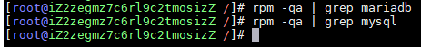
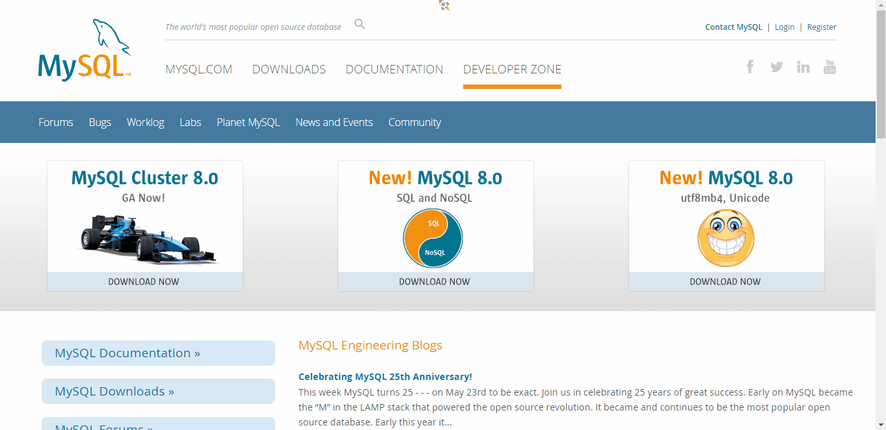

## Linux中的Mysql安装详情【CentOS 8】

### 卸载centos7自带的mariadb，不然安装MySQL的时候会和mariadb文件相冲突导致安装不成功：
- 查看系统中是否有mariadb
    ```shell
    [root@localhost mysq]#rpm -qa | grep mariadb
    ```

- 卸载
    ```shell
    [root@localhost mysq]#rpm-e 版本信息
    ```

- 查看系统中是否有mysql
    ```shell
    [root@localhost mysq]#rpm -qa | grep mariadb
    ```

- 卸载--nodeps强制卸载：
    ```shell
    [root@localhost /]# rpm -e --nodeps 版本信息
    ```

- 查询所有Mysql对应的文件夹：
    ```shell
    [root@localhost /]# whereis mysql
    mysql: /usr/bin/mysql /usr/include/mysql
    [root@localhost lib]# find / -name mysql
    /data/mysql
    /data/mysql/mysql
    ```

- 删除相关目录或文件：
    ```shell
    [root@localhost /]# rm -rf /usr/bin/mysql /usr/include/mysql /data/mysql /data/mysql/mysql
    ```

- 验证是否删除完毕：
    ```shell
    [root@localhost /]# whereis mysql
    mysql:
    [root@localhost /]# find / -name mysql
    [root@localhost /]# 
    ```

- 如果环境干净，则如图：


### Mysql官网下载需要的安装包：
**下载地址：**
```shell 
#5.7版本下载地址
https://www.oracle.com/java/technologies/javase/javase-jdk8-downloads.html

#历史版本下载地址
http://downloads.mysql.com/archives/community/
```


### 安装：
- 1.检查mysql用户组和用户是否存在，如果没有，则创建特殊的账号，叫做mysql（所属组mysql）
    ```shell
    [root@localhost /]# cat /etc/group | grep mysql
    [root@localhost /]# cat /etc/passwd |grep mysql
    [root@localhost /]#useradd -r -s /sbin/nologin mysql
    查询用户信息
    [root@localhost /]#id mysql 
    ```

- 2.解压mysql压缩包，解压到/usr/local/mysql目录
    ```shell
    [root@localhost /]#tar-zxf mysql-5.6.44-linux-glibc2.12-×86_64.tar.gz
    [root@localhost /]#mv mysql-5.6.44-linux-glibc2.12-x8664 /usr/local/mysql
    ```

- 3.在/usr/local/mysql目录下创建data目录
    ```shell
    [root@localhost /]# mkdir /usr/local/mysql/data
    ```

- 4.更改/usr/local/mysql目录权限，更改文件拥有者与所属组都必须为mysql
    ```shell
    [root@localhost /]# chown -R mysql:mysql /usr/local/mysql
    [root@localhost /]# chmod -R 755 /usr/local/mysql
    ```

- 5.编译安装并初始化mysql,务必记住初始化输出日志末尾的密码（数据库管理员临时密码）
    ```shell
    [root@localhost /]# cd /usr/local/mysql/bin
    [root@localhost bin]# ./mysqld --initialize --user=mysql --datadir=/usr/local/mysql/data --basedir=/usr/local/mysql
    ```
    **运行初始化命令成功后，输出日志如下：**
    记录日志最末尾位置root@localhost:后的字符串，此字符串为mysql管理员临时登录密码
    
- 6.编辑配置文件my.cnf，添加配置如下
    ```shell
    [root@localhost bin]#  vim /etc/my.cnf
    
    [mysqld]
    datadir=/usr/local/mysql/data
    port = 3306
    sql_mode=NO_ENGINE_SUBSTITUTION,STRICT_TRANS_TABLES
    symbolic-links=0
    max_connections=400
    innodb_file_per_table=1
    #表名大小写不明感，敏感为
    lower_case_table_names=1
    ```

- 7.启动mysql服务器
    ```shell
    [root@localhost /]# /usr/local/mysql/support-files/mysql.server start
    ```
    - 启动完成

    - 如果出现如下提示信息：`Starting MySQL... ERROR! The server quit without updating PID file`
      查看是否存在mysql和mysqld的服务，如果存在，则结束进程，再重新执行启动命令
      ```shell
      #查询服务
      ps -ef|grep mysql
      ps -ef|grep mysqld
      
      #结束进程
      kill -9 PID
      
      #启动服务
      /usr/local/mysql/support-files/mysql.server start
      ```

- 8.添加软连接，并重启mysql服务
    ```shell
    [root@localhost /]#  ln -s /usr/local/mysql/support-files/mysql.server /etc/init.d/mysql 
    [root@localhost /]#  ln -s /usr/local/mysql/bin/mysql /usr/bin/mysql
    [root@localhost /]#  service mysql restart
    ```
    **执行结果**

- 9.登录mysql，修改密码(密码为步骤5生成的临时密码)
    ```shell
    [root@localhost /]#  mysql -u root -p
    Enter password:
    mysql>set password for root@localhost = password('yourpass');
    ```
    **执行结果**

- 10.开放远程连接
    ```shell
    mysql>use mysql;
    msyql>update user set user.Host='%' where user.User='root';
    mysql>flush privileges;
    ```
    **执行结果**

- 11.设置开机自动启动
    ```shell
    #将服务文件拷贝到init.d下，并重命名为mysql
    [root@localhost /]# cp /usr/local/mysql/support-files/mysql.server /etc/init.d/mysqld
    
    #赋予可执行权限
    [root@localhost /]# chmod +x /etc/init.d/mysqld
    
    #添加服务
    [root@localhost /]# chkconfig --add mysqld
    
    #显示服务列表
    [root@localhost /]# chkconfig --list
    ```


- 注意
补充说明：
第4步时，可能会出现错误：

出现该问题首先检查该链接库文件有没有安装使用 命令进行核查
[root@localhost bin]# rpm -qa|grep libaio   
[root@localhost bin]# 

运行命令后发现系统中无该链接库文件
[root@localhost bin]#  yum install  libaio-devel.x86_64

安装成功后，继续运行数据库的初始化命令，此时可能会出现如下错误：

执行如下命令后：
[root@localhost bin]#  yum -y install numactl

执行无误之后，再重新执行第4步初始化命令，无误之后再进行第5步操作！
