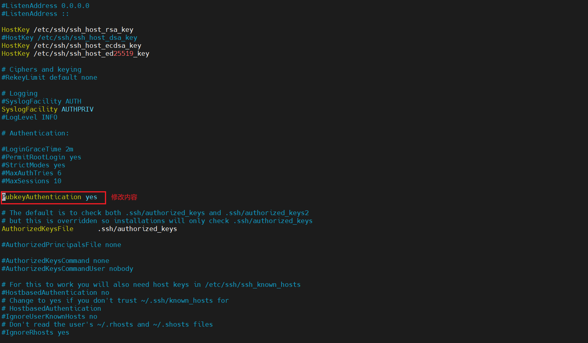
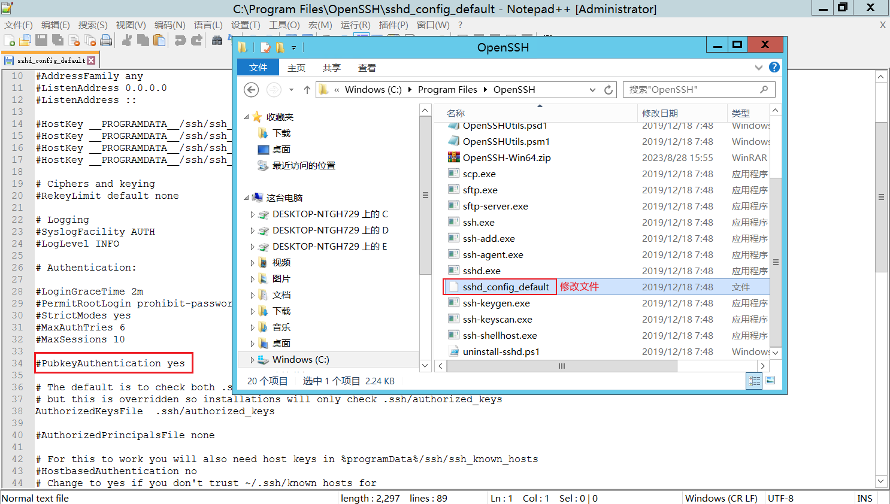

## SSH通过ssh-key开启免密登录（window，linux均适用）
> 如果A想SSH连接B，又不想输入密码；此时就可以通过A中生成的SSH密钥对，上传PublicKey到B，配置如下操作后，A就能直接连接B了

### 生成密钥对
> 采用rsa算法，可以使用其他算法，但dsa默认不支持；最好生成rsa密钥，ssh支持
```shell
ssh-keygen -t rsa
```

### 将公钥(id_rsa.pub)传到远程主机的~/.ssh目录下，重命名文件名为authorized_keys
```shell
## 这个root和用户名称可以自定，想给哪个用户开，就传到那个用户的.ssh文件夹下面
# linux
cd /root/.ssh
# windows
C:\Users\用户名称\.ssh
```


### 修改远程主机sshd_config配置，重启sshd服务
```shell
## centos7 修改 
vim /etc/ssh/sshd_config
# 修改为如下配置
PubkeyAuthentication yes
StrictModes no

# 重启ssh
systemctl restart sshd

## windows server 2012修改
配置如图，需要注意：windows的方式，需要通过[【YC】windows-server开启ssh服务器.md]中的说明安装OpenSSH
```



