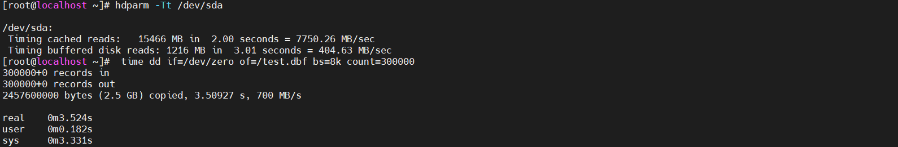

## Linux 下测试磁盘读写 I/O 速度的方法汇总

### 使用 hdparm 命令
> 这是一个是用来获取ATA/IDE硬盘的参数的命令；仅用于Linux系统，对于UNIX系统，ATA/IDE硬盘用的可能比较少，一般大型的系统都是使用磁盘阵列的
```shell
# 安装hdparm命令
yum install hdparm
# 命令
hdparm -Tt /dev/sda
# 结果
/dev/sda:
 Timing cached reads:   15466 MB in  2.00 seconds = 7750.26 MB/sec
 Timing buffered disk reads: 1216 MB in  3.01 seconds = 404.63 MB/sec
 
# 说明
在2秒钟读取了6676MB的缓存，约合3340.18 MB/sec
在3.11秒中读取了218MB磁盘(物理读)，读取速度约合70.11 MB/sec
```


### 使用dd命令
> /dev/null 伪设备，回收站，写该文件不会产生IO。
> /dev/zero 伪设备，会产生空字符流，对它不会产生IO。
* 测试磁盘的IO写速度
```shell
# 命令
time dd if=/dev/zero of=/test.dbf bs=8k count=300000
# 结果
300000+0 records in
300000+0 records out
10.59s real 0.43s user 9.40s system

# 查看生成文件大小
du -sm /test.dbf
# 结果
2347 /test.dbf

# 说明
在10.59秒的时间里，生成2347M的一个文件，IO写的速度约为221.6MB/sec；当然这个速度可以多测试几遍取一个平均值，符合概率统计
```
* 测试磁盘的IO读速度
```shell
# 查看系统个磁盘大小
df -m

# 结果
Filesystem                        1M-blocks Used Available Use%  Mounted on
/dev/mapper/VolGroup00-LogVol00     19214   9545   8693     53%     /
/dev/sda1                             99     13     82      14%    /boot
none                                 506      0     506      0%    /dev/shm

# 执行磁盘读命令
time dd if=/dev/mapper/VolGroup00-LogVol00 of=/dev/null bs=8k

# 结果
2498560+0 records in
2498560+0 records out
247.99s real 1.92s user 48.64s system

# 说明（通过/dev/mapper/VolGroup00-LogVol00文件夹大小除以运行时间得到平均读取速度）
在247.99秒的时间里读取了19214MB的文件，计算下来平均速度为77.48MB/sec
```