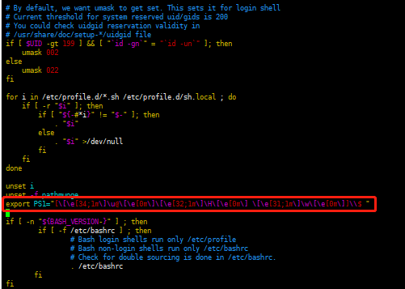

## 个人使用Linux中常用的命令集合

#### 修改Linux中的字体显示颜色

* 修改etc下的profile文件，命令：`vim /etc/profile`
* 添加信息：`export PS1="[\[\e[34;1m\]\u@\[\e[0m\]\[\e[32;1m\]\H\[\e[0m\] \[\e[31;1m\]\w\[\e[0m\]]\\$"`

  
#### 根据软件名称查询到该软件的所有安装路径
```shell
# 如果系统中没有安装yum，请先安装yum

# 查找所有的文件所在位置
yum find -name 软件名称

# 查询文件
whereis 文件名称
```
