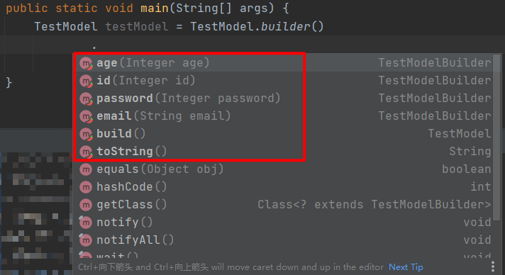

## Lombok注解说明：Builder

### 源码
#### Builder
```java
@Target({ElementType.TYPE, ElementType.METHOD, ElementType.CONSTRUCTOR})
@Retention(RetentionPolicy.SOURCE)
public @interface Builder {
    // 修改建造者方法名称：在内部类外部的方法public static TestModel.TestModelBuilder builder() {return new TestModel.TestModelBuilder();}
    String builderMethodName() default "builder";
    
    // 修改建造者类中的构建方法名称：在内部类中的方法
    String buildMethodName() default "build";

    // 修改建造者类名称
    String builderClassName() default "";

    // 如果为true，则生成实例方法以获取使用此实例的值初始化的构建器
    boolean toBuilder() default false;

    // 设置生成的构建器类的访问级别
    AccessLevel access() default AccessLevel.PUBLIC;

    // 建造者类中的方法名都会以等号后面的名称为前缀：public TestModel.TestModelBuilder gudaoId(final Integer id){ this.id = id; return this;}
    String setterPrefix() default "";

    @Target({ElementType.FIELD})
    @Retention(RetentionPolicy.SOURCE)
    public @interface Default {
    }

    @Target({ElementType.FIELD, ElementType.PARAMETER})
    @Retention(RetentionPolicy.SOURCE)
    public @interface ObtainVia {
        String field() default "";

        String method() default "";

        boolean isStatic() default false;
    }
}
```
#### Singular
```java
@Target({FIELD, PARAMETER})
@Retention(SOURCE)
public @interface Singular {
	// 修改添加集合元素的方法名
	String value() default "";
}
```

### Builder说明与注意点
* 一个名为FooBuilder的内部静态类，并具有和实体类形同的属性（称为构建器）
* 在构建器中：对于目标类中的所有的属性和未初始化的final字段，都会在构建器中创建对应属性
* 在构建器中：创建一个无参的default构造函数
* 在构建器中：对于实体类中的每个参数，都会对应创建类似于“setter”的方法，只不多方法名与该参数名相同。 并且返回值是构建器本身（便于链式调用），如上例所示
* 在构建器中：一个build()方法，调用此方法，就会根据设置的值进行创建实体对象
* 在构建器中：同时也会生成一个toString()方法
* 在实体类中：会创建一个builder()方法，它的目的是用来创建构建器
* final属性不管赋不赋值都能编译通过
* @Builder和@NoArgsConstructor一起使用冲突问题
  ```shell
  只使用@Builder会自动创建全参构造器。而添加上@NoArgsConstructor后就不会自动产生全参构造器
  
  两种解决方式：
    去掉@NoArgsConstructor
    添加@AllArgsConstructor（建议使用这种，毕竟无参构造最好保证是有的）
    枚举值建议这样来就行了，不要加@NoArgsConstructor
  ```

#### 实例演示
```java
/**
 * @Auther: Gudao
 * @Date: 2021/4/10
 * @Description:
 */
@Builder
public class TestModel {
    private Integer id;
    @NonNull
    private Integer password;
    private final String name = "gudao";
    private final Integer age;
    private transient String email;
    private static String adderss;
}
```
#### 编译后文件
```java
public class TestModel {
    private Integer id;
    @NonNull
    private Integer password;
    private final String name = "gudao";
    private final Integer age;
    private transient String email;
    private static String adderss;

    TestModel(final Integer id, @NonNull final Integer password, final Integer age, final String email) {
        if (password == null) {
            throw new NullPointerException("password is marked non-null but is null");
        } else {
            this.id = id;
            this.password = password;
            this.age = age;
            this.email = email;
        }
    }
    
    public static TestModel.TestModelBuilder builder() {
        return new TestModel.TestModelBuilder();
    }
    
    // 生成一个构造者类
    public static class TestModelBuilder {
        private Integer id;
        private Integer password;
        private Integer age;
        private String email;

        TestModelBuilder() {
        }

        public TestModel.TestModelBuilder id(final Integer id) {
            this.id = id;
            return this;
        }

        public TestModel.TestModelBuilder password(@NonNull final Integer password) {
            if (password == null) {
                throw new NullPointerException("password is marked non-null but is null");
            } else {
                this.password = password;
                return this;
            }
        }

        public TestModel.TestModelBuilder age(final Integer age) {
            this.age = age;
            return this;
        }

        public TestModel.TestModelBuilder email(final String email) {
            this.email = email;
            return this;
        }

        public TestModel build() {
            return new TestModel(this.id, this.password, this.age, this.email);
        }

        public String toString() {
            return "TestModel.TestModelBuilder(id=" + this.id + ", password=" + this.password + ", age=" + this.age + ", email=" + this.email + ")";
        }
    }
}
```
#### 使用


### Singular使用与注意点
* 在使用@Singular注释注释一个集合字段（使用@Builder注释类），lombok会将该构建器节点视为一个集合，并生成两个adder方法而不是setter方法
    * 一个向集合添加单个元素
    * 一个将另一个集合的所有元素添加到集合中
* 将不生成仅设置集合（替换已添加的任何内容）的setter。 还生成了clear方法。 这些singular构建器相对而言是有些复杂的，主要是来保证以下特性
    * 在调用build()时，生成的集合将是不可变的
    * 在调用build()之后调用其中一个adder方法或clear方法不会修改任何已经生成的对象。如果对集合修改之后，再调用build()，则会创建一个基于上一个对象创建的对象实体
    * 生成的集合将被压缩到最小的可行格式，同时保持高效
* Singular只能应用于lombok已知的集合类型。目前，支持的类型有
    * java.util
        * Iterable, Collection, 和List (一般情况下，由压缩的不可修改的ArrayList支持)
        * Set, SortedSet, and NavigableSet (一般情况下，生成可变大小不可修改的HashSet或者TreeSet)
        * Map, SortedMap, and NavigableMap (一般情况下，生成可变大小不可修改的HashMap或者TreeMap)
    * Guava’s com.google.common.collect
        * ImmutableCollection and ImmutableList
        * ImmutableSet and ImmutableSortedSet
        * ImmutableMap, ImmutableBiMap, and ImmutableSortedMap
        * ImmutableTable

#### 实例演示
```java
/**
 * @Auther: Gudao
 * @Date: 2021/4/10
 * @Description:
 */
@Builder
public class TestModel {
    private Integer id;
    @NonNull
    private Integer password;
    private final String name = "gudao";
    private final Integer age;
    private transient String email;
    private static String adderss;
    @Singular
    private List<String> hobbies;
}
```
#### 编译后文件
```java
public class TestModel {
    private Integer id;
    @NonNull
    private Integer password;
    private final String name = "gudao";
    private final Integer age;
    private transient String email;
    private static String adderss;
    private List<String> hobbies;

    TestModel(final Integer id, @NonNull final Integer password, final Integer age, final String email, final List<String> hobbies) {
        if (password == null) {
            throw new NullPointerException("password is marked non-null but is null");
        } else {
            this.id = id;
            this.password = password;
            this.age = age;
            this.email = email;
            this.hobbies = hobbies;
        }
    }

    public static TestModel.TestModelBuilder builder() {
        return new TestModel.TestModelBuilder();
    }

    public static class TestModelBuilder {
        private Integer id;
        private Integer password;
        private Integer age;
        private String email;
        private ArrayList<String> hobbies;

        TestModelBuilder() {
        }

        public TestModel.TestModelBuilder id(final Integer id) {
            this.id = id;
            return this;
        }

        public TestModel.TestModelBuilder password(@NonNull final Integer password) {
            if (password == null) {
                throw new NullPointerException("password is marked non-null but is null");
            } else {
                this.password = password;
                return this;
            }
        }

        public TestModel.TestModelBuilder age(final Integer age) {
            this.age = age;
            return this;
        }

        public TestModel.TestModelBuilder email(final String email) {
            this.email = email;
            return this;
        }

        public TestModel.TestModelBuilder hobby(final String hobby) {
            if (this.hobbies == null) {
                this.hobbies = new ArrayList();
            }

            this.hobbies.add(hobby);
            return this;
        }

        public TestModel.TestModelBuilder hobbies(final Collection<? extends String> hobbies) {
            if (hobbies == null) {
                throw new NullPointerException("hobbies cannot be null");
            } else {
                if (this.hobbies == null) {
                    this.hobbies = new ArrayList();
                }

                this.hobbies.addAll(hobbies);
                return this;
            }
        }

        public TestModel.TestModelBuilder clearHobbies() {
            if (this.hobbies != null) {
                this.hobbies.clear();
            }

            return this;
        }

        public TestModel build() {
            List hobbies;
            switch(this.hobbies == null ? 0 : this.hobbies.size()) {
            case 0:
                hobbies = Collections.emptyList();
                break;
            case 1:
                hobbies = Collections.singletonList(this.hobbies.get(0));
                break;
            default:
                hobbies = Collections.unmodifiableList(new ArrayList(this.hobbies));
            }

            return new TestModel(this.id, this.password, this.age, this.email, hobbies);
        }

        public String toString() {
            return "TestModel.TestModelBuilder(id=" + this.id + ", password=" + this.password + ", age=" + this.age + ", email=" + this.email + ", hobbies=" + this.hobbies + ")";
        }
    }
}
```