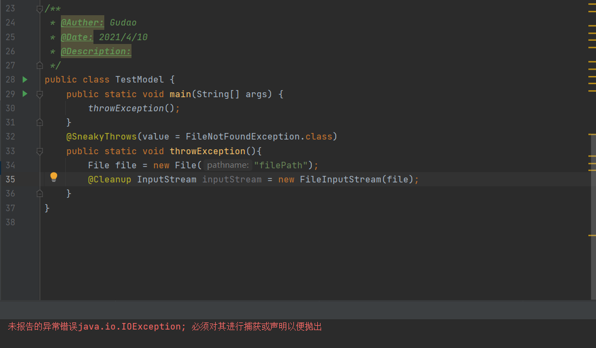

## Lombok注解说明：SneakyThrows  & Synchronized

### 源码
#### SneakyThrows
```java
@Target({ElementType.METHOD, ElementType.CONSTRUCTOR})
@Retention(RetentionPolicy.SOURCE)
public @interface SneakyThrows {
  // 指定准确的异常类型
  Class<? extends Throwable>[] value() default java.lang.Throwable.class;
}
```
#### Synchronized
```java

```

### SneakyThrows说明与注意点
> @SneakyThrows 可用于偷偷抛出checked exception，而无需在方法上的throws子句中声明需要抛出的异常。 由lombok生成的代码，不会忽略，不会包装，不会替换或以其他方式修改抛出的checked exception，而是将 checked exception 看做unchecked exception，不处理，直接扔掉
* value：制定了异常之后，lombok就会只捕捉我们指定的一种或者几种类型的异常，当然如果指定的类型没有被捕捉到，就会被抛到上一层
  ```java
  public class SneakyThrowsTest {
      public static void main(String[] args) {
          throwException();
      }
      @SneakyThrows(value = NullPointerException.class)
      public static void throwException(){
          String str  = null;
          String[] split = str.split(",");
          System.out.println(split);
      }
  }
  // 编译后：
  public class SneakyThrowsTest {
      public SneakyThrowsTest() {}
  
      public static void main(String[] args) {
          throwException();
      }
      public static void throwException() {
          try {
              String str = null;
              String[] split = ((String)str).split(",");
              System.out.println(split);
          } catch (NullPointerException var2) {
              throw var2;
          }
      }
  }
  ```
* 使用的时候如果使用注解的情况下，还是不要指定异常类型了；下面的情况制定了会编译异常
    ```java
    public class TestModel {
        public static void main(String[] args) {
            throwException();
        }
        @SneakyThrows(value = FileNotFoundException.class)
        // @SneakyThrows 可以编译通过 
        public static void throwException(){
            File file = new File("filePath");
            @Cleanup InputStream inputStream = new FileInputStream(file);
        }
    }
    ```
    
* 在实际开发中使用@SneakyThrows并不是太多，在处理一些业务时使用起来并不灵活。但是在一些情况下可以使用，比如在一些不太可能发生异常的地方，但是你又必须cache checked exception的地方使用这个@SneakyThrows annotation会显得代码比较规整，易读

#### 实例演示
```java
public class SneakyThrowsTest {
  public static void main(String[] args) {
    throwException();
  }
  @SneakyThrows
  public static void throwException() {
    String str  = null;
    String[] split = str.split(",");
    System.out.println(split);
  }
}
```
#### 编译后文件
```java
public class SneakyThrowsTest {
  public SneakyThrowsTest() {}

  public static void main(String[] args) {
    throwException();
  }
  public static void throwException() {
    try {
      String str = null;
      String[] split = ((String)str).split(",");
      System.out.println(split);
    } catch (Throwable var2) {
      throw var2;
    }
  }
}
```
#### 说明
> lombok都可以抛出所有异常，catch (Throwable var2)放在方法体的开始和结束，可以到所有的异常

### Synchronized说明与注意点
* @Synchronized是synchronized方法修饰符的更安全的变体。与synchronized一样，注释只能用于静态和实例方法。
* @Synchronized的操作类似于synchronized关键字，但它锁定在不同的对象上。
* 关键字synchronized锁定this，但@Synchronized锁定在名为$lock的字段上，并且该字段是私有的；（如果该字段不存在，则会为你创建该字段。）如果注释静态方法，则注释会锁定名为$LOCK的静态字段
* 如果lock/LOCK自动生成的，则字段将使用一个空Object[]数组进行初始化，而不仅仅是new Object()显示该模式在实际使用中的大多数代码片段。Lombok这样做是因为新对象不可序列化，而0大小的数组则可序列化。因此，使用@Synchronized不会阻止您的对象被序列化。
* @Synchronized("gudao")：Synchronized 自定义锁，必须先实例化这个实体，否则将会在编译期发出错误

#### 实例演示
```java
/**
 * @Auther: Gudao
 * @Date: 2021/4/10
 * @Description:
 */
public class TestModel {
    // 指定对象为锁
    private final Object gudao = new Object();

    @Synchronized
    public static void method1(){
        System.out.println("001");
    }
    @Synchronized
    public void method2(){
        System.out.println("002");
    }
    @Synchronized("gudao")
    public int method3(){
        System.out.println("003");
        return 0;
    }
}
```
#### 编译后文件
```java
public class TestModel {
  private static final Object $LOCK = new Object[0];
  private final Object $lock = new Object[0];
  private final Object gudao = new Object();

  public TestModel() {
  }

  public static void method1() {
    synchronized($LOCK) {
      System.out.println("001");
    }
  }

  public void method2() {
    synchronized(this.$lock) {
      System.out.println("002");
    }
  }

  public int method3() {
    synchronized(this.gudao) {
      System.out.println("003");
      return 0;
    }
  }
}
```
#### 说明
> 为什么在注解@Synchronized中通过value属性指定自定义的锁名称时，而不会自动生成此自定义的锁字段字段：因为否则在字段名称中输入错误将导致很难找到错误！