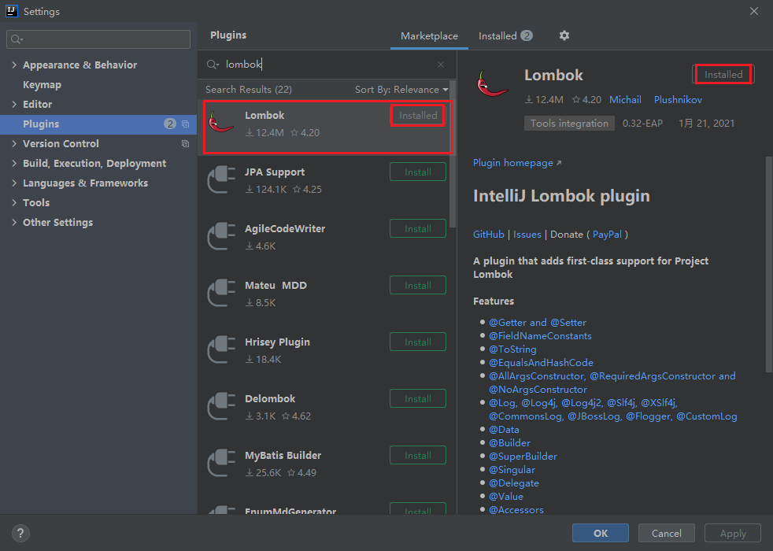
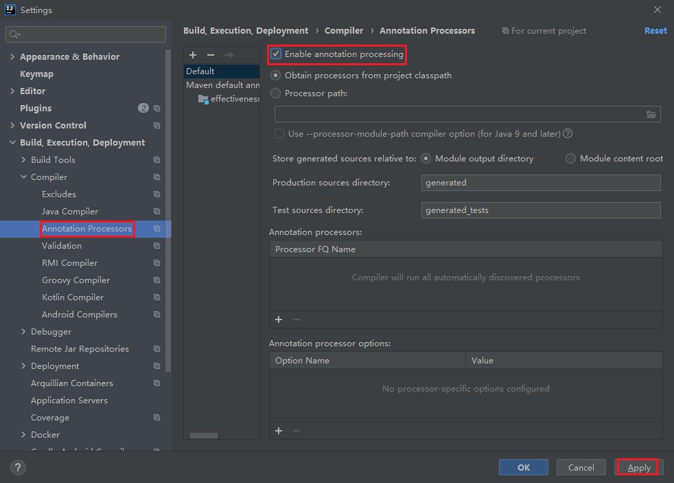

## Lombok配置信息

### Maven坐标
```xml
<!-- scope=provided，说明它只在编译阶段生效 -->
<dependency>
    <groupId>org.projectlombok</groupId>
    <artifactId>lombok</artifactId>
    <version>1.18.16</version>
    <scope>provided</scope>
</dependency>
```

### IDEA相关配置
* 添加lombok插件
    
* Idea相关配置打开
    > 由于lombok基于插入式注解引擎，只在编译器生成代码，因此进行编译的时候，需要idea开启注解引擎支持功能，其功能默认开启，但有时候是关闭状态，需要我们自己手动开启，否则idea会编译报错：
    
    
