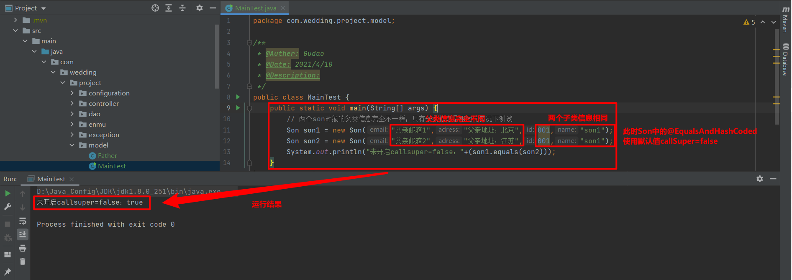
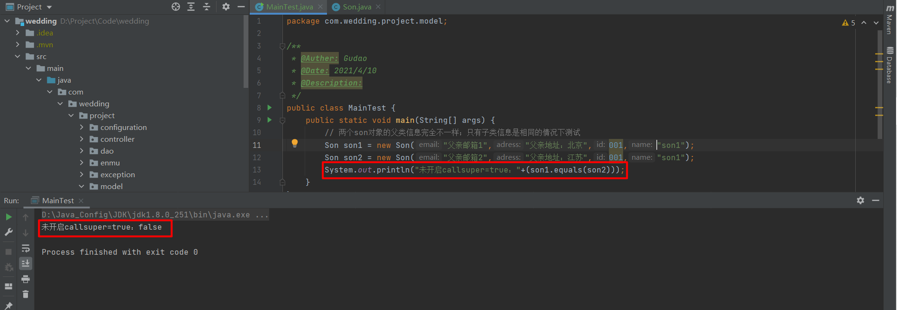

## callsuper的true和false区别

### @EqualsAndHashCode(callSuper=false/true)
> 默认false，表示是否将父类的equals和hashCode方法加到该子类的equals和hashCode方法中

### 实例演示
#### 父类
```java
/**
 * @Auther: Gudao
 * @Date: 2021/4/10
 * @Description:
 */
@Data
@NoArgsConstructor
@AllArgsConstructor
public class Father {
    private String email;
    private String adress;
}
```
#### 子类：当只使用@EqualsAndHashCode注解，此时的callSuper默认值为false，此时的子类通过equals方法比较相同后就不会去比较父类equals方法
```java
/**
 * @Auther: Gudao
 * @Date: 2021/4/10
 * @Description:
 */
@EqualsAndHashCode
@Data
@AllArgsConstructor
public class Son extends Father{
    private Integer id;
    private String name;

    // 可以默认不写，通过set方法设置father中的属性
    public Son(String email, String adress, Integer id, String name) {
        super(email, adress);
        this.id = id;
        this.name = name;
    }
}
```
#### 测试方法
```java
/**
 * @Auther: Gudao
 * @Date: 2021/4/10
 * @Description:
 */
public class MainTest {
    public static void main(String[] args) {
        // 两个son对象的父类信息完全不一样；只有子类信息是相同的情况下测试
        Son son1 = new Son("父亲邮箱1","父亲地址：北京",001,"son1");
        Son son2 = new Son("父亲邮箱2","父亲地址：江苏",001,"son1");
        System.out.println("未开启callsuper=false"+(son1.equals(son2)));// true
    }
}
```
#### 当只使用@EqualsAndHashCode注解，此时的callSuper默认值为false运行如图


#### 子类修改@EqualsAndHashCode(callSuper = true)
> 设置callSuper为true时，就会比较当前类的equals相同的情况下去比较父类的equals方法
```java
/**
 * @Auther: Gudao
 * @Date: 2021/4/10
 * @Description: 设置callSuper为true时，就会比较当前类的equals相同的情况下去比较父类的equals方法
 */
@EqualsAndHashCode(callSuper = true)
@Data
@AllArgsConstructor
public class Son extends Father{
    private Integer id;
    private String name;

    // 可以默认不写，通过set方法设置father中的属性
    public Son(String email, String adress, Integer id, String name) {
        super(email, adress);
        this.id = id;
        this.name = name;
    }
}
```
#### 测试方法
```java
/**
 * @Auther: Gudao
 * @Date: 2021/4/10
 * @Description:
 */
public class MainTest {
    public static void main(String[] args) {
        // 两个son对象的父类信息完全不一样；只有子类信息是相同的情况下测试
        Son son1 = new Son("父亲邮箱1","父亲地址：北京",001,"son1");
        Son son2 = new Son("父亲邮箱2","父亲地址：江苏",001,"son1");
        System.out.println("未开启callsuper=true"+(son1.equals(son2)));// false
    }
}
```
#### 当子类中使用@EqualsAndHashCode(callSuper = true)
