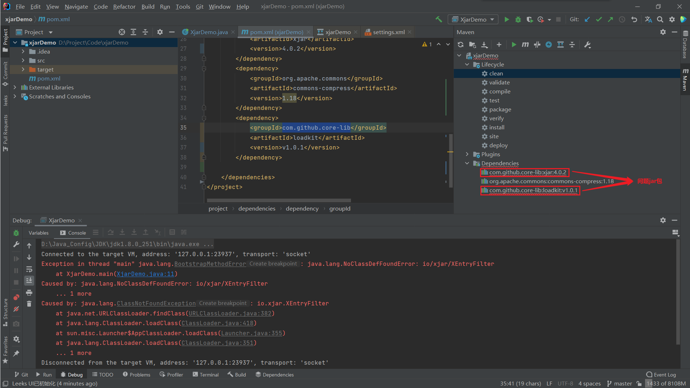
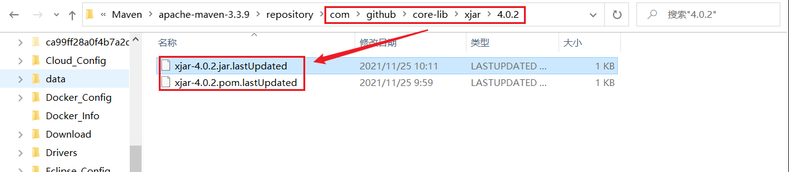
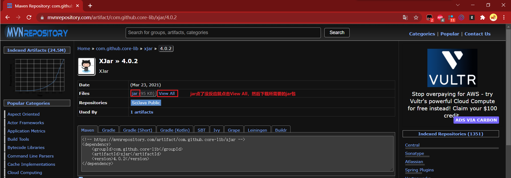
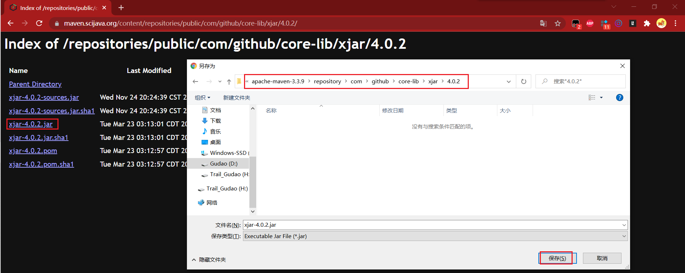
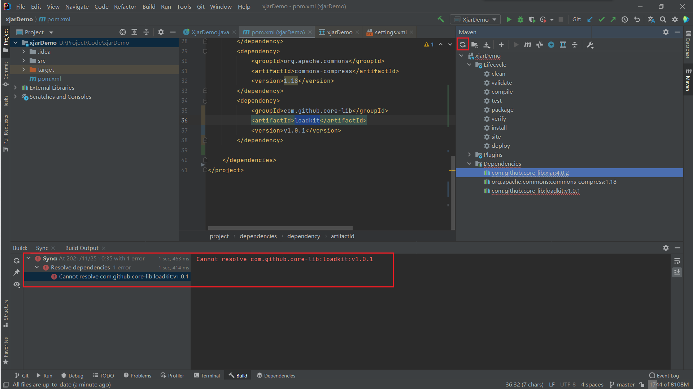
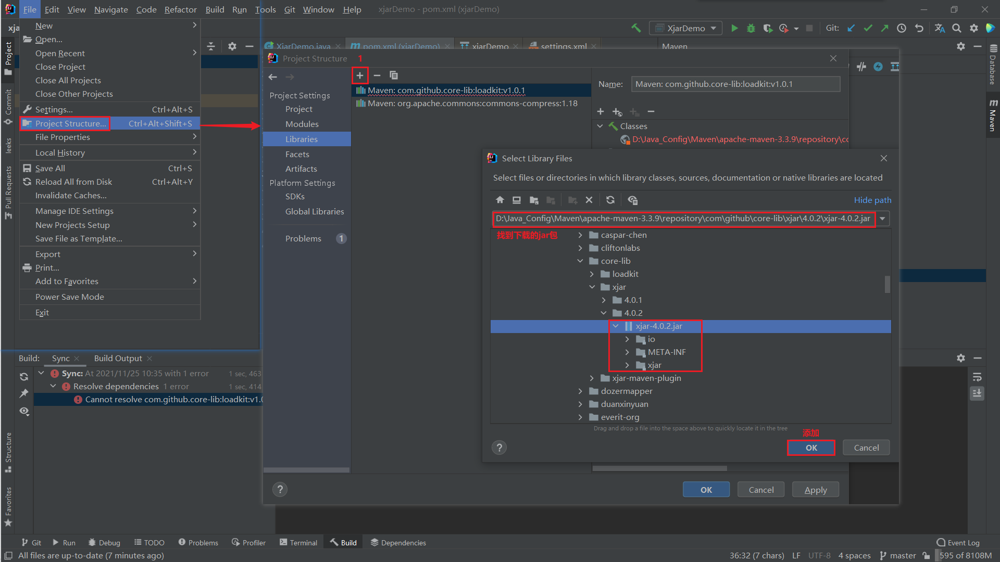
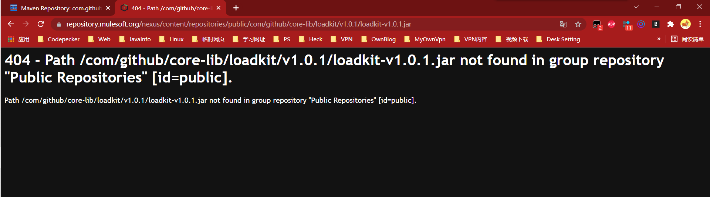
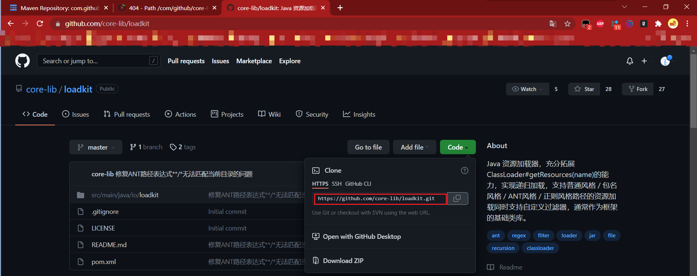
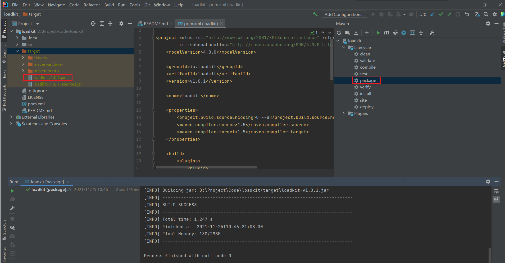
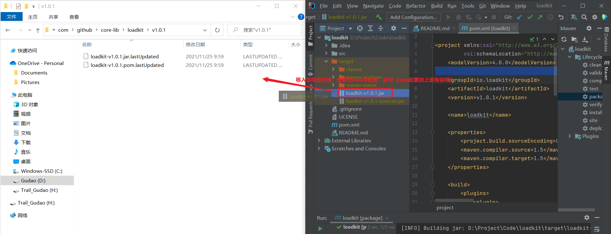

## maven中jar包下载不下来-终极
> plugin中的jar包引用报红看【maven-项目导入之后全部飘红.md】

### 下载不下来原因（此处都演示）
* 网络太差，下载下来的都是`.lastUpdated`文件
* maven仓库中下载的jar包没有了，访问报404
* plugin中引入的jar包本地没有

### 网络太差，下载下来的都是`.lastUpdated`文件

* 项目中的两个问题jar包，运行时就包图中的类找不到问题
* xjar是maven仓库官网存在，可以下载导入项目
* loadkit是maven仓库官网都没有了，直接github拉去项目自行打包

#### 本地引入jar包一直下载不下来，maven仓库直接下载
* 本地下载的都是`.lastUpdated`文件
  
* 直接去maven官网下载jar包到指定路径（此处为了方便就下载到了指定本地jar仓库中，如果不知道jar路径，可以使用另一种方法（idea项目配置））
   
  
* 此时已经不提示xjar包下载不下来了
  
* 方法二：idea项目配置
  

### maven中的jar包已经不存在

#### maven仓库没有，github找到项目直接打包下载（一般只适合jar包的group为com.githubde）
* Github中找到jar包项目
  
* 将项目打成需要的jar包
  
* 将jar包移入指定本地jar仓库中
  
