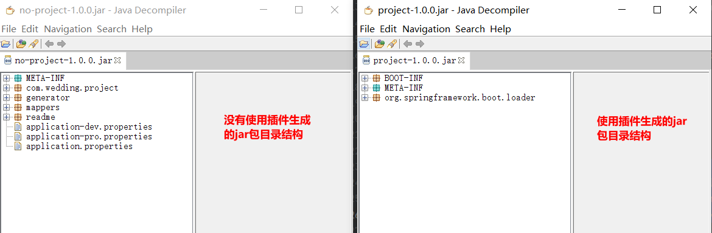
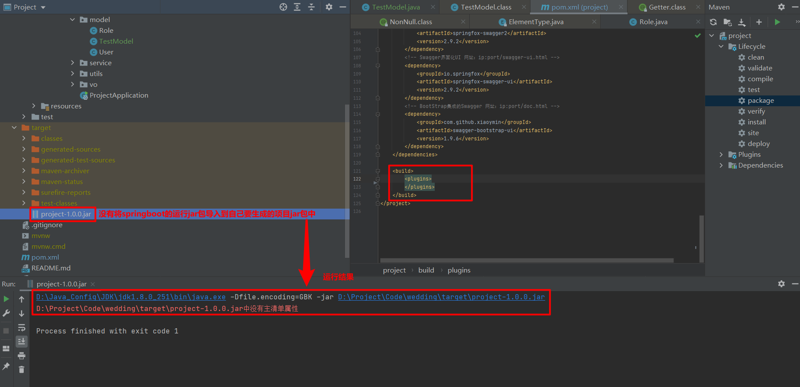

## spring-boot-maven-plugin插件说明
> spring-boot-maven-plugin插件，会将依赖的jar包全部打包进去。

### 配置信息，配置在pom文件的plugins标签下
```xml
<plugin>
    <!-- 添加后就会将所有springboot启动运行所需要的jar都包含进来 -->
    <groupId>org.springframework.boot</groupId>
    <artifactId>spring-boot-maven-plugin</artifactId>
</plugin>
```
### 使用插件前后生成的jar包区别


### 不配置生成的jar包运行结果


### configuration
#### Springboot中完整配置
```xml
<dependencies>
    <dependency>
        <groupId>org.projectlombok</groupId>
        <artifactId>lombok</artifactId>
        <optional>true</optional>
    </dependency>
</dependencies>

<build>
    <plugins>
        <plugin>
            <!-- 添加后就会将所有springboot启动运行所需要的jar都包含进来 -->
            <groupId>org.springframework.boot</groupId>
            <artifactId>spring-boot-maven-plugin</artifactId>
            <configuration>
                <excludes>
                    <exclude>
                        <groupId>org.projectlombok</groupId>
                        <artifactId>lombok</artifactId>
                    </exclude>
                </excludes>
            </configuration>
        </plugin>
    </plugins>
</build>
```
#### 打包第三方jar包和排除第三方jar包
* 打包：configuration标签下的include属性(一般不怎么使用)
    * configuration下增加includes，include添加需要排除的jar包groupId和artifactId

* 排除：configuration标签下的exclude属性
    * configuration下增加excludes，exclude添加需要排除的jar包groupId和artifactId
    
* 注意：scope是test、provided的话，是无法include进来的，compile(默认)、runtime会被包含进来