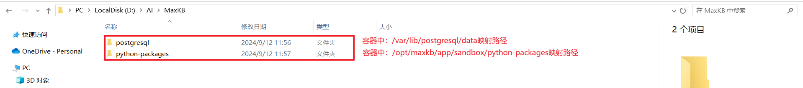
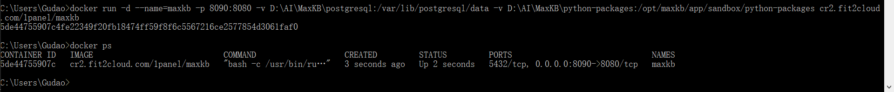

## MaxKB部署说明-Windows-Docker

### 配置说明
* 系统：Win 10
* Docker Desktop 4.33.1

### 项目地址
[GitHub](https://github.com/1Panel-dev/MaxKB]

### Docker Desktop安装：[【YC】win安装docker.md](../docker/【YC】win安装docker.md)
> 参考【YC】win安装docker.md安装文档，最Windows 10系统安装Docker Desktop。

### 安装部署-Docker版本
> 目前做数据持久化，本地对容器内数据文件夹做了映射
```shell
# 创建映射文件夹（不要存在空格，不要存在中文）
如下图：映射路径配置

# 启动容器，将创建的映射文件夹通过 -v 进行挂载映射
## 修改 -v 后的映射路径，可自定义如：C:/postgresql:/var/lib/postgresql/data（win路径:容器内映射路径）
## 修改 -p 后的端口，可自定义如：9090:8080（win端口:容器内映射端口）
docker run -d --name=maxkb -p 8090:8080 -v D:\AI\MaxKB\postgresql:/var/lib/postgresql/data -v D:\AI\MaxKB\python-packages:/opt/maxkb/app/sandbox/python-packages cr2.fit2cloud.com/1panel/maxkb
```



#### 注意
* 如果镜像不存在，在执行命令的时候会先下载镜像，然后启动容器。演示的图片中镜像已经下载好了，所以直接启动容器。
* 如果镜像下载失败，请寻找国内的镜像源。
* 项目启动后：用户名: admin 密码: MaxKB@123..

### 访问
> 浏览器访问：http://localhost:8090；也可以通过Docker Desktop的Containers菜单里面当前容器的`Port(s)`点击访问
