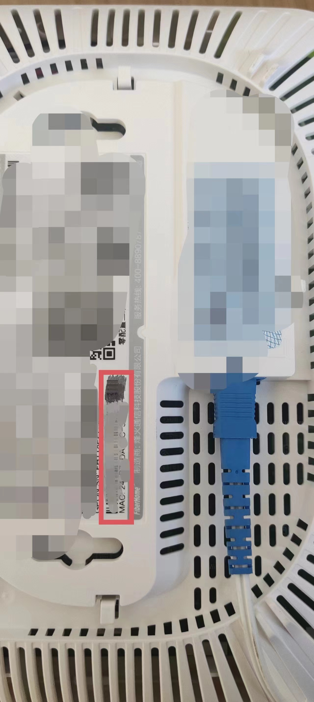
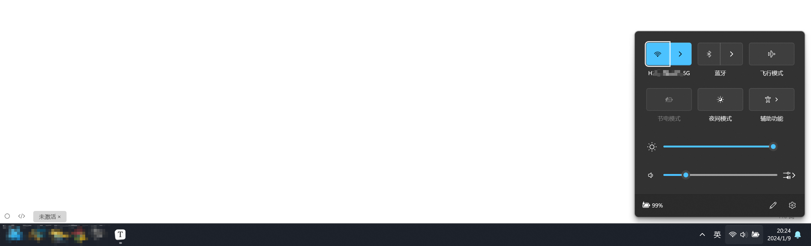
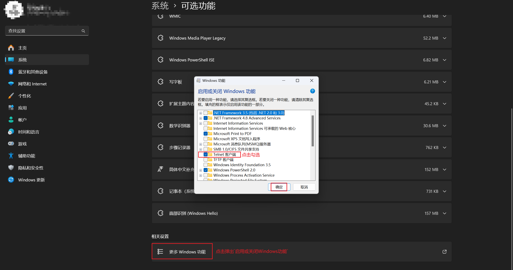
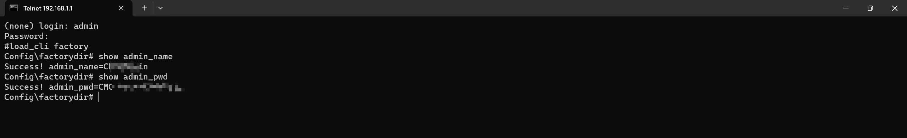
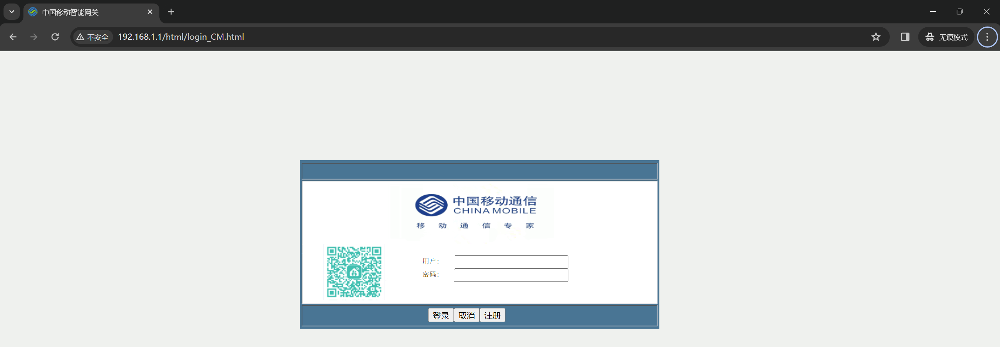

## 移动光猫超级管理员账号密码获取

> 看了几篇网上给的账号密码；很多都是账号对的，密码错了。
>
> 注意：2024年1月9号测试有用

### 环境说明

* 光猫型号：HG6145D2
* 宽带地址：北京

### 查看光猫盒子后面的MAC地址

> 红框中被涂抹的信息，把中间的`-`去掉就是我们需要的了，如：24B7DABC3130



### 通过网线连接光猫或者连接WIFI

> 测试直接连接光猫的WIFI也可以；只要能访问通`192.168.1.1`这个地址即可



### 界面访问如下地址，查看telnet是否开启

> 请求参数中的key的值为光猫的MAC地址；
> 通过浏览器访问下面的地址，不然后面telnet不生效

```shell
# 将192.168.1.1改为自己的光猫地址
# 将24B7DABC3130改为自己的光猫MAC
http:/192.168.1.1/cgi-bin/telnetenable.cgi?telnetenable=1&key=24B7DABC3130
```

### 打开`telnet`命令



### 获取超级密码

> 通过`win+R -> 输入cmd` 打开命令行界面

```shell
# 通过telnet监听192.168.1.1
telnet 192.168.1.1
# 输入用户名称admin
admin
# 输入密码Fh@加上MAC的后6位，Mac在上面，比如：Fh@2XF21
Fh@BC3130
# 执行出厂设置
load_cli factory
# 展示账号信息
show admin_name
# 展示密码，这样明文密码就出来了
show admin_pwd
```



### 访问移动后台管理界面

> 打开浏览器输入`192.168.1.1`

