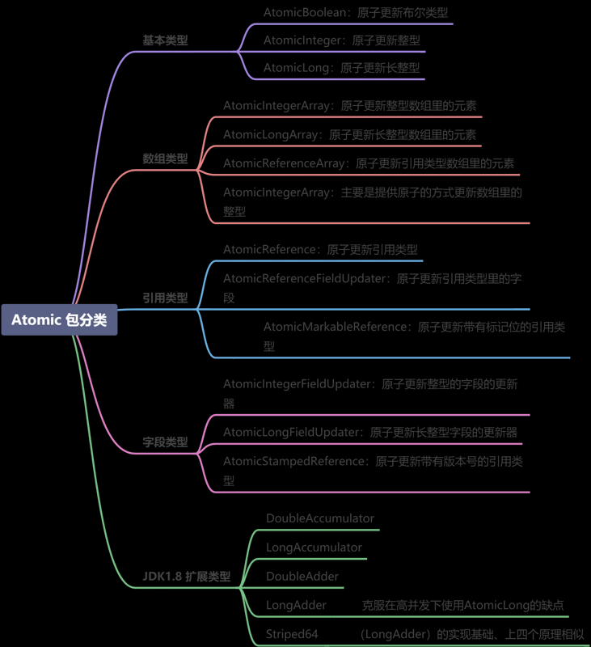
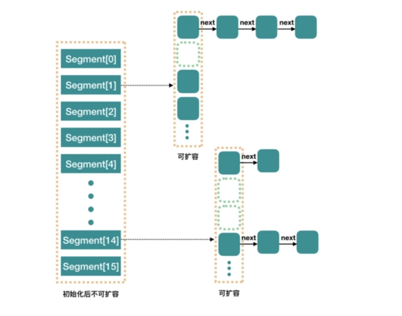
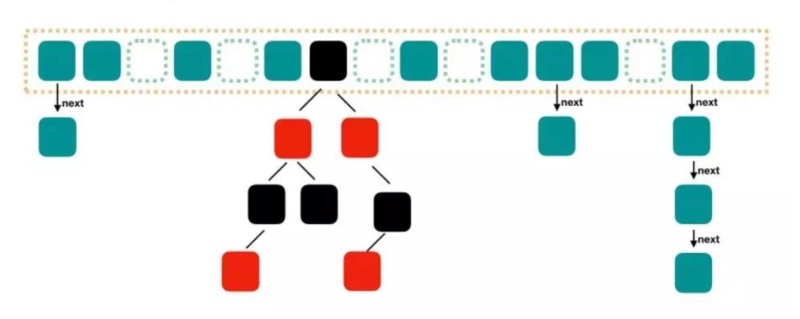
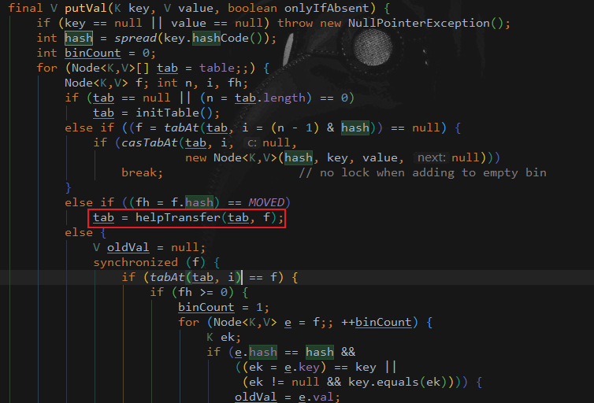
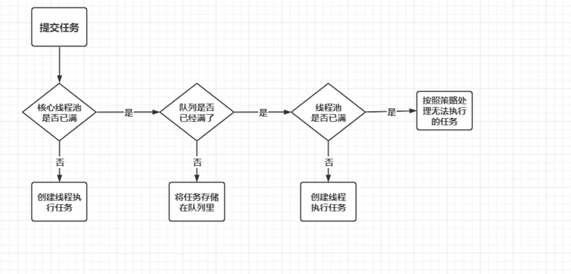
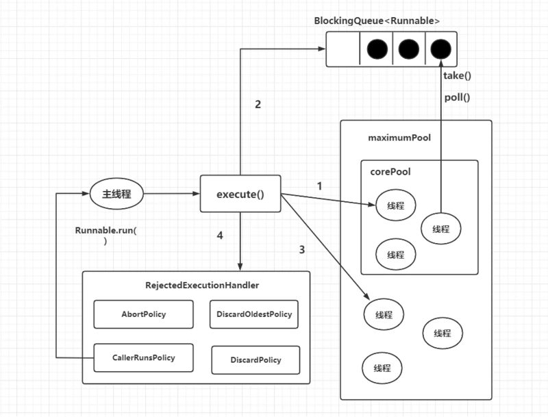
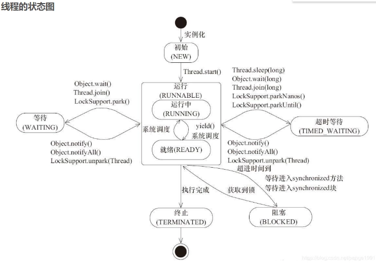
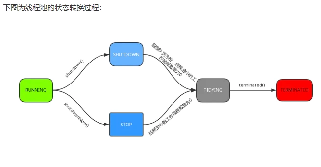

## 多线程中的问题

### 线程启动的三种方式
* 继承Thread类创建线程
* 实现Runnable接口创建线程
* 使用线程池例如用Executor框架来启动【Execitor.newCachedThread()】

### 如何关闭线程
* 关闭线程直接让线程执行完毕就会把线程关闭
* JDK中有stop()方法也能对线程进行关闭，该方法太过粗暴，可能会产生状态的不一致

### wait/notify与sleep的比较.
* 相同点
1. 都会让线程进入阻塞的状态. 都会响应中断.
* 不同点
1. wait/notify 必须在同步方法中去执行(线程更加安全, 防止死锁和永久等待), 而sleep不需要
2. wait/notify 会释放锁, sleep不会释放锁
3. sleep方法必须传递参数,设置休眠时间. 而wait方法可以不传递时间参数, 如果不传递,直到被唤醒
4. wait/notify 所属的Object类(Java对象中,每一个类都是一把锁), sleep属于Thread.

### 多线程与高并发
1. synchronized 当多个线程同时访问同一个资源的时候需要对这个资源上锁。
2. synchronized 既保证原子性，也保证线程间的可见性

## Synchronized

### synchronized保证原子性与线程间可见
```java
public class Thread_009 {
    private int count  = 100000;

    public /*synchronized*/ void run(){
        count--;
        System.out.println(Thread.currentThread().getName()+" count = "+count);
    }

    public static void main(String[] args) {
        Thread_009 t = new Thread_009();
        for (int i = 100000; i > 0 ; i--) {
            new Thread(t::run,"Thread "+i+" ").start();
        }
    }
}
```

```shell
不加sychronized执行结果,我们可以看到多个线程输出了同一个值，最终结果不是我们预期的0
......
Thread 38223  count = 38230
Thread 38166  count = 38229
Thread 38226  count = 38229
Thread 38169  count = 38229
Thread 38284  count = 38230
Thread 38168  count = 38228
......

当我们加上sychronized时，会解决这个问题
Thread 4  count = 3
Thread 5  count = 2
Thread 2  count = 1
Thread 1  count = 0
```
### 面试题：模拟银行账户，对业务写方法加锁，对业务读方法不加锁，可以吗？
> 答：不可以，容易产生脏读现象；具体看代码，解决方法就是把读方法也加锁

```java
public class Thread_010 {
    String name;
    double balance;

    public /*synchronized*/ void set(String name,double balance){
        this.name = name;
        try {
            Thread.sleep(2000);
        } catch (InterruptedException e) {
            e.printStackTrace();
        }
        this.balance = balance;
    }

    public synchronized double getBalance(){
        return this.balance;
    }

    public static void main(String[] args) {
        Thread_010 account = new Thread_010();
        new Thread(()->account.set("柯南",300.0)).start();
        try {
            TimeUnit.SECONDS.sleep(1);
        } catch (InterruptedException e) {
            e.printStackTrace();
        }
        System.out.println("当前账户余额："+account.getBalance());

        try {
            TimeUnit.SECONDS.sleep(2);
        } catch (InterruptedException e) {
            e.printStackTrace();
        }

        System.out.println("当前账户余额："+account.getBalance());
    }
}
```
```shell
不加锁执行结果：
当前账户余额：0.0
当前账户余额：300.0
加锁执行结果：
当前账户余额：300.0
当前账户余额：300.0
```

### synchronized 锁重入|异常锁
* 锁重入
> 一个同步方法内可以调用另一个同步方法，及一个类中两个方法都加了锁，那么他们锁定的都是同一个对象，当我们在m1中调用m2时，会发现他们呢是同一个线程的申请这把锁，允许执行m2，这就叫锁重入。
* 异常锁
> 程序执行过程中，如果某个环节出现异常，默认锁会被释放，外部等待的程序就会冲进来，程序乱入，可能会访问到异常时产生的数据；一般用try-catch解决，保证流程是不会被异常中断的。

### synchronized 锁升级
这里强烈安利 《我是厕所所长一、二》-马士兵 马老师的文章生动的讲解了锁升级的一个过程，通俗易懂！

## CAS

### 面试题：CAS（自旋锁）一定比系统锁的效率高吗？
> 答：不一定，分具体情况：执行时间短（加锁的代码），线程数少，用自旋；执行时间长，线程数多，用系统锁。

### 什么是 CAS？
> CAS（Compare And Swap）指比较并交换。CAS算法CAS(V, E, N)包含 3 个参数，V 表示要更新的变量，E 表示预期的值，N 表示新值。在且仅在 V 值等于 E值时，才会将 V 值设为 N，如果 V 值和 E 值不同，则说明已经有其他线程做了更新，当前线程什么都不做。最后，CAS 返回当前 V 的真实值。Concurrent包下所有类底层都是依靠CAS操作来实现，而sun.misc.Unsafe为我们提供了一系列的CAS操作。

### CAS 有什么缺点？ 
> ABA问题 自旋问题 范围不能灵活控制

### 对 CAS 中的 ABA 产生有解决方案吗？
#### 什么是 ABA 问题呢？
* 代码示例看【MSB009】cas中ABA问题解决.md
> 多线程环境下。线程 1 从内存的V位置取出 A ，线程 2 也从内存中取出 A，并将 V 位置的数据首先修改为 B，接着又将 V 位置的数据修改为 A，线程 1 在进行CAS操作时会发现在内存中仍然是 A，线程 1 操作成功。尽管从线程 1 的角度来说，CAS操作是成功的，但在该过程中其实 V 位置的数据发生了变化，线程 1 没有感知到罢了，这在某些应用场景下可能出现过程数据不一致的问题。
#### 解决
> 可以版本号（version）来解决 ABA 问题的，在 atomic 包中提供了 AtomicStampedReference 这个类，它是专门用来解决 ABA 问题的，通过getStampe()方法获取当前版本戳，通过compareAndSet()方法进行修改，方法中包含：引用预期值、引用新值、版本戳预期值、版本戳新值

### CAS 自旋导致的问题？ 
> 由于单次 CAS 不一定能执行成功，所以 CAS 往往是配合着循环来实现的，有的时候甚至是死循环，不停地进行重试，直到线程竞争不激烈的时候，才能修改成功。  CPU 资源也是一直在被消耗的，这会对性能产生很大的影响。所以这就要求我们，要根据实际情况来选择是否使用 CAS，在高并发的场景下，通常 CAS 的效率是不高的。

### CAS 范围不能灵活控制 
> 不能灵活控制线程安全的范围。只能针对某一个，而不是多个共享变量的，不能针对多个共享变量同时进行 CAS 操作，因为这多个变量之间是独立的，简单的把原子操作组合到一起，并不具备原子性。

## AQS

### 什么是 AQS？

> AbstractQueuedSynchronizer抽象同步队列简称AQS，它是实现同步器的基础组件，并发包中锁的底层就是使用AQS实现的。AQS定义了一套多线程访问共享资源的同步框架，许多同步类的实现都依赖于它，例如常用的Synchronized、ReentrantLock、ReentrantReadWriteLock、Semaphore、CountDownLatch等。该框架下的锁会先尝试以CAS乐观锁去获取锁，如果获取不到，则会转为悲观锁（如RetreenLock）

### 了解 AQS 共享资源的方式吗？
1. 独占式：只有一个线程能执行，具体的Java实现有ReentrantLock。
2. 共享式：多个线程可同时执行，具体的Java实现有Semaphore和CountDownLatch。

## Atomic

### Atomic 原子更新 
> Java 从 JDK1.5 开始提供了 java.util.concurrent.atomic 包，方便程序员在多线程环 境下，无锁的进行原子操作。在 Atomic 包里一共有 12 个类，四种原子更新方式，分别是原子更新基本类型，原子更新数组，原子更新引用和原子更新字段。在 JDK 1.8 之后又新增几个原子类。如下如：


### 列举几个AtomicLong 的常用方法
1. long getAndIncrement() ：以原子方式将当前值加1，注意，返回的是旧值。（i++)
2. long incrementAndGet() ：以原子方式将当前值加1，注意，返回的是新值。（++i）
3. long getAndDecrement() ：以原子方式将当前值减 1，注意，返回的是旧值 。(i--)
4. long decrementAndGet() ：以原子方式将当前值减 1，注意，返回的是新值 。(--i)
5. long addAndGet（int delta） ：以原子方式将输入的数值与实例中的值（AtomicLong里的value）相加，并返回结果

### 说说 AtomicInteger 和 synchronized 的异同点？
#### 相同点
* 都是线程安全
#### 不同点
* 背后原理
> synchronized 背后的 monitor 锁。在执行同步代码之前，需要首先获取到 monitor 锁，执行完毕后，再释放锁。原子类，线程安全的原理是利用了 CAS 操作。
* 使用范围
> 原子类使用范围是比较局限的,一个原子类仅仅是一个对象，不够灵活。而 synchronized 的使用范围要广泛得多。比如说 synchronized 既可以修饰一个方法，又可以修饰一段代码，相当于可以根据我们的需要，非常灵活地去控制它的应用范围
* 粒度
> 原子变量的粒度是比较小的，它可以把竞争范围缩小到变量级别。通常情况下，synchronized 锁的粒度都要大于原子变量的粒度。
* 性能
> synchronized 是一种典型的悲观锁，而原子类恰恰相反，它利用的是乐观锁。

### 原子类和 volatile 有什么异同？
* volatile 可见性问题
* 解决原子性问题

### AtomicLong 可否被 LongAdder 替代？
* 有了更高效的 LongAdder，那 AtomicLong 可否不使用了呢？是否凡是用到 AtomicLong 的地方，都可以用 LongAdder 替换掉呢？答案是不是的，这需要区分场景。
* LongAdder 只提供了 add、increment 等简单的方法，适合的是统计求和计数的场景，场景比较单一，而 AtomicLong 还具有 compareAndSet 等高级方法，可以应对除了加减之外的更复杂的需要 CAS 的场景。
> 结论：如果我们的场景仅仅是需要用到加和减操作的话，那么可以直接使用更高效的 LongAdder，但如果我们需要利用 CAS 比如compareAndSet 等操作的话，就需要使用 AtomicLong 来完成

## 并发工具

### CountDownLatch
> 基于线程计数器来实现并发访问控制，主要用于主线程等待其他子线程都执行完毕后执行相关操作。其使用过程为：在主线程中定义CountDownLatch，并将线程计数器的初始值设置为子线程的个数，多个子线程并发执行，每个子线程在执行完毕后都会调用countDown函数将计数器的值减1，直到线程计数器为0，表示所有的子线程任务都已执行完毕，此时在CountDownLatch上等待的主线程将被唤醒并继续执行。

### CyclicBarrier
> CyclicBarrier（循环屏障）是一个同步工具，可以实现让一组线程等待至某个状态之后再全部同时执行。在所有等待线程都被释放之后，CyclicBarrier可以被重用。CyclicBarrier的运行状态叫作Barrier状态，在调用await方法后，线程就处于Barrier状态。
#### CyclicBarrier中最重要的方法是await方法，它有两种实现。
1. public int await()：挂起当前线程直到所有线程都为Barrier状态再同时执行后续的任务。
2. public int await(long timeout, TimeUnit unit)：设置一个超时时间，在超时时间过后，如果还有线程未达到Barrier状态，则不再等待，让达到Barrier状态的线程继续执行后续的任务。

### Semaphore
> Semaphore指信号量，用于控制同时访问某些资源的线程个数，具体做法为通过调用acquire()获取一个许可，如果没有许可，则等待，在许可使用完毕后通过release()释放该许可，以便其他线程使用。

### CyclicBarrier 和 CountdownLatch 有什么异同？
#### 相同点
都能阻塞一个或一组线程，直到某个预设的条件达成发生，再统一出发。
#### 不同点，具体如下。
* 作用对象不同
> CyclicBarrier 要等固定数量的线程都到达了栅栏位置才能继续执行，而 CountDownLatch 只需等待数字倒数到 0，也就是说 CountDownLatch 作用于事件，但 CyclicBarrier 作用于线程；CountDownLatch 是在调用了 countDown 方法之后把数字倒数减 1，而 CyclicBarrier 是在某线程开始等待后把计数减 1。
* 可重用性不同
> CountDownLatch 在倒数到 0 并且触发门闩打开后，就不能再次使用了，除非新建一个新的实例；而 CyclicBarrier 可以重复使用。CyclicBarrier 还可以随时调用 reset 方法进行重置，如果重置时有线程已经调用了 await 方法并开始等待，那么这些线程则会抛出 BrokenBarrierException 异常。
* 执行动作不同
> CyclicBarrier 有执行动作 barrierAction，而 CountDownLatch 没这个功能。

### CountDownLatch、CyclicBarrier、Semaphore的区别如下。
1. CountDownLatch和CyclicBarrier都用于实现多线程之间的相互等待，但二者的关注点不同。CountDownLatch主要用于主线程等待其他子线程任务均执行完毕后再执行接下来的业务逻辑单元，而CyclicBarrier主要用于一组线程互相等待大家都达到某个状态后，再同时执行接下来的业务逻辑单元。此外，CountDownLatch是不可以重用的，而CyclicBarrier是可以重用的。
2. Semaphore和Java中的锁功能类似，主要用于控制资源的并发访问。

## Locks

### 公平锁与非公平锁
> ReentrantLock支持公平锁和非公平锁两种方式。公平锁指锁的分配和竞争机制是公平的，即遵循先到先得原则。非公平锁指JVM遵循随机、就近原则分配锁的机制。ReentrantLock通过在构造函数ReentrantLock(boolean fair)中传递不同的参数来定义不同类型的锁，默认的实现是非公平锁。这是因为，非公平锁虽然放弃了锁的公平性，但是执行效率明显高于公平锁。如果系统没有特殊的要求，一般情况下建议使用非公平锁。

### synchronized 和 lock 有什么区别？
1. synchronized 可以给类，方法，代码块加锁，而 lock 只能给代码块加锁。
2. synchronized 不需要手动获取锁和释放锁，使用简单，发生异常会自动释放锁，不会造成死锁，而 lock 需要手动自己加锁和释放锁，如果使用不当没有 unLock 去释放锁，就会造成死锁。
3. 通过 lock 可以知道有没有成功获取锁，而 synchronized 无法办到。

### synchronized 和 Lock 如何选择？
synchronized 和 Lock 都是用来保护资源线程安全的。
都保证了可见性和互斥性。
synchronized 和 ReentrantLock 都拥有可重入的特点。
#### 不同点
1. 用法（lock 需要配合finally ）
2. ReentrantLock可响应中断、可轮回，为处理锁提供了更多的灵活性
3. ReentrantLock通过Condition可以绑定多个条件
4. 加解锁顺序（）
5. synchronized 锁不够灵活
6. 是否可以设置公平/非公平
7. 二者的底层实现不一样：synchronized是同步阻塞，采用的是悲观并发策略；Lock是同步非阻塞，采用的是乐观并发策略。
#### 使用
1. 如果能不用最好既不使用 Lock 也不使用 synchronized。
2. 如果 synchronized 关键字适合你的程序，这样可以减少编写代码的数量，减少出错的概率
3. 如果特别需要 Lock 的特殊功能，比如尝试获取锁、可中断、超时功能等，才使用 Lock。

### Lock接口的主要方法
1. void lock():获取锁，调用该方法当前线程将会获取锁，当锁获得后，从该方法返回
2. void lockInterruptibly() throws InterruptedException:可中断地获取锁，和lock方法地不同之处在于该方法会响应中断，即在锁的获取中可以中断当前线程
3. boolean tryLock(): 尝试非阻塞地获取锁，调用该方法后立刻返回，如果能够获取则返回 true 否则 返回false
4. boolean tryLock(long time, TimeUnit unit):超时地获取锁，当前线程在以下 3 种情况下会返回：
    1. 当前线程在超时时间内获得了锁
    2. 当前线程在超时时间被中断
    3. 超时时间结束后，返回 false
5. void unlock(): 释放锁
6. Condition newCondition():获取锁等待通知组件，该组件和当前的锁绑定，当前线程只有获得了锁，才能调用该组件的 wait() 方法，而调用后，当前线程将释放锁。

### tryLock、lock和lockInterruptibly的区别
#### tryLock、lock和lockInterruptibly的区别如下
1. tryLock若有可用锁，则获取该锁并返回true，否则返回false，不会有延迟或等待；tryLock(long timeout, TimeUnit unit)可以增加时间限制，如果超过了指定的时间还没获得锁，则返回 false。
2. lock若有可用锁，则获取该锁并返回true，否则会一直等待直到获取可用锁。
3. 在锁中断时lockInterruptibly会抛出异常，lock不会。

### ReentrantReadWriteLock 读写锁的获取规则
> 要么是一个或多个线程同时有读锁，要么是一个线程有写锁，但是两者不会同时出现。也可以总结为：读读共享、其他都互斥（写写互斥、读写互斥、写读互斥）
* ReentrantLock 适用于一般场合，ReadWriteLock 适用于读多写少的情况，合理使用可以进一步提高并发效率。

### 读锁应该插队吗？什么是读写锁的升降级？
ReentrantReadWriteLock 的实现选择了“不允许插队”的策略，这就大大减小了发生“饥饿”的概率。

#### 插队策略

* 公平策略下
> 只要队列里有线程已经在排队，就不允许插队。
* 非公平策略下
> 如果允许读锁插队，那么由于读锁可以同时被多个线程持有，所以可能造成源源不断的后面的线程一直插队成功，导致读锁一直不能完全释放，从而导致写锁一直等待，为了防止“饥饿”，在等待队列的头结点是尝试获取写锁的线程的时候，不允许读锁插队。

> 写锁可以随时插队，因为写锁并不容易插队成功，写锁只有在当前没有任何其他线程持有读锁和写锁的时候，才能插队成功，同时写锁一旦插队失败就会进入等待队列，所以很难造成“饥饿”的情况，允许写锁插队是为了提高效率。
* 升降级策略
> 只能从写锁降级为读锁，不能从读锁升级为写锁。

### 怎么防止死锁？
1. 尽量使用 tryLock(long timeout,TimeUnit unit) 的方法（ReentrantLock 、ReenttranReadWriteLock）设置超时时间，超时可以退出防止死锁。
2. 尽量使用 java.util.concurrent 并发类代替手写锁。
3. 尽量降低锁的使用粒度，尽量不要几个功能用同一把锁。
4. 尽量减少同步的代码块。

### Condition 类和 Object 类锁方法区别区别
1. Condition 类的 awiat 方法和 Object 类的 wait 方法等效
2. Condition 类的 signal 方法和 Object 类的 notify 方法等效
3. Condition 类的 signalAll 方法和 Object 类的 notifyAll 方法等效
4. ReentrantLock 类可以唤醒指定条件的线程，而 object 的唤醒是随机的

## 并发容器

> HashMap[ConcurrentHashMap中也适用]

### HashMap默认初始化大小为什么是1 << 4（16）
```java
/**
 * The default initial capacity - MUST be a power of two.
 */
static final int DEFAULT_INITIAL_CAPACITY = 1 << 4; 
```
* HashMap默认初始化大小为什么是16，这里分两个维度分析，为什么是2的幂，为什么是16而不是8或者32。

### 默认初始化大小为什么定义为2的幂？
```java
 final V putVal(int hash, K key, V value, boolean onlyIfAbsent,
                   boolean evict) {
        Node<K,V>[] tab; Node<K,V> p; int n, i;
        if ((tab = table) == null || (n = tab.length) == 0)
            n = (tab = resize()).length;
        if ((p = tab[i = (n - 1) & hash]) == null)
            tab[i] = newNode(hash, key, value, null);
```
* 我们知道HashMap的底层数据结构是数组+链表/数组+红黑树，由以上方法，可以发现数组下标索引的定位公式是：i = (n - 1) & hash，当初始化大小n是2的倍数时，(n - 1) & hash等价于n%hash。定位下标一般用取余法，为什么这里不用取余呢？
    * 因为，与运算（&）比取余（%）运算效率高
    * 求余运算： a % b就相当与a-(a / b)*b 的运算。
    * 与运算： 一个指令就搞定
> 因此，默认初始化大定义为2的幂，就是为了使用更高效的与运算

### 默认初始化大小为什么是16而不是8或者32？
* 如果太小，4或者8，扩容比较频繁；如果太大，32或者64甚至太大，又占用内存空间。
> 打个比喻，假设你开了个情侣咖啡厅，平时一般都是7,8对情侣来喝咖啡，高峰也就10对。那么，你是不是设置8个桌子就好啦，如果人来得多再考虑加桌子。如果设置4桌，那么就经常座位不够要加桌子，如果设置10桌或者更多，那么肯定占地方嘛。

### 默认加载因子为什么是0.75
```java
/**
 * The load factor used when none specified in constructor.
 */
static final float DEFAULT_LOAD_FACTOR = 0.75f;
```
> 加载因子表示哈希表的填满程度，跟扩容息息相关。为什么不是0.5或者1呢？
* 如果是0.5，就是说哈希表填到一半就开始扩容了，这样会导致扩容频繁，并且空间利用率比较低。
* 如果是1，就是说哈希表完全填满才开始扩容，这样虽然空间利用提高了，但是哈希冲突机会却大了。可以看一下源码文档的解释：
```markdown
 * <p>As a general rule, the default load factor (.75) offers a good
 * tradeoff between time and space costs.  Higher values decrease the
 * space overhead but increase the lookup cost (reflected in most of
 * the operations of the <tt>HashMap</tt> class, including
 * <tt>get</tt> and <tt>put</tt>).  The expected number of entries in
 * the map and its load factor should be taken into account when
 * setting its initial capacity, so as to minimize the number of
 * rehash operations.  If the initial capacity is greater than the
 * maximum number of entries divided by the load factor, no rehash
 * operations will ever occur.
```
* 翻译大概意思是：
    * 作为一般规则，默认负载因子（0.75）在时间和空间成本上提供了良好的权衡。负载因子数值越大，空间开销越低，但是会提高查找成本（体现在大多数的HashMap类的操作，包括get和put）。设置初始大小时，应该考虑预计的entry数在map及其负载系数，并且尽量减少rehash操作的次数。如果初始容量大于最大条目数除以负载因子，rehash操作将不会发生。简言之， 负载因子0.75 就是冲突的机会 与空间利用率权衡的最后体现，也是一个程序员实验的经验值。
* StackOverFlow另一种回答：`lim (log(2)/log(s/(s -1)))/s as s -> infinity = log(2) ~8.693...`
    * 一个bucket空和非空的概率为0.5，通过牛顿二项式等数学计算，得到这个loadfactor的值为log（2），约等于0.693。最后选择选择0.75，可能0.75是接近0.693的四舍五入数中，比较好理解的一个，并且默认容量大小16*0.75=12，为一个整数。

### 链表转换红黑树的阀值为什么是8     
```java
/**
 * The bin count threshold for using a tree rather than list for a
 * bin.  Bins are converted to trees when adding an element to a
 * bin with at least this many nodes. The value must be greater
 * than 2 and should be at least 8 to mesh with assumptions in
 * tree removal about conversion back to plain bins upon
 * shrinkage.
 */
static final int TREEIFY_THRESHOLD = 8;
```
JDK8及以后的版本中，HashMap底层数据结构引入了红黑树。当添加元素的时候，如果桶中链表元素超过8，会自动转为红黑树。那么阀值为什么是8呢？请看HashMap的源码这段注释
```markdown
* Ideally, under random hashCodes, the frequency of
* nodes in bins follows a Poisson distribution
* (http://en.wikipedia.org/wiki/Poisson_distribution) with a
* parameter of about 0.5 on average for the default resizing
* threshold of 0.75, although with a large variance because of
* resizing granularity. Ignoring variance, the expected
* occurrences of list size k are (exp(-0.5) * pow(0.5, k) /
* factorial(k)). The first values are:
*
* 0:    0.60653066
* 1:    0.30326533
* 2:    0.07581633
* 3:    0.01263606
* 4:    0.00157952
* 5:    0.00015795
* 6:    0.00001316
* 7:    0.00000094
* 8:    0.00000006
* more: less than 1 in ten million
```
* 理想状态中，在随机哈希码情况下，对于默认0.75的加载因子，桶中节点的分布频率服从参数为0.5的泊松分布，即使粒度调整会产生较大方差。
* 由对照表，可以看到链表中元素个数为8时的概率非常非常小了，所以链表转换红黑树的阀值选择了8。

### 一个树的链表还原阈值为什么是6
```java
/**
 * The bin count threshold for untreeifying a (split) bin during a
 * resize operation. Should be less than TREEIFY_THRESHOLD, and at
 * most 6 to mesh with shrinkage detection under removal.
 */
static final int UNTREEIFY_THRESHOLD = 6;
```
* 上一小节分析，可以知道，链表树化阀值是8，那么树还原为链表为什么是6而不是7呢？这是为了防止链表和树之间频繁的转换。如果是7的话，假设一个HashMap不停的插入、删除元素，链表个数一直在8左右徘徊，就会频繁树转链表、链表转树，效率非常低下。

### 最大容量为什么是1 << 30    
```java
/**
 * The maximum capacity, used if a higher value is implicitly specified
 * by either of the constructors with arguments.
 * MUST be a power of two <= 1<<30.
 */
static final int MAXIMUM_CAPACITY = 1 << 30;
```
#### HashMap为什么要满足2的n次方？
* 由第一小节（HashMap默认初始化大小为什么是1 << 4）分析可知，HashMap容量需要满足2的幂，与运算比取余运算效率高。只有容量是2的n次方时，与运算才等于取余运算。
```java 
tab[i = (n - 1) & hash]
```
#### 为什么不是2的31次方呢？
* 我们知道，int占四个字节，一个字节占8位，所以是32位整型，也就是说最多32位。那按理说，最大数可以向左移动31位即2的31次幂，在这里为什么不是2的31次方呢？
* 实际上，二进制数的最左边那一位是符号位，用来表示正负的，我们来看一下demo代码：
```java
System.out.println(1<<30);
System.out.println(1<<31);
System.out.println(1<<32);
System.out.println(1<<33);
System.out.println(1<<34);

// 输出
1073741824
-2147483648
1
2
4
```
> 所以，HashMap最大容量是1 << 30。

### 哈希表的最小树形化容量为什么是64
```java
/**
 * The smallest table capacity for which bins may be treeified.
 * (Otherwise the table is resized if too many nodes in a bin.)
 * Should be at least 4 * TREEIFY_THRESHOLD to avoid conflicts
 * between resizing and treeification thresholds.
 */
static final int MIN_TREEIFY_CAPACITY = 64;
```
* 这是因为容量低于64时，哈希碰撞的机率比较大，而这个时候出现长链表的可能性会稍微大一些，这种原因下产生的长链表，我们应该优先选择扩容而避免不必要的树化。

### HashMap中Node中的hash什么时候为负数
* hash为key通过hash算法计算出来的`"420112199111183939".hashCode(); -->结果是：-61`，但是在HashMap中会通过hash>>>16，将32的key的hash值高16位都变为0，变为正数，然后再与数组长度(n-1)进行&运算得出当前key的索引下标
```java
public int hashCode() {
    int h = hash;
    if (h == 0 && value.length > 0) {
        char val[] = value;

        for (int i = 0; i < value.length; i++) {
            h = 31 * h + val[i];
        }
        hash = h;
    }
    return h;
}
```
* 可以看出，String中计算hashcode是先将字符串拆分程字符数组，然后for循环累加h的值，因为h是int类型，当其值超过其最大范围`-2147483648～2147483647`中的2147483647的时候就会变为负数，这时候代码执行结束，返回去的值则也就成了负值

### ConcurrentHashMap中Node中的hash什么时候为负数
* 当ConcurrentHashMap正在进行扩容的时候，node中的hash为-1

### 为什么 ConcurrentHashMap 比 HashTable 效率要高？
#### HashTable 
* 使用一把锁（锁住整个链表结构）处理并发问题，多个线程竞争一把锁，容易阻塞；
#### ConcurrentHashMap
* JDK 1.7 中使用分段锁（ReentrantLock + Segment + HashEntry），相当于把一个 HashMap 分成多个段，每段分配一把锁，这样支持多线程访问。锁粒度：基于 Segment，包含多个 HashEntry。
* JDK 1.8 中使用 CAS + synchronized + Node + 红黑树。锁粒度：Node（首结点）（实现 Map.Entry）。锁粒度降低了。

### ConcurrentHashMap JDK 1.7/JDK 1.8
#### JDK 1.7 结构

* JDK 1.7 中的ConcurrentHashMap 内部进行了 Segment分段，Segment 继承了 ReentrantLock，可以理解为一把锁，各个 Segment 之间都是相互独立上锁的，互不影响。
* 相比于之前的 Hashtable 每次操作都需要把整个对象锁住而言，大大提高了并发效率。因为它的锁与锁之间是独立的，而不是整个对象只有一把锁。
* 每个 Segment 的底层数据结构与 HashMap 类似，仍然是数组和链表组成的拉链法结构。默认有 0~15 共 16 个 Segment，所以最多可以同时支持 16 个线程并发操作（操作分别分布在不同的 Segment 上）。16 这个默认值可以在初始化的时候设置为其他值，但是一旦确认初始化以后，是不可以扩容的。
#### JDK 1.8 结构

##### 图中的节点有三种类型： 
1. 第一种是最简单的，空着的位置代表当前还没有元素来填充。
2. 第二种就是和 HashMap 非常类似的拉链法结构，在每一个槽中会首先填入第一个节点，但是后续如果计算出相同的 Hash 值，就用链表的形式往后进行延伸。
3. 第三种结构就是红黑树结构，这是 Java 7 的 ConcurrentHashMap 中所没有的结构，在此之前我们可能也很少接触这样的数据结构
* 链表长度大于某一个阈值（默认为 8），满足容量从链表的形式转化为红黑树的形式。
* 红黑树是每个节点都带有颜色属性的二叉查找树，颜色为红色或黑色，红黑树的本质是对二叉查找树 BST 的一种平衡策略，我们可以理解为是一种平衡二叉查找树，查找效率高，会自动平衡，防止极端不平衡从而影响查找效率的情况发生，红黑树每个节点要么是红色，要么是黑色，但根节点永远是黑色的。

### ConcurrentHashMap 中 get 的过程
1. 计算 Hash 值，并由此值找到对应的槽点；
2. 如果数组是空的或者该位置为 null，那么直接返回 null 就可以了；
3. 如果该位置处的节点刚好就是我们需要的，直接返回该节点的值；
4. 如果该位置节点是红黑树或者正在扩容，就用 find 方法继续查找；
5. 否则那就是链表，就进行遍历链表查找

### ConcurrentHashMap 中 put 的过程
1. 判断 Node[] 数组是否初始化，没有则进行初始化操作
2. 通过 hash 定位数组的索引坐标，是否有 Node 节点，如果没有则使用 CAS 进行添加（链表的头节点），添加失败则进入下次循环。
3. 检查到内部正在扩容，就帮助它一块扩容。
4. 如果 f != null ，则使用 synchronized 锁住 f 元素（链表/红黑二叉树的头元素）
5. 如果是 Node （链表结构）则执行链表的添加操作
6. 如果是 TreeNode （树形结构）则执行树添加操作。
7. 判断链表长度已经达到临界值 8 ，当然这个 8 是默认值，大家也可以去做调整，当节点数超过这个值就需要把链表转换为树结构。

#### 扩容的过程中其他竞争线程空转吗,还是怎么样

1. 根据双哈希之后的 hash 值找到数组对应的下标位置，如果该位置未存放节点，也就是说不存在 hash 冲突，则使用 CAS 无锁的方式将数据添加到容器中，并且结束循环。
2. 如果并未满足上一步，则会判断容器是否正在被其他线程进行扩容操作，如果正在被其他线程扩容，则放弃添加操作，加入到扩容大军中（ConcurrentHashMap 扩容操作采用的是多线程的方式，后面我们会讲到），扩容时并未跳出死循环，这一点就保证了容器在扩容时并不会有其他线程进行数据添加操作，这也保证了容器的安全性。
3. 如果 hash 冲突，则进行链表操作或者红黑树操作（如果链表树超过8，则修改链表为红黑树），在进行链表或者红黑树操作时，会使用 synchronized 锁把头节点被锁住了，保证了同时只有一个线程修改链表，防止出现链表成环。

### 什么是阻塞队列?
> 阻塞队列（BlockingQueue）是一个支持两个附加操作的队列。这两个附加的操作支持阻塞的插入和移除方法。
#### 支持阻塞的插入方法
> 意思是当队列满时，队列会阻塞插入元素的线程，直到队列不满。
#### 支持阻塞的移除方法
>意思是在队列为空时，获取元素的线程会等待队列变为非空。

阻塞队列常用于生产者和消费者的场景，生产者是向队列里添加元素的线程，消费者是从队列里取元素的线程。阻塞队列就是生产者用来存放元素、消费者用来获取元素的容器。

### 列举几个常见的阻塞队列
1. ArrayBlockingQueue：一个由数组结构组成的有界阻塞队列。
2. LinkedBlockingQueue：一个由链表结构组成的有界阻塞队列。
3. PriorityBlockingQueue：一个支持优先级排序的无界阻塞队列。
4. DelayQueue：一个使用优先级队列实现的无界阻塞队列。
5. SynchronousQueue：一个不存储元素的阻塞队列。
6. LinkedTransferQueue：一个由链表结构组成的无界阻塞队列。
7. LinkedBlockingDeque：一个由链表结构组成的双向阻塞队列。

## 线程池

### 使用线程池的优势
> Java 中的线程池是运用场景最多的并发框架，几乎所有需要异步或并发执行任务的程序都可以使用线程池。
1. 降低资源消耗。 通过重复利用已创建的线程降低线程创建和销毁造成的消耗。
2. 提高响应速度。 当任务到达时，任务可以不需要等到线程创建就能立即执行。
3. 提高线程的可管理性。 线程是稀缺资源，如果无限制地创建，不仅会消耗系统资源，还会降低系统的稳定性，使用线程池可以进行统一分配、调优和监控。但是，要做到合理利用线程池，必须对其实现原理了如指掌。

### 创建线程有三种方式：
* 继承 Thread 重写 run 方法
* 实现 Runnable 接口
* 实现 Callable 接口 （有返回值）

###　线程池的实现原理
#### 当提交一个新任务到线程池时，线程池的处理流程如下：
1. 线程池判断核心线程池里的线程是否都在执行任务。如果不是，则创建一个新的工作线程来执行任务。如果核心线程池里的线程都在执行任务，则进入下个流程。
2. 线程池判断工作队列是否已经满。如果工作队列没有满，则将新提交的任务存储在这个工作队列里。如果工作队列满了，则进入下个流程。
3. 线程池判断线程池的线程是否都处于工作状态。如果没有，则创建一个新的工作线程来执行任务。如果已经满了，则交给饱和策略来处理这个任务。

4. ThreadPoolExecutor执行execute()方法的示意图 如下:
<br>
ThreadPoolExecutor执行execute方法分下面 4 种情况:
    1. 如果当前运行的线程少于corePoolSize，则创建新线程来执行任务（注意，执行这一步骤需要获取全局锁）。
    2. 如果运行的线程等于或多于corePoolSize，则将任务加入BlockingQueue。
    3. 如果无法将任务加入BlockingQueue（队列已满），则创建新的线程来处理任务（注意，执行这一步骤需要获取全局锁）。
    4. 如果创建新线程将使当前运行的线程超出maximumPoolSize，任务将被拒绝，并调用RejectedExecutionHandler.rejectedExecution()方法。
* ThreadPoolExecutor采取上述步骤的总体设计思路，是为了在执行execute()方法时，尽可能地避免获取全局锁（那将会是一个严重的可伸缩瓶颈）。在ThreadPoolExecutor完成预热之后（当前运行的线程数大于等于corePoolSize），几乎所有的execute()方法调用都是执行步骤 2，而步骤2不需要获取全局锁。

### 线程有哪些状态？
1. NEW（初始），新建状态，线程被创建出来，但尚未启动时的线程状态；
2. RUNNABLE（就绪状态），表示可以运行的线程状态，它可能正在运行，或者是在排队等待操作系统给它分配 CPU 资源；
3. BLOCKED（阻塞），阻塞等待锁的线程状态，表示处于阻塞状态的线程正在等待监视器锁，比如等待执行 synchronized 代码块或者使用 synchronized 标记的方法；
4. WAITING（等待），等待状态，一个处于等待状态的线程正在等待另一个线程执行某个特定的动作，比如，一个线程调用了 Object.wait() 方法，那它就在等待另一个线程调用 Object.notify() 或 Object.notifyAll() 方法；
5. TIMED_WAITING（超时等待），计时等待状态，和等待状态（WAITING）类似，它只是多了超时时间，比如调用了有超时时间设置的方法 Object.wait(long timeout) 和 Thread.join(long timeout) 等这些方法时，它才会进入此状态；
6. TERMINATED，终止状态，表示线程已经执行完成。


### 线程池的状态有那些？
1. running ：这是最正常的状态，接受新的任务，处理等待队列中的任务。
2. shutdown：不接受新的任务提交，但是会继续处理等待队列中的任务。
3. stop：不接受新的任务提交，不再处理等待队列中的任务，中断正在执行任务的线程。
4. tidying：所有的任务都销毁了，workcount 为 0，线程池的状态再转换 tidying 状态时，会执行钩子方法 terminated()。
5. terminated： terminated() 方法结束后，线程池的状态就会变成这个。


### 线程池中 sumbit() 和 execute() 方法有什么区别？
* execute()
    * 只能执行 Runable 类型的任务。
* submit() 
    * 可以执行 Runable 和 Callable 类型的任务。

Callable 类型的任务可以获取执行的返回值，而 Runnable 执行无返回值。

### 线程池创建的方式
* newSingleThreadExecutor()
> 他的特点是在于线程数目被限制位1：操作一个无界的工作队列，所以它保证了所有的任务的都是顺序执行，最多会有一个任务处于活动状态，并且不允许使用者改动线程池实例，因此可以避免其改变线程数目。
* newCachedThreadPool()
> 它是一种用来处理大量短时间工作任务的线程，具有几个鲜明的特点，它会试图缓存线程并重用，当无缓存线程可用时，就会创建新的工作线程，如果线程闲置的时间超过 60 秒，则被终止并移除缓存；长时间闲置时，这种线程池不会消耗什么资源，其内部使用 synchronousQueue 作为工作队列。
* newFixedThreadPool(int nThreads)
> 重用指定数目 nThreads 的线程，其背后使用的无界的工作队列，任何时候最后有 nThreads 个工作线程活动的，这意味着 如果任务数量超过了活动队列数目，将在工作队列中等待空闲线程出现，如果有工作线程退出，将会有新的工作线程被创建，以补足指定的数目 nThreads。
* newSingleThreadScheduledExecutor()
> 创建单线程池，返回ScheduleExecutorService 可以进行定时或周期性的工作强度。
* newScheduleThreadPool(int corePoolSize)
> 和 newSingleThreadSceduleExecutor() 类似，创建的ScheduledExecutorService可以进行定时或周期的工作调度，区别在于单一工作线程还是工作线程。
* newWorkStrealingPool(int parallelism)
> 这是一个经常被人忽略的线程池，Java 8 才加入这个创建方法，其内部会构建ForkJoinPool利用 work-strealing 算法 并行的处理任务，不保证处理顺序。
* ThreadPollExecutor 
> 是最原始的线程池创建，上面 1-3 创建方式 都是对ThreadPoolExecutor 的封装。

上面 7 种创建方式中，前 6 种 通过Executors工厂方法创建，ThreadPoolExecutor 手动创建。

### ThreadPollExecutor 构造方法
#### 下面介绍下 ThreadPoolExecutor 接收 7 个参数的构造方法
```java
/**
* 用给定的初始参数创建一个新的ThreadPoolExecutor。
*/
public ThreadPoolExecutor(
                      int corePoolSize,//线程池的核心线程数量
                      int maximumPoolSize,//线程池的最大线程数
                      long keepAliveTime,//当线程数大于核心线程数时，多余的空闲线程存活的最长时间
                      TimeUnit unit,//时间单位
                      BlockingQueue<Runnable> workQueue,//任务队列
                      ThreadFactory threadFactory,//线程工厂
                      RejectedExecutionHandler handler//拒绝策略
                      )
```
* corePoolSize 
> 核心线程数线程数定义了最小可以同时运行的线程数量。
* maximumPoolSize
> 当队列中存放的任务达到队列容量的时候，当前可以同时运行的线程数量变为最大线程数。
* workQueue
> 当新任务来的时候会先判断当前运行的线程数量是否达到核心线程数，如果达到的话，信任就会被存放在队列中。
* keepAliveTime
> 线程活动保持时间,当线程池中的线程数量大于 corePoolSize 的时候，如果这时没有新的任务提交，核心线程外的线程不会立即销毁，而是会等待，直到等待的时间超过了 keepAliveTime才会被回收销毁；
* unit
> keepAliveTime 参数的时间单位。
* threadFactory
> 任务队列，用于保存等待执行的任务的阻塞队列。可以选择以下几个阻塞队列。

    ArrayBlockingQueue：是一个基于数组结构的有界阻塞队列，此队列按 FIFO（先进先出）原则对元素进行排序。
    LinkedBlockingQueue：一个基于链表结构的阻塞队列，此队列按FIFO排序元素，吞吐量通常要高于ArrayBlockingQueue。静态工厂方法Executors.newFixedThreadPool()使用了这个队列。
    SynchronousQueue：一个不存储元素的阻塞队列。每个插入操作必须等到另一个线程调用移除操作，否则插入操作一直处于阻塞状态，吞吐量通常要高于Linked-BlockingQueue，静态工厂方法Executors.newCachedThreadPool使用了这个队列。
    PriorityBlockingQueue：一个具有优先级的无限阻塞队列。
handler
> 饱和策略(又称拒绝策略)。当队列和线程池都满了，说明线程池处于饱和状态，那么必须采取一种策略处理提交的新任务。这个策略默认情况下是AbortPolicy，表示无法处理新任务时抛出异常。在JDK 1.5 中 Java 线程池框架提供了以下4种策略。

    AbortPolicy：直接抛出异常。
    CallerRunsPolicy：只用调用者所在线程来运行任务。
    DiscardOldestPolicy：丢弃队列里最近的一个任务，并执行当前任务。
    DiscardPolicy：不处理，丢弃掉
    
