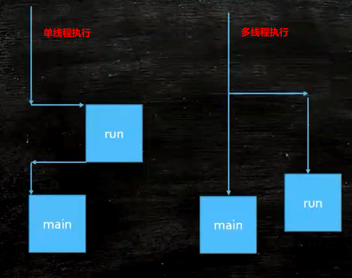

## 线程与进程
<https://github.com/GudaoFQ/MultithReading/tree/main/src/main/java/com/gudao/m001_thread_start>
* 线程是进程的一个实体,是CPU调度和分派的基本单位,它是比进程更小的能独立运行的基本单位. 线程自己基本上不拥有系统资源,只拥有一点在运行中必不可少的资源(如程序计数器,一组寄存器和栈),但是它可与同属一个进程的其他的线程共享进程所拥有的全部资源

#### 进程
```shell
program app -> QQ.exe
QQ Running -> 进程 
QQ Running -> 进程 
```

#### 线程
> 一个程序中不同的执行路径


### 示例代码
```java
/**
 * Author : GuDao
 * 2020-10-18
 */
public class ThreadStart {
    private static class T1 extends Thread{
        @Override
        public void run() {
            for(int i=0;i<10;i++){
                try {
                    //sleep 1 微秒
                    TimeUnit.MICROSECONDS.sleep(1);
                } catch (InterruptedException e) {
                    e.printStackTrace();
                }
                System.out.println("T1");
            }
        }
        public static void main(String[] args) {
            //启动T1中的run方法【此时不会去创建一个新的线程去执行任务，只会沿着main线程执行】
            //new T1().run();
            //启动T1进程【此时会启动T1线程，同时执行main线程和T1线程】
            new T1().start();

            for(int i=0;i<10;i++){
                try {
                    //sleep 1 微秒
                    TimeUnit.MICROSECONDS.sleep(1);
                } catch (InterruptedException e) {
                    e.printStackTrace();
                }
                System.out.println("main");
            }
        }
    }
}
```
#### new T1().run执行结果
```shell
T1
T1
T1
T1
T1
T1
T1
T1
T1
T1
main
...
main
```
#### new T1().start执行结果
```shell
main
T1
main
T1
T1
main
main
T1
T1
main
main
T1
main
T1
main
T1
main
T1
main
T1
```

#### 进程和线程的区别
> 进程和线程的主要差别在于它们是不同的操作系统资源管理方式。进程有独立的地址空间，一个进程崩溃后，在保护模式下不会对其它进程产生影响，而线程只是一个进程中的不同执行路径。线程有自己的堆栈和局部变量，但线程之间没有单独的地址空间，一个线程死掉就等于整个进程死掉，所以多进程的程序要比多线程的程序健壮，但在进程切换时，耗费资源较大，效率要差一些。但对于一些要求同时进行并且又要共享某些变量的并发操作，只能用线程，不能用进程。
1. 简而言之,一个程序至少有一个进程,一个进程至少有一个线程..
2. 线程的划分尺度小于进程，使得多线程程序的并发性高。.
3. 另外，进程在执行过程中拥有独立的内存单元，而多个线程共享内存，从而极大地提高了程序的运行效率。.
4. 线程在执行过程中与进程还是有区别的。每个独立的线程有一个程序运行的入口、顺序执行序列和程序的出口。但是线程不能够独立执行，必须依存在应用程序中，由应用程序提供多个线程执行控制。.
5. 从逻辑角度来看，多线程的意义在于一个应用程序中，有多个执行部分可以同时执行。但操作系统并没有将多个线程看做多个独立的应用，来实现进程的调度和管理以及资源分配。这就是进程和线程的重要区别。