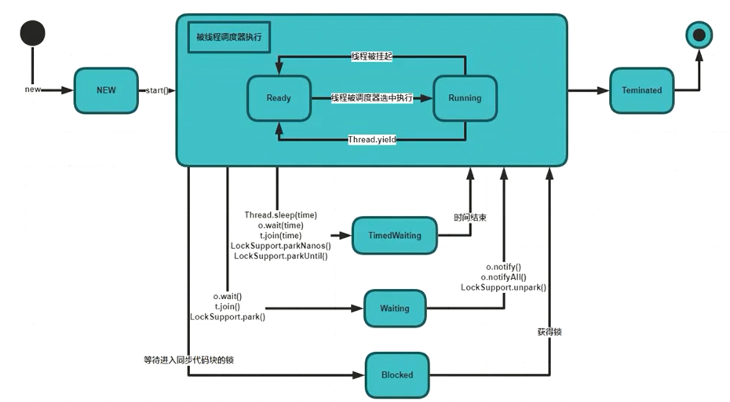
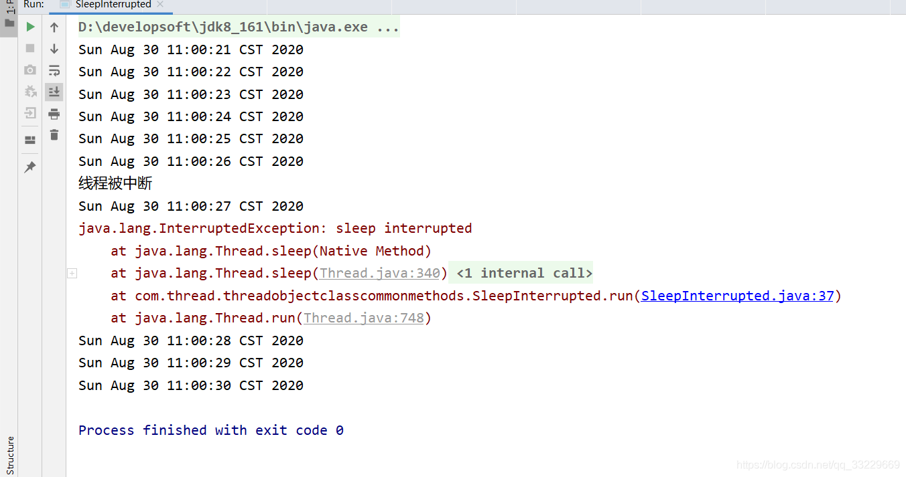

## 线程中的状态

<https://github.com/GudaoFQ/Multithreading/tree/main/src/main/java/com/gudao/m004_thread_state>

### 新建状态(New)
> 当用new操作符创建一个线程后， 例如new Thread(r)，此时线程处在新建状态。 当一个线程处于新建状态时，线程中的任务代码还没开始运行。

### 就绪状态(Runnable)
> 也被称为“可执行状态”。一个新创建的线程并不自动开始运行，要执行线程，必须调用线程的start()方法。当调用了线程对象的start()方法即启动了线程，此时线程就处于就绪状态。

> 处于就绪状态的线程并不一定立即运行run()方法，线程还必须同其他就绪线程竞争CPU，只有获得CPU使用权才可以运行线程。比如在单核心CPU的计算机系统中，不可能同时运行多个线程，一个时刻只能有一个线程处于运行状态。对与多个处于就绪状态的线程是由Java运行时系统的线程调度程序(thread scheduler)来调度执行。

> 除了调用start()方法后让线程变成就绪状态，一个线程阻塞状态结束后也可以变成就绪状态，或者从运行状态变化到就绪状态。

### 运行状态(Running)
> 线程获取到CPU使用权进行执行。需要注意的是，线程只能从就绪状态进入到运行状态。真正开始执行run()方法的内容。

### 阻塞状态(Blocked)
>线程在获取锁失败时(因为锁被其它线程抢占)，它会被加入锁的同步阻塞队列，然后线程进入阻塞状态(Blocked)。处于阻塞状态(Blocked)的线程放弃CPU使用权，暂时停止运行。待其它线程释放锁之后，阻塞状态(Blocked)的线程将在次参与锁的竞争，如果竞争锁成功，线程将进入就绪状态(Runnable) 。

### 等待状态(WAITING)
> 或者叫条件等待状态，当线程的运行条件不满足时，通过锁的条件等待机制(调用锁对象的wait()或显示锁条件对象的await()方法)让线程进入等待状态(WAITING)。处于等待状态的线程将不会被cpu执行，除非线程的运行条件得到满足后，其可被其他线程唤醒，进入阻塞状态(Blocked)。调用不带超时的Thread.join()方法也会进入等待状态。

### 限时等待状态(TIMED_WAITING)
> 限时等待是等待状态的一种特例，线程在等待时我们将设定等待超时时间，如超过了我们设定的等待时间，等待线程将自动唤醒进入阻塞状态(Blocked)或就绪状态(Runnable) 。在调用Thread.sleep()方法，带有超时设定的Object.wait()方法，带有超时设定的Thread.join()方法等，线程会进入限时等待状态(TIMED_WAITING)。

### 死亡状态(TERMINATED)
> 线程执行完了或者因异常退出了run()方法，该线程结束生命周期。

### 补充：线程中断
> 此种现象只会出现在`sleep` `wait` `join` `parkNanos` `parkuntil`方法中

> 中断只是让用户处理出现中断后，线程该如何执行【在设置特别长的sleep时间时，中途可以通过interrupt来让线程走中断异常，将现在执行完成】
####　示例：
```java
/**
 * Author : GuDao
 * 2020-10-18
 */
public class SleepInterrupted implements Runnable {
    public static void main(String[] args) {
        Thread thread = new Thread(new SleepInterrupted());
        thread.start();
        //让子线程运行6s后, 让其中断
        try {
            Thread.sleep(6000);
        } catch (InterruptedException e) {
            e.printStackTrace();
        }
        //中断thread线程执行
        thread.interrupt();
    }

    @Override
    public void run() {
        for (int i = 0; i < 10; i++) {
            System.out.println(new Date());
            try {
                //每隔一秒 去打印当前时间
                TimeUnit.SECONDS.sleep(1L);
            } catch (InterruptedException e) {
                //处理线程中断后的逻辑
                System.out.println("线程被中断 ");
                e.printStackTrace();
            }
        }
    }
}
```
#### 执行结果

**可以看到打印了六条语句后, 打印出了线程被中断. 并且抛出了异常.但是可以看到线程并没有被中断, 之后还是会继续打印. 说明了在sleep的时候, 如果被中断, 会 清除中断状态**