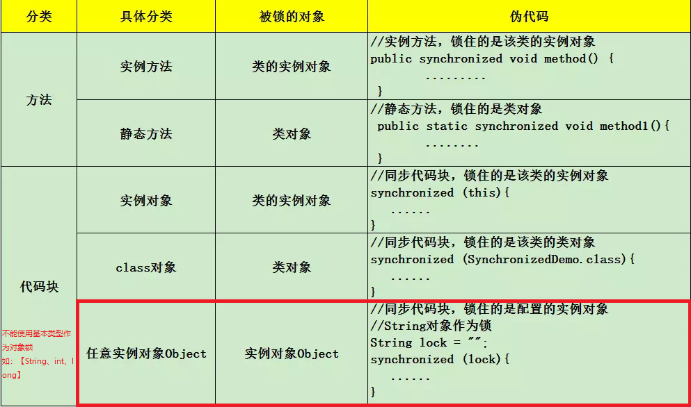
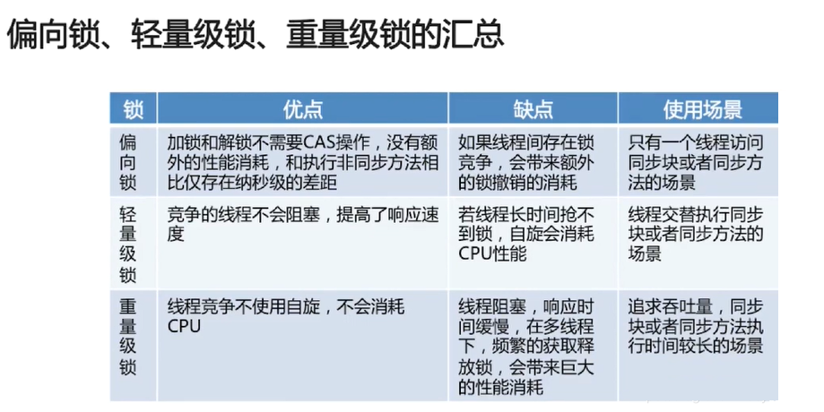

## Synchronized介绍
#### synchronized 总共有三种用法

> 这里的需要注意的是：如果锁的是类对象的话，尽管new多个实例对象，但他们仍然是属于同一个类依然会被锁住，即线程之间保证同步关系。
<https://github.com/GudaoFQ/Multithreading/tree/main/src/main/java/com/gudao/m005_sync_methed>

#### 加锁原则
> 我们加锁代码有个原则：尽量少的锁代码，比如我的方法中只需要对count++进行synchronized，我们没必要把整个方法锁住，只锁count++就可以了。但是如果我们一个方法内有N多个地方需要加锁，我们就直接锁方法，就不要每次都让线程竞争了。

##### 修饰普通方法
```java
public class SyncMothed {
    public synchronized void mothedOne(){
       
    }
}
```
##### 修饰静态方法
> 静态方法是没有this对象的，我们也可以不用new出来一个对象进行加锁
```java
public class Sync{
    //下面两个没有区别
    
    public synchronized static void mothedOne(){//此处的synchronized相当于synchronized(Sync.class){}
        
    }
    public static void mothedTwo(){
        //注意：此处的（）中不能使用this
        synchronized(Sync.class){
            
        }
    }
}
```
##### 修饰代码块
```java
public class SyncMothed {
    //同步代码块,锁住的是该类的实例对象
    public void mothedTwo(){
        synchronized (this){
            
        }
    }
}

public class SyncObject {
    private Object lock = new Object();//不可以使用String常量 Integer Long
    
    public void objectLock(){
        synchronized (lock){
        
        }
    }
}
```

#### synchronized可重入性
> 若一个程序或子程序可以“在任意时刻被中断然后操作系统调度执行另外一段代码，这段代码又调用了该子程序不会出错”，则称其为可重入（reentrant或re-entrant）的。即当该子程序正在运行时，执行线程可以再次进入并执行它，仍然获得符合设计时预期的结果。与多线程并发执行的线程安全不同，可重入强调对单个线程执行时重新进入同一个子程序仍然是安全的。
<https://github.com/GudaoFQ/Multithreading/blob/main/src/main/java/com/gudao/m006_sync_question/SyncWithReenty.java>

```java
public class Father {
	synchronized void m() {
		System.out.println("Father start");
		try {
			TimeUnit.SECONDS.sleep(1);
		} catch (InterruptedException e) {
			e.printStackTrace();
		}
		System.out.println("Father end");
	}
	
	public static void main(String[] args) {
		new Son().m();
	}
	
}

class Son extends Father {
	@Override
	synchronized void m() {
		System.out.println("Son m start");
		//重入父类的同步方法
		super.m();
		System.out.println("Son m end");
	}
}
```

#### 可重入的条件
1. 不在函数内使用静态或全局数据。
2. 不返回静态或全局数据，所有数据都由函数的调用者提供。
3. 使用本地数据（工作内存），或者通过制作全局数据的本地拷贝来保护全局数据。
4. 不调用不可重入函数。

#### synchronized可重入锁的实现
> 每个锁关联一个线程持有者和一个计数器。当计数器为0时表示该锁没有被任何线程持有，那么任何线程都都可能获得该锁而调用相应方法。当一个线程请求成功后，JVM会记下持有锁的线程，并将计数器计为1。此时其他线程请求该锁，则必须等待。而该持有锁的线程如果再次请求这个锁，就可以再次拿到这个锁，同时计数器会递增。当线程退出一个synchronized方法/块时，计数器会递减，如果计数器为0则释放该锁。

#### synchronized产生异常后其它线程乱入问题
<https://github.com/GudaoFQ/Multithreading/blob/main/src/main/java/com/gudao/m006_sync_question/SyncRunningException.java>
* 任务独立<br>
**使用try catch语句在出现异常的地方捕获异常，当前线程不会结束，执行完catch语句后还会向下执行**
> 任务之间不会相互影响，此时，可以遇到异常，记录日志，然后，继续执行后续的任务；最后，等所有的任务都执行完毕，再根据日志处理，发生异常的任务

* 任务整体<br>
**在出现异常的地方不捕获异常，此时当前线程就会释放锁，让其它线程运行**
> 任务之间存在关联关系，所有的任务是一个整体。某一个任务执行失败，后续的任务，都会受到影响；此时，可以直接抛出异常，记录日志，后续的任务不再继续执行，执行过的任务，可以回滚

#### synchronized的四种锁状态

**注：synchronized自旋锁默认会自旋10次**
> 看：【MSB厕所所长】1-2.md

#### 锁的优化
##### 锁粗化&锁细化
* 下面的代码反过来就是锁细化
> 原则上，我们都知道在加同步锁的时候，尽可能的将同步块的作用范围限制在尽量小的范围，比如下面这两种情况：
```java
//未进行粗化
public class SynchronizedTest {
	
	private int count;
	
	public void test() {
		System.out.println("test");
		int a = 0;
		synchronized (this) {
			count++;
		}
	}
}
//粗化后
public class SynchronizedTest {
	
	private int count;
	
	public void test() {
		synchronized (this) {
			System.out.println("test");
			int a = 0;
			count++;
		}
	}
}
```
1. 很明显，第一种实现方式好于第二种，它并不会将对非共享数据的操作划分到同步代码块中，使得同步需要的操作数量更少，在存在锁竞争的情况下，也可以使得等待锁的线程尽快的拿到锁。
2. 对于大多数情况，这种思想是完全正确的，但是如果存在一连串的操作都对同一个对象进行反复的加锁和解锁，甚至加锁的操作出现在循环体中，那么即使没有线程竞争共享资源，频繁的进行加锁操作也会导致性能损耗。
3. 锁粗化的思想就是扩大加锁范围，避免反复的加锁和解锁。

##### 这里还是拿 StringBuffer 举例，如下所示
```java
class Test{
    public String test(String str){
           int i = 0;
           StringBuffer sb = new StringBuffer();
           while(i < 100){
               sb.append(str);
               i++;
           }
           return sb.toString();
    }
}
```
> 在这种情况下，JVM 会检测到这样一连串的操作都对同一个对象加锁（while 循环内 100 次执行 append，没有锁粗化的就要进行 100 次加锁/解锁），此时 JVM 就会将加锁的范围粗化到这一连串的操作的外部（比如 while 虚幻体外），使得这一连串操作只需要加一次锁即可。
###### 总结
> synchronized在不被挣抢很剧烈的情况下应该实行锁细化操作
* 在需要加锁的方法中，当需要加锁的代码前后有很多的业务逻辑代码执行，此时的synchronized就应该加在需要加锁的代码那，而不是将整个方法锁住
* 当很多的细琐被挣用的特别频繁的时候，此时可以将一些细琐进行粗化成一个大锁

##### 锁消除
> 锁消除是一种更为彻底的优化，在 JIT 编译时，对运行上下文进行扫描，去除不可能存在共享资源竞争的锁。
```java
class Test{
    public void add(String str1,String str2){
             StringBuffer sb = new StringBuffer();
             sb.append(str1).append(str2);
    }
}
```
* 我们都知道 StringBuffer 是线程安全的，因为它的关键方法都是被 synchronized 修饰过的，但我们看上面这段代码，我们会发现，sb 这个引用只会在 add 方法中使用，不可能被其它线程引用（因为是局部变量，栈私有），因此 sb 是不可能共享的资源，JVM 会自动消除 StringBuffer 对象内部的锁。